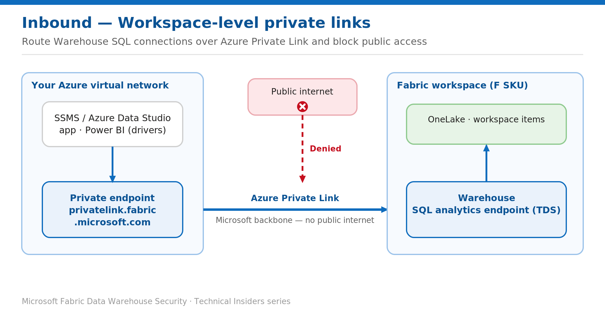

# Lock the Warehouse SQL Endpoint Behind Workspace-Level Private Links

> Route inbound Warehouse connections over Azure Private Link and shut off the public internet.

*Series: Network security · Layer: Inbound (1 of 3) · Audience: Fabric DW admins · Level 300*

This post walks you through routing every inbound connection to a Fabric Warehouse's **SQL analytics endpoint** through **Azure Private Link**, then denying public internet access to the workspace. After this, SSMS, drivers, and Power BI reach the warehouse only from inside your virtual network.

## How to read this series

This is the first of five posts on securing the Fabric Data Warehouse network boundary — inbound first, then outbound. Every entry is written as a **prescriptive, step-by-step runbook**, not a conceptual overview: you get the exact prerequisites, the portal and template actions, the T-SQL or PowerShell where it applies, a validation step to prove the control works, the current limitations, and a rollback. The intent is that you can implement each control end-to-end without leaving the article.

The *why* behind each control — threat model, architecture, and design trade-offs — is kept deliberately short so the steps stay front and centre. For that deeper technical rationale, use the **Microsoft Fabric security white paper** as the companion reference to the whole series; each post also links the specific product documentation for the feature it configures in its **References** section.

- [Microsoft Fabric security white paper — Microsoft Learn](https://learn.microsoft.com/en-us/fabric/security/white-paper-landing-page)

## Scenario — when to use this

You operate a Fabric Warehouse that holds regulated data — finance, HR, or PII — and your security team has mandated that no data-plane endpoint may be reachable from the public internet. Analysts and services connect from a corporate network already peered to Azure (via VNet, ExpressRoute, or VPN), and auditors expect proof that the Warehouse **SQL analytics endpoint** answers only from inside your virtual network.

Reach for this pattern when *"no public endpoints"* is a hard compliance requirement and you have an Azure VNet that user and service traffic already flows through. If you only need to restrict access to a known set of corporate IPs without standing up private networking, the lighter-weight IP firewall in Post 2 may be the better fit.

For more detail on how this option works, see:

- [Microsoft Fabric security white paper — Microsoft Learn](https://learn.microsoft.com/en-us/fabric/security/white-paper-landing-page)
- [Workspace-level private links overview — Microsoft Learn](https://learn.microsoft.com/en-us/fabric/security/security-workspace-level-private-links-overview)

## What you'll set up

- A **workspace-level private link** that terminates in your Azure VNet.
- A private endpoint mapped to the workspace sub-resource and resolved through the `privatelink.fabric.microsoft.com` DNS zone.
- Public internet access to the workspace set to **deny**, so the Warehouse SQL endpoint is private-only.



*Figure 1 — Inbound Warehouse SQL traffic flows over a workspace-level private endpoint; public internet is denied.*

## Prerequisites

- The workspace is assigned to a **Fabric capacity (F SKU)**. Premium (P SKU) and trial capacities are not supported.
- A Fabric administrator has enabled the tenant setting **Configure workspace-level inbound network rules**.
- You are a **workspace admin** and hold Azure rights to create a private link service, virtual network, and private endpoint.
- You have the **workspace ID** (the GUID after `/groups/` in the workspace URL) and the **tenant ID** (Fabric portal → **?** → **About Power BI** → the `ctid` value).
- First time in the tenant: re-register the resource provider — Azure portal → **Subscriptions → Resource providers → Microsoft.Fabric → Re-register**.

## Step 1 — Create the Fabric private link service

1. Confirm the workspace runs on an F SKU: **Workspace settings → License info**.
2. In the Azure portal, search **Deploy a custom template**, then select **Build your own template in the editor**.
3. Paste the template below, replacing the resource name, tenant ID, and workspace ID. Deploy it.
4. After deployment, open the resource group and enable **Show hidden resources** to see the private link service.

```json
{
  "$schema": "http://schema.management.azure.com/schemas/2015-01-01/deploymentTemplate.json#",
  "contentVersion": "1.0.0.0",
  "parameters": {},
  "resources": [
    {
      "type": "Microsoft.Fabric/privateLinkServicesForFabric",
      "apiVersion": "2024-06-01",
      "name": "<resource-name>",
      "location": "global",
      "properties": {
        "tenantId": "<tenant-id>",
        "workspaceId": "<workspace-id>"
      }
    }
  ]
}
```

## Step 2 — Create the network and private endpoint

1. Create a **virtual network** in the region from which you'll connect. Reserve at least **10 IP addresses** per workspace private endpoint (Fabric consumes 5 today).
2. Create a **private endpoint**: set **Resource type** to `Microsoft.Fabric/privateLinkServicesForFabric`, select the Fabric resource from Step 1, and set **Target sub-resource** to **workspace**.
3. On the **DNS** tab, integrate with the private DNS zone **`privatelink.fabric.microsoft.com`**.
4. (Optional test harness) Deploy a VM in the VNet and reach it with **Azure Bastion** so you can validate resolution from inside the network.

> **Tip** — Keep the private endpoint, VNet, and private link service in the **same resource group** so teardown and RBAC stay simple.

## Step 3 — Deny public access to the workspace

1. In the Fabric portal, open the workspace → **Workspace settings → Inbound networking**.
2. Under **Workspace connection settings**, select **Allow connections from selected networks and workspace level private links**.
3. Select **Apply**. Public internet access is now blocked; only workspace-level private link connections succeed.

> **Note** — The deny-public setting can take **up to 30 minutes** to take effect. To also permit named public IPs alongside private link, add IP firewall rules (see the next post in this series).

## Validate

From the VM inside the VNet, confirm the workspace FQDN resolves to the **private** IP:

```text
nslookup {workspaceid}.z{xy}.w.api.fabric.microsoft.com

# workspaceid = workspace object ID with dashes removed
# xy         = first two characters of that object ID (e.g. z44)
```

- Connect SSMS / Azure Data Studio to the Warehouse SQL connection string **from inside the VNet** — the connection succeeds.
- Attempt the same connection from a **public network** after denying public access — it fails, confirming the endpoint is private-only.

## Limitations & gotchas

- **F SKU only.** Workspace-level private links are unsupported on P and trial capacities.
- Denying public access is a **workspace-wide** inbound control. Plan client connectivity (VPN, ExpressRoute, or a jump VM) **before** you enable it, or admins lose portal access.
- Allow **up to 30 minutes** for the deny-public change to propagate.
- Re-register the **Microsoft.Fabric** resource provider the first time you use workspace-level networking in a subscription, or endpoint creation fails.

## Rollback

1. **Workspace settings → Inbound networking** → select **Allow connections from all networks** → **Apply**.
2. If no longer needed, delete the private endpoint, private link service, and VNet in Azure.

## References

- [Set up and use workspace-level private links — Microsoft Learn](https://learn.microsoft.com/en-us/fabric/security/security-workspace-level-private-links-set-up)
- [Workspace-level private links overview — Microsoft Learn](https://learn.microsoft.com/en-us/fabric/security/security-workspace-level-private-links-overview)
- [Enable workspace inbound access protection for your tenant — Microsoft Learn](https://learn.microsoft.com/en-us/fabric/security/security-workspace-enable-inbound-access-protection)
