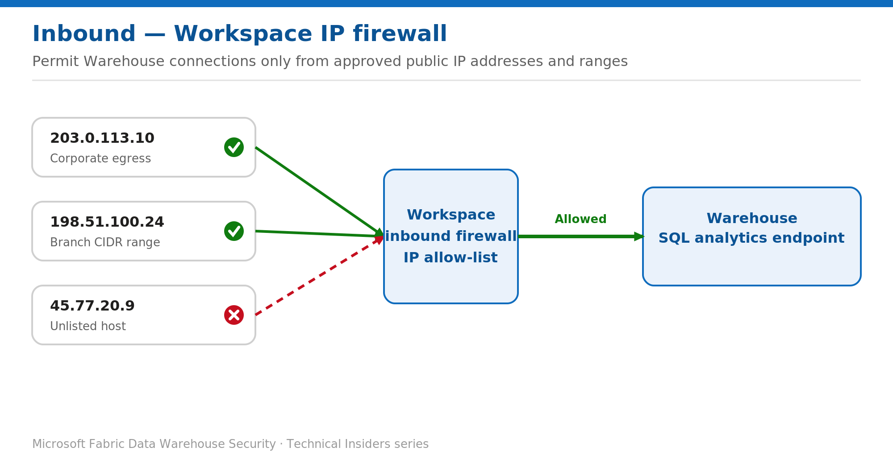

# Restrict the Warehouse to Approved IPs with Workspace Firewall Rules

> Permit inbound Warehouse connections only from your corporate egress and branch ranges.

*Series: Network security · Layer: Inbound (2 of 3) · Audience: Fabric DW admins · Level 300*

When you keep the workspace on public endpoints, this post shows you how to fence the Warehouse behind an **IP allow-list**, so only connections from approved public addresses or ranges reach the **SQL analytics endpoint**. It is the lower-effort alternative to private links when full network isolation isn't required.

## What you'll set up

- An inbound **IP firewall** on the workspace with named allow-list rules (single IP, range, or CIDR).
- All non-listed source addresses denied at the workspace boundary.



*Figure 2 — Only source IPs on the workspace allow-list reach the SQL analytics endpoint; everything else is denied.*

## Prerequisites

- The tenant setting **Configure workspace IP firewall rules** is enabled (on by default; a Fabric admin can re-enable it if it was turned off).
- You are a **workspace admin**.
- The workspace is assigned to a **Fabric capacity or trial capacity**.
- First time using workspace networking in the subscription: re-register the **Microsoft.Fabric** resource provider.

## Step 1 — Add IP firewall rules in the portal

1. Open the workspace → **Workspace settings → Inbound networking**.
2. Under **Workspace connection settings**, select **Allow connections from selected networks and workspace level private links**.
3. Under **Allow public addresses to access this workspace**, select **Edit**.
4. Select **Add address**. Enter a **Rule name**, choose the **Type** (Single IP, IP range, or CIDR), and enter the address. Repeat for each network you want to admit.
5. Select **Apply**. Only the listed addresses can reach the workspace; all other connections are automatically denied.

> **Note** — Enter the client's **actual public egress IP**. Behind NAT, a proxy, or a corporate gateway, that is the gateway address — not the workstation's local IP.

## Step 2 — (Optional) Manage rules programmatically

With the tenant setting enabled, you can read and set rules through the Fabric REST API on the public endpoint `api.fabric.microsoft.com`:

```text
# Fabric REST API — api.fabric.microsoft.com
#   Get IP rules                       -> read the current workspace allow-list
#   Set IP rules                       -> write the allow-list
#   Set Network Communication Policy   -> set the workspace public-access rule
#
# See the Fabric REST API reference for exact request URIs and bodies.
```

## Validate

- Connect from an **allow-listed** IP (SSMS or a driver) to the Warehouse SQL endpoint — the connection succeeds.
- Connect from a **non-listed** IP — the connection is denied.
- Re-open **Inbound networking** and confirm the rule list matches your intent.

## Limitations & gotchas

- IP firewall rules gate **public-endpoint** access. For full network isolation, combine private links with deny-public instead (see Post 1).
- Rules apply at the **workspace** level and therefore cover every Warehouse and SQL analytics endpoint in that workspace.
- Dynamic client IPs (home broadband, mobile) drift over time — prefer stable egress ranges or CIDR blocks.

## Rollback

1. **Workspace settings → Inbound networking** → select **Allow connections from all networks** to remove all restrictions, or open **Edit** and delete individual rules.
2. Select **Apply**.

## References

- [Set up and use workspace IP firewall rules — Microsoft Learn](https://learn.microsoft.com/en-us/fabric/security/security-workspace-level-firewall-set-up)
- [Workspace-level firewall overview — Microsoft Learn](https://learn.microsoft.com/en-us/fabric/security/security-workspace-level-firewall-overview)
- [Enable workspace inbound access protection for your tenant — Microsoft Learn](https://learn.microsoft.com/en-us/fabric/security/security-workspace-enable-inbound-access-protection)
