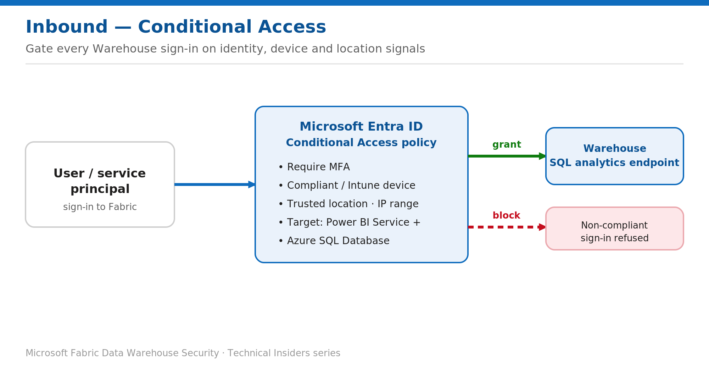

# Gate Warehouse Sign-ins with Microsoft Entra Conditional Access

> Require MFA, compliant devices, and trusted locations before any Warehouse connection.

*Series: Network security · Layer: Inbound (3 of 3) · Audience: Fabric DW admins · Level 300*

This post shows you how to enforce **Microsoft Entra Conditional Access** on connections to a Fabric Warehouse, so every sign-in — including SQL client and tooling access to the **SQL analytics endpoint** — must satisfy MFA, device-compliance, and location conditions before access is granted.

## Scenario — when to use this

Network controls tell you *where* a connection originates, but not *who* is behind it or how healthy their device is. Your identity and compliance teams require that anyone reaching the Warehouse — including SQL client tools hitting the **SQL analytics endpoint** — passes MFA, connects from a managed or compliant device, or comes from a trusted location.

Reach for this pattern when access decisions must be identity- and device-aware, layered on top of your network perimeter rather than replacing it. It pairs naturally with private links (Post 1) or the IP firewall (Post 2).

For more detail on how this option works, see:

- [Microsoft Fabric security white paper — Microsoft Learn](https://learn.microsoft.com/en-us/fabric/security/white-paper-landing-page)
- [Conditional Access in Fabric — Microsoft Learn](https://learn.microsoft.com/en-us/fabric/security/security-conditional-access)

## What you'll set up

- One Conditional Access policy that covers Fabric **and** the downstream data services the Warehouse depends on.
- Grant controls requiring **MFA** and/or a **compliant device**, scoped by location.



*Figure 3 — Every Warehouse sign-in is evaluated by a Conditional Access policy before access is granted.*

## Prerequisites

- You hold the **Conditional Access Administrator** (or Security Administrator) role in Microsoft Entra.
- **Microsoft Entra ID P1** licensing (Conditional Access).
- A **break-glass** account excluded from the policy, and a plan to pilot with **report-only** mode first.

## Step 1 — Create the Conditional Access policy

1. Sign in to the **Microsoft Entra admin center** as at least a Conditional Access Administrator.
2. Browse to **Entra ID → Conditional Access → Policies → New policy** and give it a name that fits your naming standard.
3. Under **Assignments → Users**, target the users or groups in scope, and **exclude** your break-glass account.
4. Under **Target resources**, select **Resources (formerly cloud apps) → Include → Select resources**, then add all five: **Power BI Service**, **Azure Data Explorer**, **Azure SQL Database**, **Azure Storage**, and **Azure Cosmos DB**.
5. Under **Conditions**, set **Locations** and **Device platforms** to match your requirements.
6. Under **Access controls → Grant**, require **Multifactor authentication** and/or **Require device to be marked as compliant**.
7. Set **Enable policy** to **Report-only**, then **Create**. After validating in the sign-in logs, switch it to **On**.

> **Why all five resources** — **Azure SQL Database** is the resource that governs the Warehouse **SQL analytics endpoint** (TDS) connections. Including the full set keeps Fabric and its downstream services under one consistent policy and avoids inconsistent sign-in prompts.

## Validate

- Sign in from a **non-compliant device** or an **untrusted location** — access is blocked.
- Sign in from a **compliant device** after MFA — access is granted and the Warehouse connects.
- Use the Entra **sign-in logs** and the Conditional Access **What If** tool to confirm which policy applied.

### Confirm the connection in SQL audit logs

Entra sign-in logs prove the policy fired. To close the loop at the data layer — and show that the session which reached the Warehouse is the one the policy allowed — read the SQL audit log and check the principal and client IP that actually connected.

1. Make sure SQL audit logs are enabled on the warehouse (full setup in Post 21).
2. Connect to the Warehouse and run the query below to list recent successful logins with their source IP.
3. Confirm each connection maps to an expected user and an approved network location — and that attempts you blocked during the test above do **not** appear as successful sessions.

```sql
SELECT event_time,
       succeeded,
       server_principal_name,
       client_ip,
       application_name
FROM sys.fn_get_audit_file_v2(
        '<audit-log-path>', DEFAULT, DEFAULT,
        DATEADD(HOUR, -24, SYSUTCDATETIME()), SYSUTCDATETIME())
WHERE action_id = 'LGIS'   -- successful login
ORDER BY event_time DESC;
```

> **Nice to have** — This is an observability add-on, not a requirement for Conditional Access to work. Post 21 covers audit log configuration, retention, and forensic analysis in full.

## Limitations & gotchas

- Use **one common policy** across the five resources. If you already have a Power BI policy, add these resources to it rather than creating a competing policy.
- An overly restrictive policy (for example, blocking every app except Power BI) can break features such as **dataflows**.
- Fabric does **not** support the **continuous access evaluation (CAE)** session control.
- **Service principals / workload identities** are not subject to interactive MFA — govern them with a separate Conditional Access for workload identities policy.

## Rollback

1. Set the policy to **Report-only** or **Off** in **Conditional Access → Policies**.
2. Or narrow scope by removing specific target resources, users, or grant controls.

## References

- [Conditional Access in Fabric — Microsoft Learn](https://learn.microsoft.com/en-us/fabric/security/security-conditional-access)
- [Protect inbound traffic to Microsoft Fabric — Microsoft Learn](https://learn.microsoft.com/en-us/fabric/security/protect-inbound-traffic)
- [Configure SQL audit logs in Fabric Data Warehouse — Microsoft Learn](https://learn.microsoft.com/en-us/fabric/data-warehouse/configure-sql-audit-logs)
