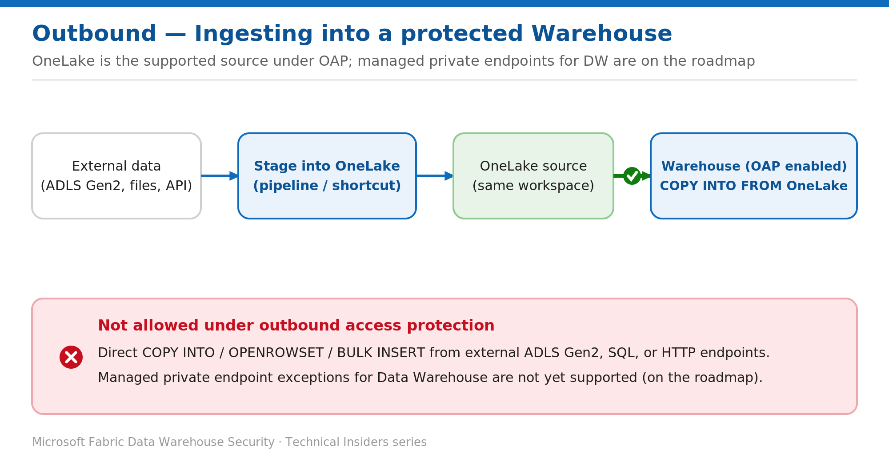

# Load Data into a Protected Warehouse with the OneLake Ingestion Pattern

> Keep ingesting after outbound access protection is on — using OneLake as the supported source.

*Series: Network security · Layer: Outbound (2 of 2) · Audience: Fabric DW admins · Level 300*

With outbound access protection enabled, direct external ingestion into the Warehouse is blocked. This post shows you how to keep loading data using **OneLake as the supported source**, and explains the current allow-list mechanics and the Data Warehouse limitation you need to design around.

## What you'll set up

- A working ingestion path into a protected Warehouse via **OneLake-sourced** `COPY INTO`.
- A clear map of which allow-list mechanisms apply to which workloads today.



*Figure 5 — Stage external data into OneLake, then COPY INTO from OneLake; direct external ingestion stays blocked.*

## Prerequisites

- **Outbound access protection is already enabled** on the workspace (see Post 4).
- You are a **workspace admin**.
- Source data can be staged into **OneLake** in the same workspace (a lakehouse Files area, or a shortcut/pipeline that writes to OneLake).

## Step 1 — Stage the source data into OneLake

1. Land the external data into **OneLake** in the same workspace — for example, into a lakehouse **Files** area via a pipeline, dataflow, or a shortcut.
2. Confirm the files are visible in the lakehouse explorer and note the OneLake path.

> **Why this works** — OAP limits the Warehouse to sources **inside the current workspace**, and OneLake is explicitly allowed as a `COPY INTO` source — so staging first into OneLake keeps ingestion flowing without opening external outbound access.

## Step 2 — Load with COPY INTO from OneLake

Run `COPY INTO` from the warehouse, pointing at the OneLake path (replace the workspace, lakehouse, and file path with your values):

```sql
COPY INTO dbo.Sales
FROM 'https://onelake.dfs.fabric.microsoft.com/<workspace>/<lakehouse>.Lakehouse/Files/sales/*.parquet'
WITH (
    FILE_TYPE = 'PARQUET'
);
```

1. Execute the statement against the Warehouse.
2. Validate the row count and spot-check a few records against the source.

## How allow-listing works across workloads (context)

Exception mechanisms differ by workload. Know which applies before you design an ingestion path:

- **Data Engineering / OneLake** workloads allow exceptions through **managed private endpoints** — created in **Workspace settings → Network Security → Managed Private Endpoints → Create**, then approved by a tenant admin in the Azure portal under **Private Link Services → Pending connections → Approve** (about 15 minutes).
- **Data Factory** workloads and **mirrored databases** allow exceptions through **data connection rules** (an allow-list of approved connectors and endpoints).
- **Data Warehouse** does **not** yet support managed private endpoint exceptions. The supported path is **OneLake-sourced** `COPY INTO`; broader allow-listing for the warehouse is on the roadmap.

> **Design guidance** — Architect pipelines so external data first lands in **OneLake**, then the Warehouse ingests from OneLake. This keeps OAP fully enabled while data continues to flow.

## Validate

- `COPY INTO` from a OneLake source **succeeds**.
- A direct `COPY INTO` / `OPENROWSET` from an external endpoint remains **blocked**, confirming OAP is intact.

## Limitations & gotchas

- Data Warehouse cannot yet allow-list external endpoints via managed private endpoints — plan for the OneLake staging hop.
- The staging pipeline/shortcut that writes into OneLake must itself run on a path permitted by your network policy.

## Rollback / adjust

- To restore direct external ingestion, disable OAP (**Workspace settings → Network Security → Block outbound public access → Off**) — at the cost of reduced protection.
- Otherwise keep OAP on and standardize on the OneLake staging pattern above.

## References

- [Outbound access protection for Data Warehouse — Microsoft Learn](https://learn.microsoft.com/en-us/fabric/security/workspace-outbound-access-protection-data-warehouse)
- [Create an allow list using managed private endpoints — Microsoft Learn](https://learn.microsoft.com/en-us/fabric/security/workspace-outbound-access-protection-allow-list-endpoint)
- [COPY INTO (Transact-SQL) — Microsoft Learn](https://learn.microsoft.com/en-us/sql/t-sql/statements/copy-into-transact-sql)
