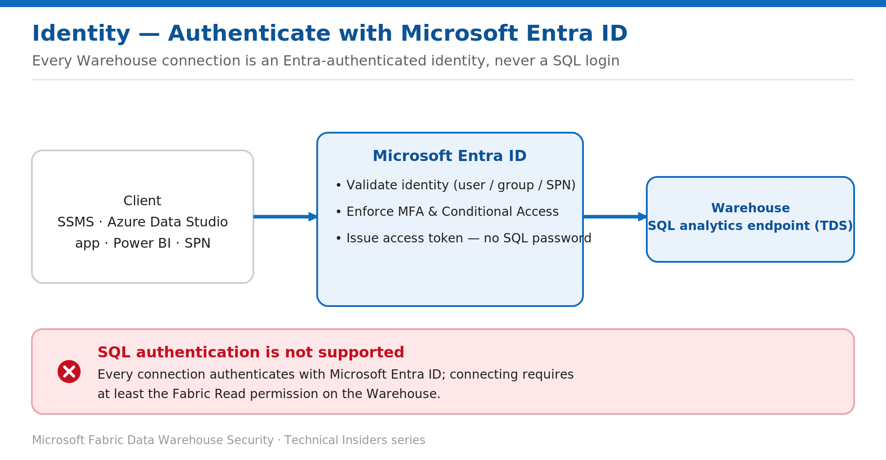

# Connect to the Warehouse with Microsoft Entra ID

> Every Warehouse connection is an Entra-authenticated identity — there are no SQL logins.

*Series: Identity & access · Layer: Identity (1 of 5) · Audience: Fabric DW admins · Level 300*

This post shows you how users, groups, and service principals connect to a Fabric **Warehouse** and its **SQL analytics endpoint** using Microsoft Entra ID. Fabric authenticates every caller through Entra — there is no SQL username/password path — so your entire access model is grounded in one identity provider.

## What you'll set up

- An Entra-authenticated connection to the Warehouse SQL endpoint from SSMS or Azure Data Studio.
- Access granted through **Entra groups** rather than individual users.
- The minimum Fabric **Read** permission in place so callers can connect.

*Figure 1 — Clients authenticate to the Warehouse through Microsoft Entra ID; SQL authentication isn't supported.*

## Prerequisites

- The caller has at least the Fabric **Read** permission on the Warehouse (via a workspace role or an item share). Without it, the connection fails.
- A client that supports Microsoft Entra authentication — SSMS 19+, Azure Data Studio, or an ODBC/OLE DB/JDBC driver with an `ActiveDirectory` authentication mode.
- Access to the Warehouse **SQL connection string** (the TDS endpoint).

## Step 1 — Copy the SQL connection string

1. Open the Warehouse in the Fabric portal.
2. From the item's settings (or the **…** menu), copy the **SQL connection string** — the TDS endpoint, in the form `<id>.datawarehouse.fabric.microsoft.com`.
3. Note the database name (the Warehouse name) for your client.

## Step 2 — Connect with Microsoft Entra authentication

1. In SSMS or Azure Data Studio, set **Server** to the SQL connection string.
2. Set **Authentication** to **Microsoft Entra MFA** (interactive). For automation, use **Microsoft Entra Service Principal**; for a joined session, **Microsoft Entra Integrated**.
3. Enter your Entra account, complete MFA, and connect to the Warehouse database.

> **Note** — There is no SQL Server username/password authentication in Fabric Warehouse — only Microsoft Entra authentication. The same identity flows through the SQL analytics endpoint, row-level security predicates (via `USER_NAME()`), column-level grants, and dynamic data masking.

## Step 3 — Grant access through Entra groups

Manage access on **Entra security groups** rather than individuals, so membership changes never require permission edits:

1. Create or choose an Entra security group per access tier — for example `Fabric-DW-Analysts`.
2. Assign the **group** to a workspace role, or share the Warehouse with the group (see the roles and sharing posts in this series).
3. Add or remove members in Entra — their Warehouse access follows automatically.

## Validate

- A member of the granted group connects with Entra MFA and runs a query — it succeeds.
- A user with no Fabric Read permission attempts to connect — the connection is refused.
- Run `SELECT USER_NAME();` to confirm the exact identity the Warehouse sees — this is what RLS and masking evaluate.

## Limitations & gotchas

- **No SQL authentication** — plan every connection, including tools and drivers, around Microsoft Entra.
- **Read** is only the connection floor; object access still depends on the workspace role, item permission, or T-SQL grants covered later in this series.
- Item-permission changes can take **up to two hours** to reach the SQL endpoint — sign out and back in to refresh.
- For unattended workloads, use a **service principal** (final post in this batch), never a shared user account.

## References

- [Security for data warehousing in Microsoft Fabric — Microsoft Learn](https://learn.microsoft.com/en-us/fabric/data-warehouse/security)
- [SQL granular permissions in Microsoft Fabric — Microsoft Learn](https://learn.microsoft.com/en-us/fabric/data-warehouse/sql-granular-permissions)
