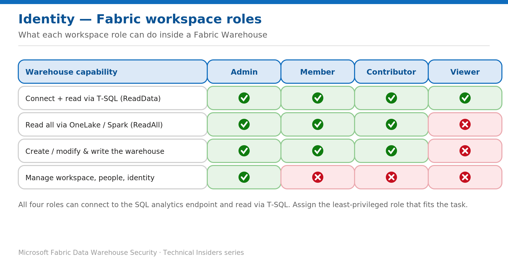

# Control Warehouse Access with Fabric Workspace Roles

> Assign the least-privileged workspace role that still lets the user do the job.

*Series: Identity & access · Layer: Identity (2 of 5) · Audience: Fabric DW admins · Level 300*

This post shows you how to grant Warehouse access with **Fabric workspace roles** and choose the right role for each user. Workspace roles apply to **all** items in the workspace, so they are the coarsest — and highest-impact — access control you assign.

## What you'll set up

- Users and groups assigned to the correct workspace role for their task.
- High-privilege roles (Admin, Member, Contributor) reserved for active collaborators only.
- Read-only consumers kept to **Viewer** plus targeted T-SQL grants.

*Figure 2 — What each workspace role (Admin, Member, Contributor, Viewer) can do inside a Warehouse.*

## Prerequisites

- You are a workspace **Admin** (required to add or remove people and other admins) or a **Member** (can add members and lower).
- Entra groups defined for each access tier (recommended over assigning individuals).

## How each role maps to Warehouse capabilities

- **Admin** — full control: manage the workspace, add/remove people, create the workspace identity, connect Git, plus everything below.
- **Member** — create/modify and write warehouse items; ReadData and ReadAll; can add members and reshare.
- **Contributor** — create/modify and write warehouse items; ReadData and ReadAll; the default role for builders.
- **Viewer** — connect to the SQL analytics endpoint and read via T-SQL (**ReadData**) only. No ReadAll (Spark/OneLake) and no write. Ideal for read-only consumers.

## Step 1 — Assign a role

1. Open the workspace → **Manage access**.
2. Select **Add people or groups** and choose an Entra user or, preferably, a **security group**.
3. Pick the role — **Admin**, **Member**, **Contributor**, or **Viewer** — and grant it.

## Step 2 — Apply least privilege

1. For read-only consumers, assign **Viewer**, then grant SELECT on specific objects in T-SQL (see the granular-permissions post).
2. Reserve **Admin/Member/Contributor** for team members actively building the solution — those roles grant access to every item in the workspace.
3. Prefer assigning **groups** so joiners and leavers are handled in Entra, not in Fabric.

> **Note** — If a user is in several groups with different roles, they receive the **highest** permission of any role they hold. Audit group membership when tightening access.

## Validate

- A **Viewer** connects and reads granted tables but cannot write or use Spark/OneLake (ReadAll) — confirm the write attempt fails.
- A **Contributor** can create and modify warehouse objects.
- Only **Admins** can change workspace membership.

## Limitations & gotchas

- Workspace roles apply to **all items** in the workspace — they are not warehouse-scoped. For single-item access, use item sharing instead (next post).
- All four roles can connect to the SQL analytics endpoint and read via T-SQL (ReadData) — don't rely on Viewer to hide data; use RLS/CLS/OLS for that.
- Role changes are effective quickly in the portal but can take time to fully propagate to the SQL endpoint.

## References

- [Roles in workspaces in Microsoft Fabric — Microsoft Learn](https://learn.microsoft.com/en-us/fabric/fundamentals/roles-workspaces)
- [Security for data warehousing in Microsoft Fabric — Microsoft Learn](https://learn.microsoft.com/en-us/fabric/data-warehouse/security)
