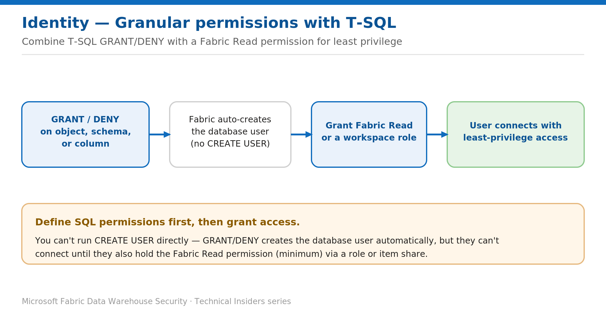

# Grant Granular Warehouse Permissions with T-SQL

> Use GRANT, DENY, and REVOKE with database roles for fine-grained, least-privilege access.

*Series: Identity & access · Layer: Identity (3 of 5) · Audience: Fabric DW admins · Level 300*

This post shows you how to grant fine-grained access inside a Fabric **Warehouse** using standard T-SQL — `GRANT`, `DENY`, and `REVOKE` — together with database roles, when workspace roles and item permissions are too coarse.

## What you'll set up

- A database role granted the exact object, schema, or column permissions a group needs.
- Users connected as **Viewer** with SELECT on only the objects they require.
- A repeatable pattern: define SQL permissions first, then grant Fabric access.



*Figure 3 — Define SQL permissions first; Fabric auto-creates the user, who then connects once they hold Fabric Read.*

## Prerequisites

- You hold elevated permissions on the Warehouse (Admin/Member/Contributor, or `CONTROL`).
- The Entra users or groups you will grant to are known (grant to the Entra identity name).

## The two-phase model

Fabric item permissions and SQL permissions work together. Define the SQL permissions **first**, then grant the user the Fabric **Read** permission (via a role or share) so they can connect:

> **CREATE USER limitation** — You can't run `CREATE USER` directly in a Fabric warehouse or SQL analytics endpoint. When you run `GRANT` or `DENY`, Fabric **creates the database user automatically** — but they still can't connect until they also have Fabric Read (minimum).

## Step 1 — Create a role and grant object permissions

Assign permissions to a **role** rather than to individuals for easier management:

```sql
-- Create a custom database role
CREATE ROLE sales_reader;

-- Grant read on a specific schema and an object
GRANT SELECT ON SCHEMA::sales TO sales_reader;
GRANT SELECT ON OBJECT::dbo.DimCustomer TO sales_reader;

-- Add an Entra user (auto-created on first GRANT) to the role
ALTER ROLE sales_reader ADD MEMBER [analyst@contoso.com];

-- Explicitly block a sensitive object
DENY SELECT ON OBJECT::dbo.EmployeeSalary TO sales_reader;
```

> **Note** — `DENY` always wins over `GRANT`. Use it to carve exceptions out of a broad grant.

## Step 2 — Grant Fabric access so the user can connect

1. Assign the user (or their Entra group) the **Viewer** workspace role, or share the Warehouse with **Read**.
2. The user connects with Entra authentication and now sees only the objects you granted.
3. Remove access later with `REVOKE` (removes a grant) or by removing the role membership / Fabric permission.

## Validate

Users can inspect their own effective permissions after connecting:

```sql
-- What can I do at the database level?
SELECT * FROM sys.fn_my_permissions(NULL, 'Database');

-- Object-scoped permissions for the current user
SELECT * FROM sys.fn_my_permissions('dbo.DimCustomer', 'Object');
```

An elevated user can review all explicit grants (this doesn't include permissions inherited from Fabric roles or item permissions):

```sql
SELECT DISTINCT pr.name, pr.type_desc, pe.state_desc, pe.permission_name
FROM sys.database_principals AS pr
INNER JOIN sys.database_permissions AS pe
  ON pe.grantee_principal_id = pr.principal_id;
```

## Limitations & gotchas

- `CREATE USER` can't be run explicitly — `GRANT`/`DENY` creates the user for you.
- SQL grants alone don't allow a connection; the user still needs Fabric **Read**.
- Elevated Fabric roles (Admin/Member/Contributor) hold `CONTROL` and bypass most object restrictions — keep those roles small.
- Grant to **roles**, not individuals, for maintainability.

## References

- [SQL granular permissions in Microsoft Fabric — Microsoft Learn](https://learn.microsoft.com/en-us/fabric/data-warehouse/sql-granular-permissions)
- [Security for data warehousing in Microsoft Fabric — Microsoft Learn](https://learn.microsoft.com/en-us/fabric/data-warehouse/security)
