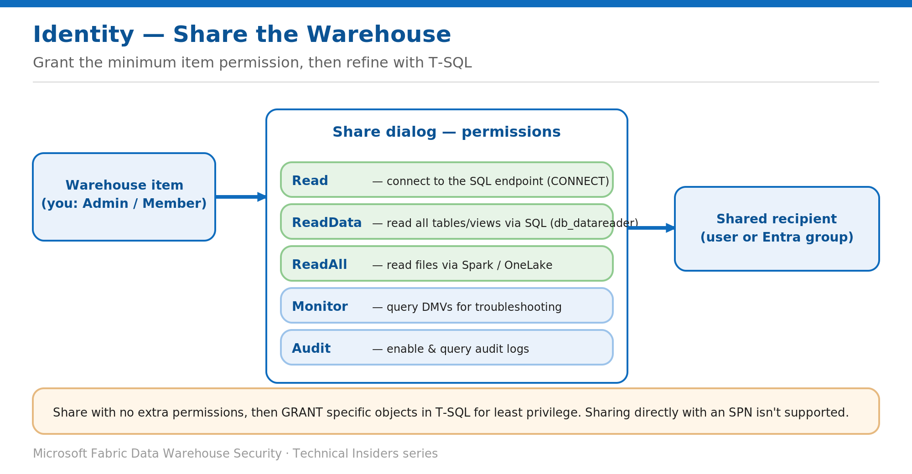

# Share the Warehouse and SQL Analytics Endpoint with Least Privilege

> Grant the minimum item permission, then refine object access with T-SQL.

*Series: Identity & access · Layer: Identity (4 of 5) · Audience: Fabric DW admins · Level 300*

This post shows you how to share a single Fabric **Warehouse** with a user or group — without giving them access to the rest of the workspace — and how to pick the right item permission so recipients get exactly the access they need.

## What you'll set up

- A Warehouse shared with a downstream consumer at the minimum permission level.
- Granular object access layered on with T-SQL where needed.
- A clear understanding of Read vs ReadData vs ReadAll.



*Figure 4 — The share dialog grants Read / ReadData / ReadAll / Monitor / Audit; combine Read with T-SQL grants for least privilege.*

## Prerequisites

- You are an **Admin** or **Member** of the workspace (required to share an item).
- The recipient is an Entra user or security group. (Sharing directly with a service principal isn't supported.)

## Step 1 — Share the Warehouse

1. In the workspace, hover the Warehouse row and select the **Share** quick action (or **Share** from the Warehouse item).
2. Choose the recipient (user or group) and whether to notify them by email.
3. Select the permissions to grant (next section), then **Grant access**.

## Step 2 — Choose the right permission

- **Read** (default, no extra options) — lets the recipient **connect** to the SQL analytics endpoint (equivalent to `CONNECT`). They can't query any object until you grant it in T-SQL.
- **ReadData** ("Read all data using SQL") — read all tables and views via T-SQL (equivalent to `db_datareader`).
- **ReadAll** ("Read all data using Apache Spark") — read the underlying files via Spark/OneLake. `ReadData` and `ReadAll` are **separate and don't overlap**.
- **Monitor** — query DMVs (e.g., `sys.dm_exec_requests`) for troubleshooting. **Audit** — enable and query audit logs. These can't be granted on their own.

## Step 3 — Least privilege with Read + T-SQL

For object-level access, share with **Read only** (no extra permissions), then grant specific objects in T-SQL:

```sql
-- After sharing the Warehouse with Read only:
GRANT SELECT ON OBJECT::dbo.DimProduct TO [partner@contoso.com];
```

> **Note** — Item-permission changes can take **up to two hours** to reach the SQL endpoint. They appear in **Manage permissions** immediately; recipients should sign out and back in.

## Validate

- A **Read-only** recipient connects but can't query until a T-SQL grant is added — confirm the query then succeeds.
- A **ReadData** recipient can read all tables/views. A **ReadAll** recipient can read files via a Spark notebook.
- Open **Manage permissions** (workspace → **…** → Manage permissions) to review who has what.

## Limitations & gotchas

- Recipients access the Warehouse via the **owner's identity** (delegated) — don't remove the owner from the workspace.
- Shared recipients get access to **that Warehouse only**, not other workspace items. For read/write collaboration, add them to a workspace role instead.
- Sharing a Warehouse is currently **UI-only**, and sharing directly with a **service principal** isn't supported.
- A recipient with "Read all data using SQL" gets a **read-only** editor and can create but not save queries.

## References

- [Share your data and manage permissions — Microsoft Learn](https://learn.microsoft.com/en-us/fabric/data-warehouse/share-warehouse-manage-permissions)
- [SQL granular permissions in Microsoft Fabric — Microsoft Learn](https://learn.microsoft.com/en-us/fabric/data-warehouse/sql-granular-permissions)
