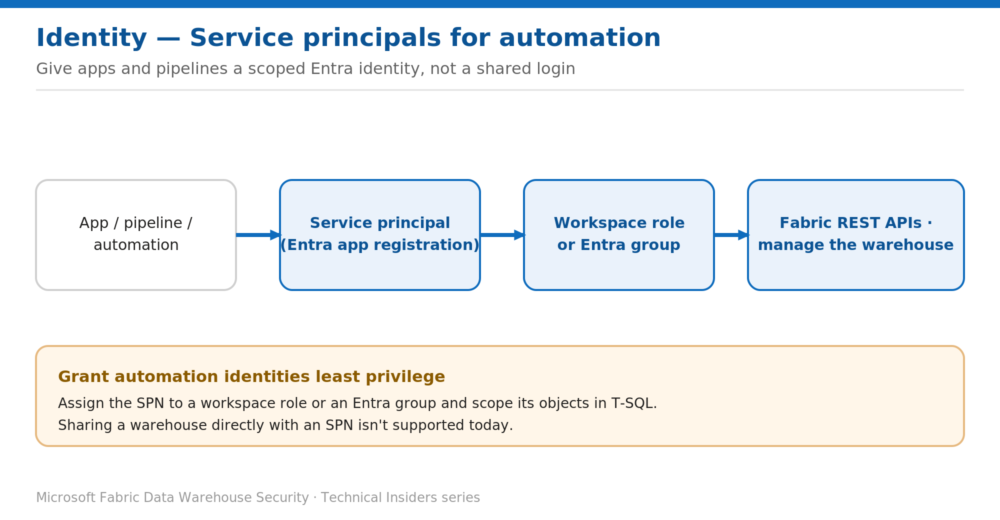

# Automate Warehouse Access with Service Principals

> Give apps and pipelines a scoped Entra identity instead of a user account.

*Series: Identity & access · Layer: Identity (5 of 5) · Audience: Fabric DW admins · Level 300*

This post shows you how to let applications, pipelines, and CI/CD automation reach a Fabric **Warehouse** using a **service principal** (Entra app registration) — with least privilege and no interactive sign-in.

## What you'll set up

- A service principal that can manage or query the Warehouse via the Fabric REST APIs and the SQL endpoint.
- The SPN scoped through a workspace role (or Entra group) plus T-SQL object grants.



*Figure 5 — A service principal is assigned to a workspace role (or Entra group) and scoped with T-SQL, not shared directly.*

## Prerequisites

- An Entra **app registration** (service principal) with a client secret or certificate.
- You are a workspace **Admin** (or Member) — Admin/Member/Contributor members can use service principals to manage warehouses via the Fabric REST APIs.
- The tenant admin has enabled service principal use for the relevant Fabric APIs, where required.

## Step 1 — Give the service principal workspace access

1. Add the service principal (or, preferably, an **Entra group** that contains it) to the workspace via **Manage access**.
2. Assign the least-privileged role for the task — **Viewer** for read/query automation, **Contributor** for build/deploy automation.
3. The SPN now inherits the same API-based permissions as a user in that role (Items REST API, Job Scheduler API, etc.).

> **Note** — Service principals (app registrations) can be assigned to workspace roles and to Entra groups. **Sharing a Warehouse directly with an SPN isn't supported** — grant access through a role or group instead.

## Step 2 — Scope the SPN's data access in T-SQL

Grant only the objects the automation needs (the SPN is auto-created as a database user on first grant):

```sql
-- Read-only automation: grant SELECT on just what it needs
GRANT SELECT ON SCHEMA::reporting TO [MyApp-SPN];

-- Or add the SPN to a scoped role
ALTER ROLE reporting_reader ADD MEMBER [MyApp-SPN];
```

## Step 3 — Connect the automation

1. Acquire an Entra token for the SPN (client credentials flow) targeting the Fabric/SQL resource.
2. Connect to the SQL connection string using the **Microsoft Entra Service Principal** authentication mode (or pass the token via the driver).
3. For control-plane tasks (create/refresh/deploy), call the **Fabric REST APIs** with the SPN token.

## Validate

- The SPN connects non-interactively and can query only its granted objects.
- A REST API call (e.g., list items) with the SPN token succeeds for its role.
- Rotate the client secret/certificate and confirm access continues with the new credential.

## Limitations & gotchas

- You **can't share a Warehouse directly with an SPN** — use a workspace role or Entra group.
- Only Admin/Member/Contributor members can drive warehouse management via SPNs and the REST APIs.
- Store secrets in a vault and rotate them; prefer certificates over long-lived secrets.
- Apply the same least-privilege T-SQL grants to SPNs as to users — an over-privileged automation identity is a prime exfiltration risk.

## References

- [Roles in workspaces in Microsoft Fabric — Microsoft Learn](https://learn.microsoft.com/en-us/fabric/fundamentals/roles-workspaces)
- [Share your data and manage permissions — Microsoft Learn](https://learn.microsoft.com/en-us/fabric/data-warehouse/share-warehouse-manage-permissions)
- [Security for data warehousing in Microsoft Fabric — Microsoft Learn](https://learn.microsoft.com/en-us/fabric/data-warehouse/security)
