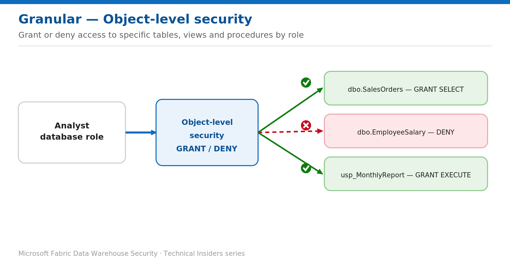

# Restrict Tables, Views, and Procedures with Object-Level Security

> Grant and deny access to specific database objects by role.

*Series: Granular data access · Layer: Data (1 of 5) · Audience: Fabric DW admins · Level 300*

This post shows you how to control which **objects** — tables, views, and stored procedures — a user or role can touch in a Fabric **Warehouse**, using T-SQL `GRANT`, `DENY`, and `REVOKE`. Object-level security is the foundation the row, column, and masking controls build on.

## What you'll set up

- A database role that can read only the objects it needs.
- Sensitive objects explicitly denied, and stored procedures exposed via EXECUTE.



*Figure 1 — Object-level security grants or denies access to specific tables, views, and stored procedures per role.*

## Prerequisites

- You hold elevated permissions on the Warehouse (Admin/Member/Contributor, or `CONTROL`).
- The consumer has (or will get) the Fabric **Read** permission so they can connect.

## Step 1 — Grant and deny at the object level

```sql
-- A role for the reporting team
CREATE ROLE report_reader;

-- Allow read on approved objects
GRANT SELECT ON OBJECT::dbo.SalesOrders TO report_reader;
GRANT SELECT ON OBJECT::dbo.vwSalesSummary TO report_reader;

-- Allow execution of an approved stored procedure
GRANT EXECUTE ON OBJECT::dbo.usp_MonthlyReport TO report_reader;

-- Explicitly block a sensitive table
DENY SELECT ON OBJECT::dbo.EmployeeSalary TO report_reader;

-- Add the consumer (auto-created on first grant)
ALTER ROLE report_reader ADD MEMBER [reporting@contoso.com];
```

> **Note** — Grant at the **schema** level (`GRANT SELECT ON SCHEMA::reporting TO report_reader;`) to cover every current and future object in that schema, then `DENY` the exceptions. `DENY` always overrides `GRANT`.

## Step 2 — Prefer roles and schemas

1. Group objects that share an access policy into a **schema**, and grant on the schema.
2. Assign permissions to **database roles**, then add Entra users or groups as members.
3. Reserve elevated Fabric roles (Admin/Member/Contributor) for the few who need `CONTROL`.

## Validate

Confirm what a connected user can actually reach:

```sql
SELECT * FROM sys.fn_my_permissions('dbo.EmployeeSalary', 'Object');  -- expect no SELECT
SELECT * FROM sys.fn_my_permissions('dbo.SalesOrders', 'Object');     -- expect SELECT
```

- Query a granted object — succeeds. Query a denied object — access is refused.

## Limitations & gotchas

- Object-level security controls **access to the object**, not which rows or columns are visible — layer RLS, CLS, and masking on top.
- Elevated roles with `CONTROL` bypass object restrictions — keep that group minimal.
- SQL grants don't allow a connection on their own; the user still needs Fabric **Read**.

## References

- [SQL granular permissions in Microsoft Fabric — Microsoft Learn](https://learn.microsoft.com/en-us/fabric/data-warehouse/sql-granular-permissions)
- [Security for data warehousing in Microsoft Fabric — Microsoft Learn](https://learn.microsoft.com/en-us/fabric/data-warehouse/security)
