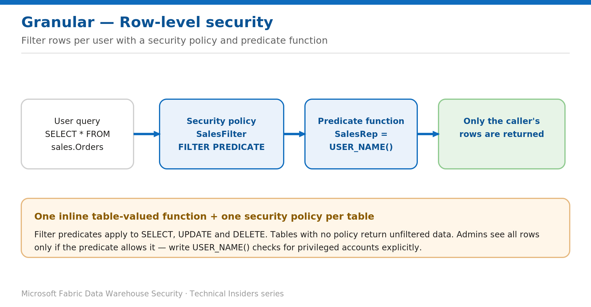

# Filter Rows per User with Row-Level Security

> Restrict which rows each identity can read with a security policy and predicate function.

*Series: Granular data access · Layer: Data (2 of 5) · Audience: Fabric DW admins · Level 300*

This post shows you how to enforce **row-level security (RLS)** in a Fabric **Warehouse**, so each user sees only the rows they're authorized for — enforced in the database tier and honored by every client, including Power BI.

## What you'll set up

- A predicate function that decides which rows an identity can see.
- A security policy that binds the predicate to the target table with a filter.



*Figure 2 — A security policy binds an inline table-valued predicate that filters rows by USER_NAME().*

## Prerequisites

- `ALTER ANY SECURITY POLICY` permission, and `ALTER` on the schema hosting the policy.
- For each predicate: `SELECT` and `REFERENCES` on the predicate function, and `REFERENCES` on the target table and the columns it uses.
- A dedicated **Security** schema to hold the predicate function (recommended).

## Step 1 — Create the predicate function

The predicate is an inline table-valued function that returns a row when access is allowed. This example lets each sales rep see their own rows, and a manager see all:

```sql
CREATE SCHEMA Security;
GO
CREATE FUNCTION Security.tvf_securitypredicate(@SalesRep AS varchar(100))
RETURNS TABLE
WITH SCHEMABINDING
AS
RETURN SELECT 1 AS result
       WHERE @SalesRep = USER_NAME()
          OR USER_NAME() = 'manager@contoso.com';
GO
```

## Step 2 — Bind it with a security policy

```sql
CREATE SECURITY POLICY SalesFilter
ADD FILTER PREDICATE Security.tvf_securitypredicate(SalesRep)
ON sales.Orders
WITH (STATE = ON);
GO
```

> **Modifying the predicate** — To change the function, **drop the policy first**, run `ALTER FUNCTION`, then recreate the policy. A schema-bound policy blocks changes to referenced columns while it exists.

## Validate

- Connect as a sales rep and `SELECT * FROM sales.Orders` — only their rows return.
- Connect as `manager@contoso.com` — all rows return.
- Filter predicates apply to **SELECT, UPDATE, and DELETE**; `INSERT` is allowed even if the new row would be filtered afterward.

## Limitations & gotchas

- **Each table needs its own policy.** A table with no policy returns unfiltered data.
- Policies apply to **all users, including `dbo` and admins** — write the predicate to allow privileged accounts (as in the example) if they must see all rows.
- In Power BI, a Warehouse in **Direct Lake** mode falls back to **DirectQuery** to honor RLS.
- Beware side-channel inference (e.g., divide-by-zero probing). Limit who can create/alter policies and predicate functions, and monitor changes.

## References

- [Row-level security in Fabric data warehousing — Microsoft Learn](https://learn.microsoft.com/en-us/fabric/data-warehouse/row-level-security)
- [SQL granular permissions in Microsoft Fabric — Microsoft Learn](https://learn.microsoft.com/en-us/fabric/data-warehouse/sql-granular-permissions)
