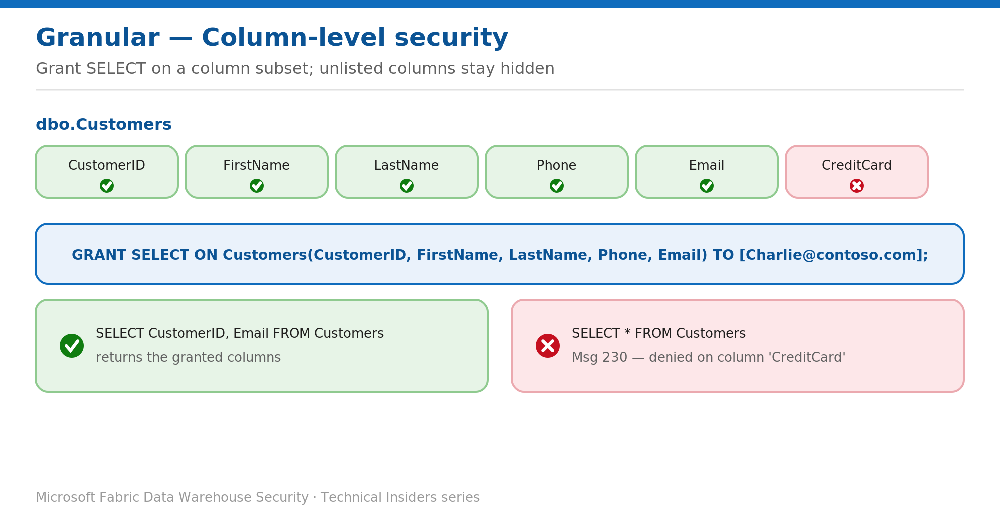

# Hide Sensitive Columns with Column-Level Security

> Grant SELECT on a column subset so unlisted columns stay out of reach.

*Series: Granular data access · Layer: Data (3 of 5) · Audience: Fabric DW admins · Level 300*

This post shows you how to restrict access to specific **columns** in a Fabric **Warehouse** table — so a user can read the non-sensitive columns while a column such as a credit-card number stays hidden — using a single T-SQL `GRANT`.

## What you'll set up

- A role or user granted SELECT on only the approved columns of a table.
- Sensitive columns withheld, with `SELECT *` failing rather than leaking them.



*Figure 3 — Granting SELECT on named columns exposes only those; querying a withheld column fails with Msg 230.*

## Prerequisites

- You hold elevated permissions on the Warehouse (Admin/Member/Contributor, or `CONTROL`).
- Only Microsoft Entra authentication is supported (the identity you grant to is an Entra user, group, or role).

## Step 1 — Grant SELECT on a column subset

Grant read on every column except the sensitive one — here `CreditCard` is withheld from Charlie:

```sql
-- Example table
CREATE TABLE dbo.Customers (
    CustomerID int, FirstName varchar(100) NULL,
    CreditCard char(16) NOT NULL, LastName varchar(100) NOT NULL,
    Phone varchar(12) NULL, Email varchar(100) NULL);

-- Grant read on the non-sensitive columns only
GRANT SELECT ON Customers(CustomerID, FirstName, LastName, Phone, Email)
    TO [Charlie@contoso.com];
```

> **Tip** — Grant to a **role** rather than an individual for easier management, then add members to the role.

## Validate

As Charlie, selecting the granted columns succeeds, but `SELECT *` (which includes `CreditCard`) fails:

```sql
-- Succeeds
SELECT CustomerID, FirstName, Email FROM Customers;

-- Fails: Msg 230, SELECT permission denied on column 'CreditCard'
SELECT * FROM Customers;
```

## Limitations & gotchas

- `SELECT *` **fails** if it includes a withheld column — update views and reports to list explicit columns.
- Column-level security applies to the Warehouse and SQL analytics endpoint; in Power BI, **Direct Lake** falls back to **DirectQuery** to honor it.
- Column grants control **visibility of the column**, not the sensitivity of the values shown — combine with dynamic data masking for partial exposure.
- Prefer granting to **roles** so the column policy is managed in one place.

## References

- [Column-level security in Fabric data warehousing — Microsoft Learn](https://learn.microsoft.com/en-us/fabric/data-warehouse/column-level-security)
- [SQL granular permissions in Microsoft Fabric — Microsoft Learn](https://learn.microsoft.com/en-us/fabric/data-warehouse/sql-granular-permissions)
