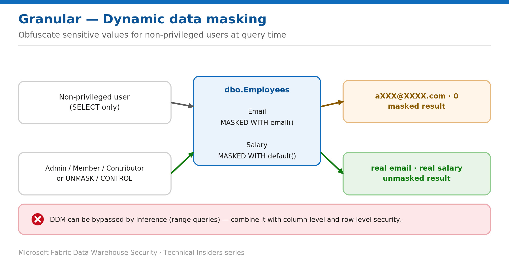

# Obfuscate Sensitive Values with Dynamic Data Masking

> Mask columns at query time for non-privileged users, with minimal application change.

*Series: Granular data access · Layer: Data (4 of 5) · Audience: Fabric DW admins · Level 300*

This post shows you how to apply **dynamic data masking (DDM)** to a Fabric **Warehouse**, so sensitive column values are obfuscated in query results for non-privileged users while the stored data is unchanged.

## What you'll set up

- Masking rules on sensitive columns (email, salary, phone, account number).
- `UNMASK` granted only to users who must see real values.



*Figure 4 — Non-privileged users see masked values; UNMASK / CONTROL (and Admin/Member/Contributor) see the real data.*

## Prerequisites

- To create a table with masks: `CREATE TABLE` and `ALTER` on the schema. To add/replace/remove a mask: `ALTER ANY MASK` and `ALTER` on the table.
- Grant `ALTER ANY MASK` to your security officer; grant `UNMASK` to users who may view real values.

## Step 1 — Add masks to columns

Apply a mask in the column definition or with `ALTER TABLE ... ALTER COLUMN`. Four functions are available — `default()`, `email()`, `random(a,b)`, and `partial(prefix,[padding],suffix)`:

```sql
-- On an existing table
ALTER TABLE dbo.Employees
    ALTER COLUMN Email ADD MASKED WITH (FUNCTION = 'email()');

ALTER TABLE dbo.Employees
    ALTER COLUMN Salary ADD MASKED WITH (FUNCTION = 'default()');

ALTER TABLE dbo.Employees
    ALTER COLUMN Phone ADD MASKED WITH (FUNCTION = 'partial(1,"XXXXXXX",0)');
```

## Step 2 — Control who sees unmasked data

```sql
-- Let a specific user see real values
GRANT UNMASK ON dbo.Employees TO [payroll@contoso.com];

-- Remove a mask when no longer needed
ALTER TABLE dbo.Employees ALTER COLUMN Phone DROP MASKED;
```

> **Note** — `CONTROL` on the database includes both `ALTER ANY MASK` and `UNMASK`. Workspace **Admin, Member, and Contributor** roles hold `CONTROL` by design, so they always see unmasked data.

## Validate

- A non-privileged user (SELECT only) queries `Email`/`Salary` — sees `aXXX@XXXX.com` and `0`.
- A user with `UNMASK` (or CONTROL) sees the real values.
- Confirm the masks with `sys.masked_columns`.

## Limitations & gotchas

- **DDM alone isn't a security boundary.** A user with query access can infer masked values with range queries (e.g., `WHERE Salary > 99999 AND Salary < 100001`).
- Always combine DDM with **column-level** and **row-level** security and least-privilege object permissions.
- Admin/Member/Contributor and any `CONTROL`/`UNMASK` holder bypass masking — scope those grants tightly.
- Masks apply to query results only; the stored data is unchanged.

## References

- [Dynamic data masking in Fabric Data Warehouse — Microsoft Learn](https://learn.microsoft.com/en-us/fabric/data-warehouse/dynamic-data-masking)
- [SQL granular permissions in Microsoft Fabric — Microsoft Learn](https://learn.microsoft.com/en-us/fabric/data-warehouse/sql-granular-permissions)
