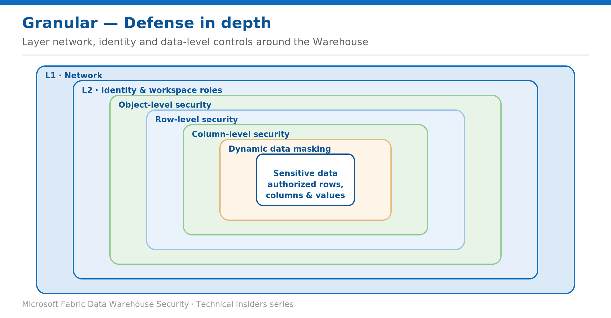

# Layer OLS, RLS, CLS, and Masking for Defense in Depth

> Combine the granular controls on one sensitive table and validate they hold together.

*Series: Granular data access · Layer: Data (5 of 5) · Audience: Fabric DW admins · Level 300*

This post shows you how to combine **object-level security, row-level security, column-level security, and dynamic data masking** on a single sensitive table in a Fabric **Warehouse** — and how to validate that the layers reinforce each other rather than leaving a gap.

## What you'll set up

- One sensitive table protected by all four granular controls, applied in the right order.
- A validation pass proving a non-privileged user is filtered, column-limited, and masked.



*Figure 5 — Object, row, column, and masking controls nest around the data on top of the network and identity layers.*

## Prerequisites

- You've read the OLS, RLS, CLS, and DDM posts in this batch — this post assembles them.
- Elevated permissions on the Warehouse, and a target table with sensitive rows and columns.

## Apply the layers in order

Build outward-in: object access first, then row filtering, then column restriction, then masking of what remains visible.

### 1 · Object-level security — who can touch the table

```sql
GRANT SELECT ON OBJECT::sales.Orders TO analyst_role;
DENY SELECT ON OBJECT::dbo.EmployeeSalary TO analyst_role;
```

### 2 · Row-level security — which rows they see

```sql
CREATE SECURITY POLICY SalesFilter
ADD FILTER PREDICATE Security.tvf_securitypredicate(SalesRep)
ON sales.Orders WITH (STATE = ON);
```

### 3 · Column-level security — which columns they see

```sql
GRANT SELECT ON sales.Orders(SaleID, SalesRep, ProductName, SaleDate)
    TO analyst_role;   -- SaleAmount withheld
```

### 4 · Dynamic data masking — obfuscate what remains

```sql
ALTER TABLE sales.Orders
    ALTER COLUMN SalesRep ADD MASKED WITH (FUNCTION = 'email()');
```

## How the layers interact

- **Order matters conceptually, not syntactically** — a query must pass object access, then row filter, then column grant, and finally masking is applied to the values returned.
- **Admins bypass more than you think.** Workspace Admin/Member/Contributor hold `CONTROL`, so they see unmasked data and (unless the RLS predicate allows them) still need the predicate written to include them. Keep elevated roles minimal.
- **DDM is the softest layer.** Because it can be inferred, it must sit behind CLS/RLS/OLS, never stand alone.
- **RLS is per-table.** Every sensitive table needs its own policy; a missing policy means unfiltered rows.

## Validate the whole stack

Connect as a non-privileged analyst and confirm every layer holds:

```sql
-- Effective permissions
SELECT * FROM sys.fn_my_permissions('sales.Orders', 'Object');

-- Rows filtered (only the caller's), columns limited, values masked
SELECT * FROM sales.Orders;          -- fails if it includes a withheld column
SELECT SaleID, SalesRep FROM sales.Orders;  -- rows filtered; SalesRep masked
```

- Rows: only the analyst's rows return (RLS).
- Columns: `SaleAmount` is unavailable; `SELECT *` errors (CLS).
- Values: `SalesRep` shows masked (DDM) unless the analyst holds `UNMASK`.
- Denied objects stay inaccessible (OLS).

## Limitations & gotchas

- Test with a **real non-privileged Entra account** — elevated roles bypass masking and, potentially, RLS.
- Document each table's controls; a table added later with no policy is an open door.
- Layer these data controls on top of the **network** (Batch 1) and **identity** (this batch) layers — defense in depth spans all three.

## References

- [Security for data warehousing in Microsoft Fabric — Microsoft Learn](https://learn.microsoft.com/en-us/fabric/data-warehouse/security)
- [Row-level security in Fabric data warehousing — Microsoft Learn](https://learn.microsoft.com/en-us/fabric/data-warehouse/row-level-security)
- [Column-level security in Fabric data warehousing — Microsoft Learn](https://learn.microsoft.com/en-us/fabric/data-warehouse/column-level-security)
- [Dynamic data masking in Fabric Data Warehouse — Microsoft Learn](https://learn.microsoft.com/en-us/fabric/data-warehouse/dynamic-data-masking)
