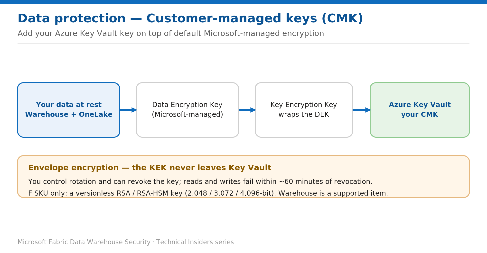

# Encrypt the Warehouse with Customer-Managed Keys

> Add your Azure Key Vault key on top of Fabric's default at-rest encryption.

*Series: Data protection · Layer: Data protection (1 of 5) · Audience: Fabric DW admins · Level 300*

Fabric encrypts all data at rest by default with Microsoft-managed keys. This post shows you how to add **customer-managed keys (CMK)** to a workspace that contains a Warehouse, so both OneLake data and warehouse metadata are protected with **your** Azure Key Vault key — and you control rotation and revocation.

## What you'll set up

- CMK enabled on the workspace, referencing your Azure Key Vault key.
- Envelope encryption in place (your KEK wraps the data encryption key).
- You in control of key rotation and revocation.



*Figure 1 — Envelope encryption: your Key Vault KEK wraps the data encryption key protecting OneLake data and warehouse metadata.*

## Prerequisites

- You are a **workspace admin**, and the workspace is on a **Fabric capacity (F SKU)** — trial capacities aren't supported for CMK.
- A Fabric administrator has enabled the tenant setting **Apply customer-managed keys**.
- An **Azure Key Vault** (or Managed HSM) with **Soft delete** and **Purge protection** enabled.
- A **versionless RSA / RSA-HSM** key (2,048 / 3,072 / 4,096-bit). Note: 4,096-bit isn't supported for SQL database in Fabric.

## Step 1 — Prepare Entra and Key Vault

1. Have a Fabric admin enable the **Apply customer-managed keys** tenant setting.
2. Create a service principal for the **Fabric Platform CMK** app (app ID `61d6811f-7544-4e75-a1e6-1c59c0383311`) in your Entra tenant.
3. In Key Vault, enable **Soft delete** and **Purge protection**.
4. In Key Vault → **Access control (IAM)**, assign the **Fabric Platform CMK** app the **Key Vault Crypto Service Encryption User** role (get, wrapKey, unwrapKey).
5. Create a **versionless** RSA/RSA-HSM key and copy its key identifier.

```text
-- Versionless key identifier format
https://<vault-name>.vault.azure.net/keys/<key-name>
-- Managed HSM:
https://<hsm-name>.managedhsm.azure.net/keys/<key-name>
```

## Step 2 — Enable CMK on the workspace

1. Open **Workspace settings → Encryption**.
2. Enable **Apply customer-managed keys**.
3. Paste the **Key identifier** and select **Apply**.
4. Watch the status — **Active**, **In progress**, or **Failed** — on the Encryption tab. Keep the key active while status is In progress.

## Validate

- The Encryption tab shows **Active**; existing and future items in the workspace, and all OneLake data, are encrypted with your key.
- Configuration requests appear in the audit log as `ApplyWorkspaceEncryption`, `DisableWorkspaceEncryption`, and `GetWorkspaceEncryption`.

## Rotate & revoke

- **Rotate:** Fabric checks Key Vault daily and uses the latest key version. Wait **24 hours** before disabling the previous version so access isn't interrupted.
- **Revoke:** revoke the key in Key Vault — read and write calls fail within **60 minutes**. Restore access in Key Vault to reinstate.
- **Disable CMK:** Workspace settings → disable **Apply customer-managed keys**; the workspace reverts to Microsoft-managed keys.

## Limitations & gotchas

- **F SKU only**; trial capacities can't use CMK.
- A CMK workspace can only contain **supported items** (Warehouse is supported); create unsupported items elsewhere.
- Some metadata isn't protected by CMK (e.g., certain lakehouse column names/table format, Spark temp data, pipeline/model metadata).
- Once the tenant setting is turned **off**, you can no longer enable/disable CMK for workspaces in that tenant.

## References

- [Customer-managed keys for Fabric workspaces — Microsoft Learn](https://learn.microsoft.com/en-us/fabric/security/workspace-customer-managed-keys)
- [Data encryption in Fabric Data Warehouse — Microsoft Learn](https://learn.microsoft.com/en-us/fabric/data-warehouse/encryption)
