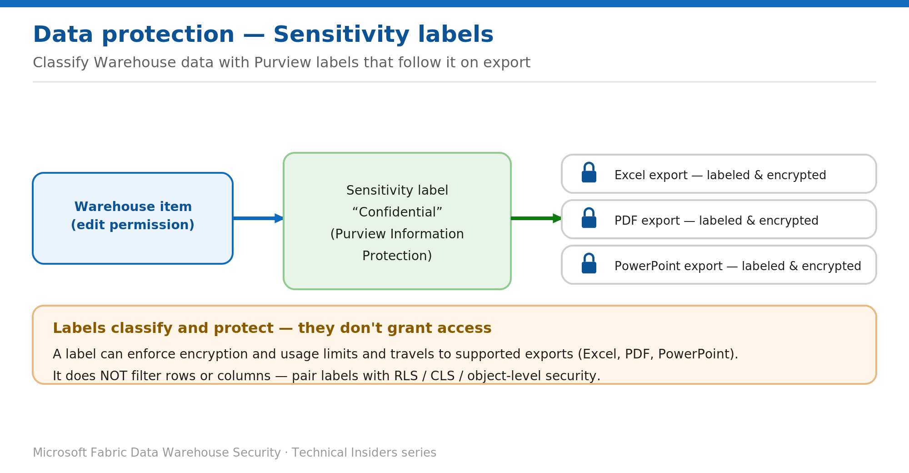

# Classify and Protect Warehouse Data with Sensitivity Labels

> Apply Purview Information Protection labels that follow the data on export.

*Series: Data protection · Layer: Data protection (2 of 5) · Audience: Fabric DW admins · Level 300*

This post shows you how to apply **Microsoft Purview Information Protection** sensitivity labels to a Fabric Warehouse, so the data is classified and — where the label enforces it — encrypted and usage-restricted, with the label following the data into Excel, PDF, and PowerPoint exports.

## What you'll set up

- A sensitivity label applied to the Warehouse item.
- Label-driven encryption/usage limits carried into supported exports.

*Figure 2 — A sensitivity label classifies the Warehouse and travels — with encryption — into supported exports.*

## Prerequisites

- An appropriate **Microsoft Purview Information Protection** license.
- Sensitivity labels **defined and published** in Purview and **enabled** on the Fabric tenant.
- A **Power BI Pro or Premium Per-User** license and **Edit** permission on the item you want to label.

## Step 1 — Apply a label

1. Open the Warehouse. Select the **sensitivity indication** in the item header to open the flyout, or open the item's **Settings → Sensitivity** section.
2. Choose the label (for example, **Confidential**) and save.

## Step 2 — Scale coverage with policies

- Use a **default label policy** so new items get a label automatically, and a **mandatory label policy** to require a label before saving.
- Rely on **downstream inheritance** so items built on the Warehouse carry its classification.

## Validate

- The label appears in the item header.
- Export to **Excel / PDF / PowerPoint** and confirm the label — and any encryption it enforces — travels with the file.

## Limitations & gotchas

- **Labels classify and protect — they don't grant or restrict data access.** They don't filter rows or columns; pair them with RLS / CLS / object-level security.
- Label-based **access control** applies only within the tenant, in .pbix files, and in supported export paths — **not** cross-tenant or to .csv/.txt exports.
- Licensing is required to apply and to view protected labels.

## References

- [Information protection in Microsoft Fabric — Microsoft Learn](https://learn.microsoft.com/en-us/fabric/governance/information-protection)
- [Apply sensitivity labels to Fabric items — Microsoft Learn](https://learn.microsoft.com/en-us/fabric/fundamentals/apply-sensitivity-labels)
