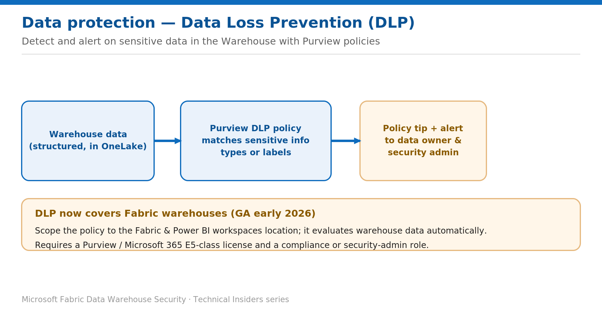

# Detect Sensitive Data in the Warehouse with DLP Policies

> Use Purview Data Loss Prevention to flag sensitive data in Fabric warehouses.

*Series: Data protection · Layer: Data protection (3 of 5) · Audience: Fabric DW admins · Level 300*

This post shows you how to configure a **Microsoft Purview Data Loss Prevention (DLP)** policy that evaluates Fabric warehouse data for sensitive information and raises policy tips and alerts. DLP now covers Fabric warehouses (generally available, early 2026).

## What you'll set up

- A DLP policy scoped to your Fabric & Power BI workspaces.
- Rules that detect sensitive info types or labels and alert data owners and security admins.

*Figure 3 — A Purview DLP policy evaluates warehouse data for sensitive info types or labels and raises alerts and policy tips.*

## Prerequisites

- Your account is in one of these roles: **Compliance administrator**, **Compliance data administrator**, **Information Protection (Admin)**, or **Security administrator**.
- A qualifying license: **Microsoft 365 E5**, **E5 Compliance**, or **E5 Information Protection & Governance**.
- Target workspaces are on **Fabric or Premium** capacity (required for DLP actions).

## Step 1 — Create the policy

1. In the **Microsoft Purview portal**, open **Data loss prevention → Policies → + Create policy**.
2. Choose the **Custom** category and **Custom** template. Select **Next**.
3. Name the policy and add a description. Select **Next** (skip **Assign admin units** — not supported).
4. Set the location to **Fabric and Power BI workspaces** (the only supported location). Keep all workspaces, or select **Edit** to include/exclude specific ones. Select **Next**.

## Step 2 — Define the rule

1. Choose **Create or customize advanced DLP rules → Create rule**.
2. Under **Conditions**, add **Content contains → Sensitive info types** or **Sensitivity labels**, then pick the types/labels to detect.
3. For a sensitive info type, set the **instance count** (1–500) and the **confidence** level.
4. Under **Actions**, configure **alerts and policy tips** to data owners and security admins. Save the rule and turn the policy **on**.

## Validate

- Introduce sensitive data into an in-scope warehouse and confirm a **policy tip / alert** is raised.
- Review matches in the DLP **alerts** and monitoring experience in Purview.

## Limitations & gotchas

- Only the **Fabric and Power BI workspaces** location is supported; admin units aren't supported.
- DLP **actions** apply only to workspaces on Fabric/Premium capacity.
- Existing DLP policies scoped to Fabric & Power BI **automatically** extend to warehouses (enabled by default) — review scope and billing.

## References

- [Configure data loss prevention policies for Fabric — Microsoft Learn](https://learn.microsoft.com/en-us/fabric/governance/data-loss-prevention-configure)
