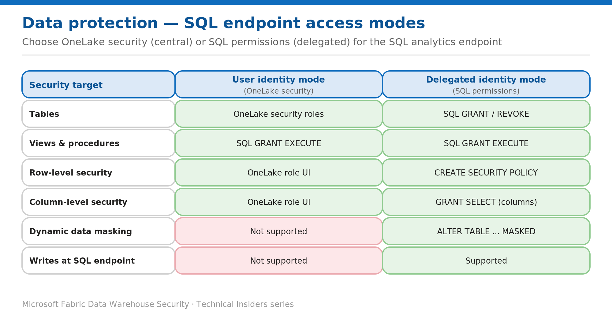

# Choose the SQL Endpoint Access Mode: OneLake Security or SQL Permissions

> Enforce data access centrally in OneLake, or granularly with SQL permissions.

*Series: Data protection · Layer: Data protection (4 of 5) · Audience: Fabric DW admins · Level 300*

This post shows you how the **SQL analytics endpoint** enforces data access in two modes — **user identity mode** (OneLake security) and **delegated identity mode** (SQL permissions) — how to switch to OneLake security, and when to use each. A Fabric **Warehouse** uses SQL-based (delegated) security; a SQL analytics endpoint over a lakehouse can opt into OneLake security.

## What you'll set up

- A clear decision between OneLake-central and SQL-delegated enforcement.
- OneLake security enabled (user identity mode) where central governance is preferred, with data access roles defined.

*Figure 4 — User identity mode enforces via OneLake roles; delegated identity mode enforces via SQL permissions.*

## Prerequisites

- **Admin or Member** (Write + Reshare) to create OneLake security roles.
- **Read** on the artifact to connect to the SQL analytics endpoint — required regardless of any SQL permissions.

## Choose the mode

- **User identity mode (OneLake security):** table access is governed by **OneLake roles**; SQL `GRANT`/`REVOKE` on tables is ignored; RLS/CLS/object-level security are defined in the **OneLake UI**; **dynamic data masking isn't supported**; writes aren't supported at the SQL endpoint. Best for **central governance** enforced consistently across SQL, Spark, and Power BI.
- **Delegated identity mode (SQL permissions):** full control with SQL `GRANT`/`REVOKE`, custom roles, RLS via `CREATE SECURITY POLICY`, and dynamic data masking. Best for **traditional SQL** security. (This is how a Fabric Warehouse works — see the identity and granular-access batches.)
- Views, stored procedures, and functions use **SQL `GRANT EXECUTE`** in **both** modes.

## Enable OneLake security (user identity mode)

1. Open the **SQL analytics endpoint** and select the **Security** tab.
2. Select **View data access mode → Data access mode settings**.
3. Select **Use OneLake security for tables (User's identity access mode)** → **Apply** → **Continue**.

> **Note** — You only need to switch a SQL analytics endpoint to user's identity mode **once**. Endpoints left in delegated mode continue to evaluate permissions with SQL.

## Create OneLake security roles

1. In the data item (for example, a lakehouse), open **Manage OneLake data access → New role**.
2. Add the **tables/folders** the role can read, and optionally add **row- or column-level** rules.
3. Add members (users or groups). **Remove them from the `DefaultReader` role** (or delete it / remove `ReadAll`) so they only get role-scoped access.

## Validate

- A role member sees only the permitted tables/rows/columns across **SQL, Spark, and Power BI**; a non-member sees no data.
- Confirm the endpoint's mode on the **Security** tab.

## Limitations & gotchas

- In user identity mode: **no writes** at the SQL endpoint, **DDM not supported**, and table `GRANT`/`REVOKE` is ignored.
- Artifact **Read** is always required to connect — SQL permissions alone don't admit a connection.
- Watch the **`DefaultReader`** role — leaving a user in it grants full data access.

## References

- [OneLake security for SQL analytics endpoints — Microsoft Learn](https://learn.microsoft.com/en-us/fabric/onelake/security/sql-analytics-endpoint-onelake-security)
- [Get started with OneLake security — Microsoft Learn](https://learn.microsoft.com/en-us/fabric/onelake/security/get-started-onelake-security)
