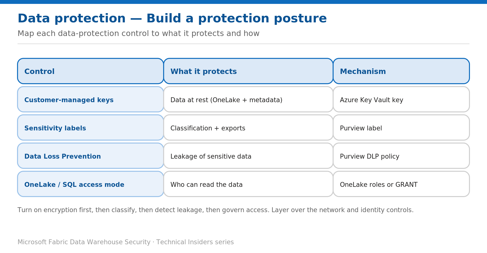

# Assemble a Data-Protection Posture for the Warehouse

> Sequence encryption, classification, leakage detection, and access governance.

*Series: Data protection · Layer: Data protection (5 of 5) · Audience: Fabric DW admins · Level 300*

This post shows you how to combine the data-protection controls — **customer-managed keys, sensitivity labels, DLP, and the SQL/OneLake access mode** — into a coherent posture for a Fabric Warehouse, and the order to roll them out on top of the network and identity layers.

## What you'll set up

- A rollout order for the data-protection controls.
- A control map you can use as a review checklist.

*Figure 5 — Each data-protection control mapped to what it protects and the mechanism behind it.*

## Roll out in this order

1. **Encryption at rest** — confirm default Microsoft-managed encryption is in place; add **customer-managed keys** where compliance requires you to control the key (Post 1).
2. **Classification** — apply **sensitivity labels** (with default/mandatory policies) so data carries its classification and stays protected on export (Post 2).
3. **Leakage detection** — scope a **DLP policy** to your Fabric & Power BI workspaces to flag sensitive data (Post 3).
4. **Access governance** — choose the **SQL endpoint access mode** (OneLake security vs SQL), then apply the granular controls — object, row, column, and masking (Batch 3).

## Control map — what each protects

- **Customer-managed keys** → data at rest (OneLake + warehouse metadata) → your Azure Key Vault key.
- **Sensitivity labels** → classification and protection on export → Purview Information Protection label.
- **Data Loss Prevention** → leakage of sensitive data → Purview DLP policy.
- **OneLake / SQL access mode** → who can read the data → OneLake roles or T-SQL `GRANT`.

## Validate the posture

- Encryption status is **Active** (CMK) where required.
- Sensitive Warehouses carry a **sensitivity label**; default/mandatory policies are on.
- A **DLP policy** covers the workspaces and raises alerts on test data.
- The **access mode** is chosen deliberately, and RLS/CLS/DDM/OLS are applied to sensitive tables.
- **SQL audit logs** are enabled (see the governance batch).

## Limitations & gotchas

- Labels and DLP require **Purview/M365 licensing**; CMK is **F SKU only**.
- These data-protection controls **layer over** the network (Batch 1) and identity (Batch 2) controls — none replaces another.
- Classification and leakage detection are **not** access controls — always pair them with the granular access controls in Batch 3.

## References

- [Security for data warehousing in Microsoft Fabric — Microsoft Learn](https://learn.microsoft.com/en-us/fabric/data-warehouse/security)
- [Information protection in Microsoft Fabric — Microsoft Learn](https://learn.microsoft.com/en-us/fabric/governance/information-protection)
- [Configure data loss prevention policies for Fabric — Microsoft Learn](https://learn.microsoft.com/en-us/fabric/governance/data-loss-prevention-configure)
- [Customer-managed keys for Fabric workspaces — Microsoft Learn](https://learn.microsoft.com/en-us/fabric/security/workspace-customer-managed-keys)
