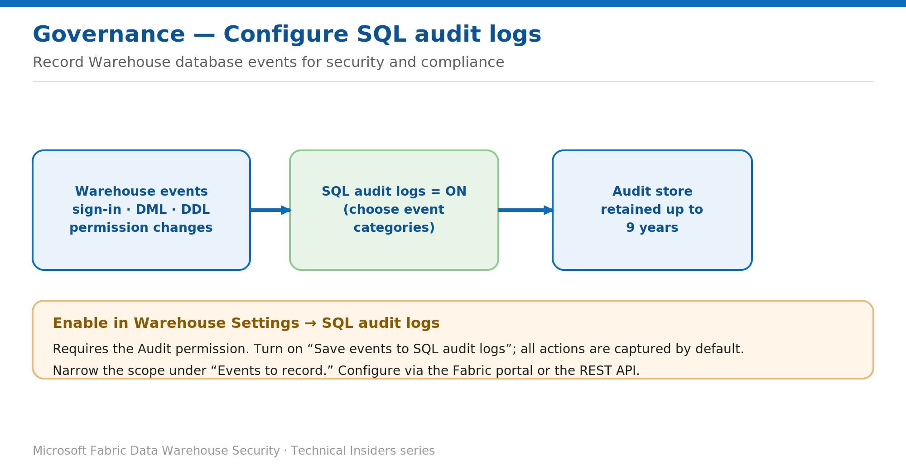

# Configure SQL Audit Logs for the Warehouse

> Record database events for security investigations and compliance.

*Series: Governance & monitoring · Layer: Governance (1 of 5) · Audience: Fabric DW admins · Level 300*

This post shows you how to enable and scope **SQL audit logs** on a Fabric Warehouse so database events — sign-ins, DML and DDL, and permission changes — are captured for later review and compliance.

## What you'll set up

- SQL audit logging enabled on the Warehouse.
- Event categories scoped to what you actually need to retain.

*Figure 1 — Warehouse events are captured to the SQL audit log with configurable event categories and retention.*

## Prerequisites

- A Fabric workspace on an **active or trial capacity**, with access to the Warehouse item.
- The **Audit** permission on the Warehouse — required to configure and query audit logs.

## Step 1 — Enable SQL audit logs

1. Open the Warehouse item's **Settings** and select the **SQL audit logs** page.
2. Enable **Save events to SQL audit logs**. By default, all actions are captured and retained for **nine years**.
3. Under **Events to record**, select only the event categories or audit action groups you need.

> **Note** — You can configure SQL audit logs in the **Fabric portal** or via the **REST API**. Scope the events you capture to control volume and retention.

## Step 2 — Query the audit logs

- Query the captured audit events to review who performed which actions on the Warehouse.
- Correlate audit events with query activity (see the monitoring post) to reconstruct a full picture.

## Validate

- Perform an audited action (for example, a permission change) and confirm it appears in the audit logs.
- Confirm the enabled event categories match your compliance requirements.

## Limitations & gotchas

- The **Audit** permission is required to both configure and query the logs.
- Capturing **all** actions for nine years can be high-volume — scope **Events to record** deliberately.

## References

- [Configure SQL audit logs in Fabric Data Warehouse — Microsoft Learn](https://learn.microsoft.com/en-us/fabric/data-warehouse/configure-sql-audit-logs)
- [Security for data warehousing in Microsoft Fabric — Microsoft Learn](https://learn.microsoft.com/en-us/fabric/data-warehouse/security)
