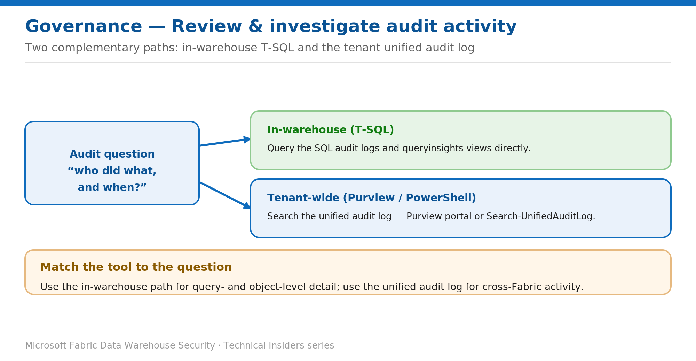

# Review and Investigate Warehouse Audit Activity

> Two complementary paths: in-warehouse T-SQL and the tenant unified audit log.

*Series: Governance & monitoring · Layer: Governance (2 of 5) · Audience: Fabric DW admins · Level 300*

This post shows you how to answer **"who did what, and when"** for a Fabric Warehouse — using the **in-warehouse** SQL audit logs and query insights for query- and object-level detail, and the **tenant unified audit log** (Purview or PowerShell) for cross-Fabric activity.

## What you'll set up

- A repeatable way to trace warehouse actions to a user and time.
- The right tool for each question — in-warehouse vs tenant-wide.



*Figure 2 — Use in-warehouse T-SQL for query/object detail and the unified audit log for cross-Fabric activity.*

## Prerequisites

- The **Audit** permission on the Warehouse (for SQL audit logs) and **SQL audit logs enabled** (previous post).
- Appropriate Purview / audit roles to search the tenant **unified audit log**.

## Path A — In-warehouse (T-SQL)

Use this for query- and object-level detail. Query the SQL audit logs, and use query insights to see who ran what:

```sql
-- Who ran queries in the last 30 minutes (as the current user)
SELECT * FROM queryinsights.exec_requests_history
WHERE start_time >= DATEADD(MINUTE, -30, GETUTCDATE())
  AND login_name = USER_NAME();
```

## Path B — Tenant-wide (Purview / PowerShell)

- In the **Microsoft Purview portal**, open **Audit** and search by activity, user, and date range — Fabric operations surface in the unified audit log.
- For automation, search the unified audit log with **`Search-UnifiedAuditLog`** (Exchange Online PowerShell).
- Use this path for **cross-Fabric** activity (sharing, permission changes, item operations) beyond a single warehouse.

## Validate

- Take a known action and locate it in **both** paths.
- Confirm the acting identity resolves to the expected Entra user or service principal.

## Limitations & gotchas

- The unified audit log has ingestion latency — recent events may take time to appear.
- Query insights covers **user queries only**, over a **30-day** window; full query text is visible to Admin/Member/Contributor.
- Searching the unified audit log requires the appropriate audit role.

## References

- [Configure SQL audit logs in Fabric Data Warehouse — Microsoft Learn](https://learn.microsoft.com/en-us/fabric/data-warehouse/configure-sql-audit-logs)
- [Security for data warehousing in Microsoft Fabric — Microsoft Learn](https://learn.microsoft.com/en-us/fabric/data-warehouse/security)
