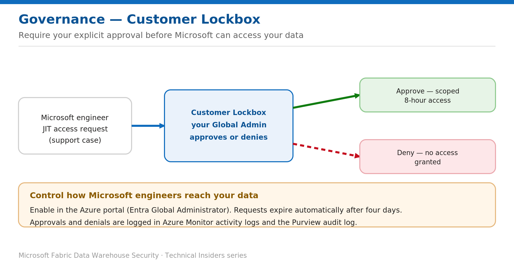

# Control Microsoft Access with Customer Lockbox

> Require explicit approval before Microsoft engineers can access your data.

*Series: Governance & monitoring · Layer: Governance (3 of 5) · Audience: Fabric DW admins · Level 300*

This post shows you how to enable **Customer Lockbox** for Microsoft Fabric, so that in the rare cases a Microsoft engineer needs access to your data to resolve a support issue, your organization must **explicitly approve** the request.

## What you'll set up

- Customer Lockbox enabled for your tenant.
- A clear approve/deny workflow, with the actions logged.

*Figure 3 — A Microsoft engineer's just-in-time request must be approved by your Global Administrator before any access.*

## Prerequisites

- You are a **Microsoft Entra Global Administrator** (required to enable Lockbox and, for tenant-scope requests, to approve).

## Step 1 — Enable Customer Lockbox

1. Open the **Azure portal** and go to **Customer Lockbox for Microsoft Azure**.
2. On the **Administration** tab, select **Enabled**.

## Step 2 — Approve or deny a request

1. When Microsoft needs access, the Global Administrator receives a **pending access request** email and becomes the designated approver.
2. Sign in to the **Azure portal** and open **Customer Lockbox → Pending Requests**; select the request to see its scope.
3. Enter a **justification** and select **Approve** (grants a default **8-hour** access window) or **Deny**.
4. If no one acts, the request **expires after four days** and no access is granted.

## Validate

- Review the **Customer Lockbox logs**: **Azure Monitor activity logs** (Create / Approve / Deny / Expiry) and the **Purview audit log**.
- Confirm approver actions are recorded for later audit.

## Limitations & gotchas

- The approver must have an **active Global Administrator** role before the request is initiated, or the request may not be visible.
- Some scenarios **don't** trigger Lockbox — e.g., emergency service-recovery situations, or incidental exposure during platform troubleshooting.
- Approvals grant a **time-boxed** window (default 8 hours); access is revoked automatically afterward.

## References

- [Customer Lockbox for Microsoft Fabric — Microsoft Learn](https://learn.microsoft.com/en-us/fabric/security/security-lockbox)
