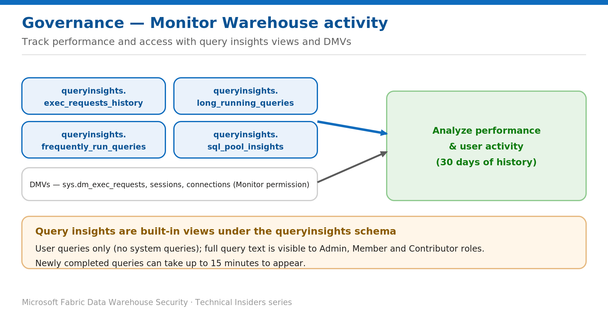

# Monitor Warehouse Activity with Query Insights and DMVs

> Track performance and user activity from built-in views.

*Series: Governance & monitoring · Layer: Governance (4 of 5) · Audience: Fabric DW admins · Level 300*

This post shows you how to monitor query performance and user activity on a Fabric Warehouse using the built-in **query insights** views and **dynamic management views (DMVs)** — useful for both tuning and security review.

## What you'll set up

- Visibility into recent queries, top consumers, and long-running statements.
- Live insight into connections, sessions, and requests via DMVs.



*Figure 4 — Query insights views and DMVs surface who ran what, how long it took, and how the pool behaved.*

## Prerequisites

- Access to the Warehouse or SQL analytics endpoint on a **Premium/F capacity**, with **Contributor** or higher.
- Full query text is visible to **Admin, Member, and Contributor** roles. The **Monitor** permission is needed to query DMVs.

## Step 1 — Query the query insights views

The `queryinsights` schema exposes autogenerated views with 30 days of history (user queries only):

```sql
-- Queries you ran in the last 30 minutes
SELECT * FROM queryinsights.exec_requests_history
WHERE start_time >= DATEADD(MINUTE, -30, GETUTCDATE())
  AND login_name = USER_NAME();

-- Top 100 queries by allocated CPU time
SELECT TOP 100 distributed_statement_id, query_hash,
       allocated_cpu_time_ms, label, command
FROM queryinsights.exec_requests_history
ORDER BY allocated_cpu_time_ms DESC;

-- Long-running queries matching a label/substring
SELECT * FROM queryinsights.long_running_queries
ORDER BY median_total_elapsed_time_ms DESC;
```

Other views: `queryinsights.exec_sessions_history`, `queryinsights.frequently_run_queries`, and `queryinsights.sql_pool_insights` (pool pressure and configuration changes).

## Step 2 — Use DMVs for live activity

- Query DMVs such as `sys.dm_exec_requests`, plus session and connection DMVs, to see **in-flight** connections, sessions, and requests.
- DMV access requires the **Monitor** permission.

## Validate

- Run a query, then find it in `queryinsights.exec_requests_history` (it can take **up to 15 minutes** to appear).
- Confirm you can identify the **most active users** and any **long-running** or high-CPU queries.

## Limitations & gotchas

- Query insights covers **user queries only** — system queries aren't stored.
- History is retained **30 days**; newly completed queries can take **up to 15 minutes** to surface.
- Full query text is visible only to **Admin/Member/Contributor** roles.

## References

- [Query insights in Fabric Data Warehouse — Microsoft Learn](https://learn.microsoft.com/en-us/fabric/data-warehouse/query-insights)
- [Share your data and manage permissions — Microsoft Learn](https://learn.microsoft.com/en-us/fabric/data-warehouse/share-warehouse-manage-permissions)
