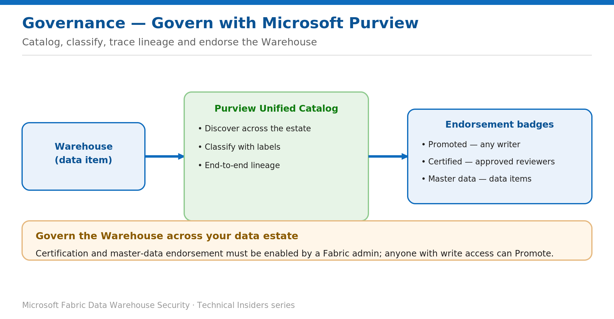

# Govern the Warehouse with Microsoft Purview

> Discover, classify, trace lineage, and endorse across your data estate.

*Series: Governance & monitoring · Layer: Governance (5 of 5) · Audience: Fabric DW admins · Level 300*

This post shows you how to bring a Fabric Warehouse under estate-wide governance with **Microsoft Purview** — discovery and classification in the **Unified Catalog**, end-to-end **lineage**, and **endorsement** so consumers can find trusted, authoritative data.

## What you'll set up

- The Warehouse discoverable and classified in the Purview Unified Catalog.
- An endorsement badge (Promoted or Certified) that signals trust.

*Figure 5 — The Warehouse surfaces in the Purview Unified Catalog and can carry an endorsement badge for trust.*

## Prerequisites

- Microsoft Purview integration enabled for your Fabric tenant.
- **Write** permission on the item to Promote it; a Fabric admin must **enable certification** (and specify reviewers) for Certified.

## Step 1 — Discover and classify in the Unified Catalog

- Fabric items — including the Warehouse — appear automatically in the **Purview Unified Catalog** with live metadata.
- Classify data with **sensitivity labels** (see the data-protection batch) so classification is visible across the estate.
- Use **lineage** to trace data from source through the Warehouse to downstream reports.

## Step 2 — Endorse the Warehouse

1. Open the Warehouse's **Endorsement** settings.
2. **Promote** the item — available to any user with **write** permission — to signal it's ready for sharing and reuse.
3. For **Certified**, request certification; only reviewers **authorized by a Fabric admin** can certify that it meets organizational standards.

> **Note** — The **Master data** badge applies to data items such as lakehouses and semantic models. **Certification** and **master data** must be enabled by a Fabric admin (certification can be delegated per domain).

## Validate

- The Warehouse shows its **endorsement badge** and is listed with precedence in search.
- The item appears in the **Unified Catalog** with metadata and lineage.

## Limitations & gotchas

- **Certification** and **master data** endorsement are available only if a Fabric admin has enabled them.
- Endorsement signals **trust and quality** — it is **not** an access control. Combine it with the security controls from the earlier batches.

## References

- [Use Microsoft Purview to govern Microsoft Fabric — Microsoft Learn](https://learn.microsoft.com/en-us/fabric/governance/microsoft-purview-fabric)
- [Endorsement overview — Microsoft Learn](https://learn.microsoft.com/en-us/fabric/governance/endorsement-overview)
- [Information protection in Microsoft Fabric — Microsoft Learn](https://learn.microsoft.com/en-us/fabric/governance/information-protection)
