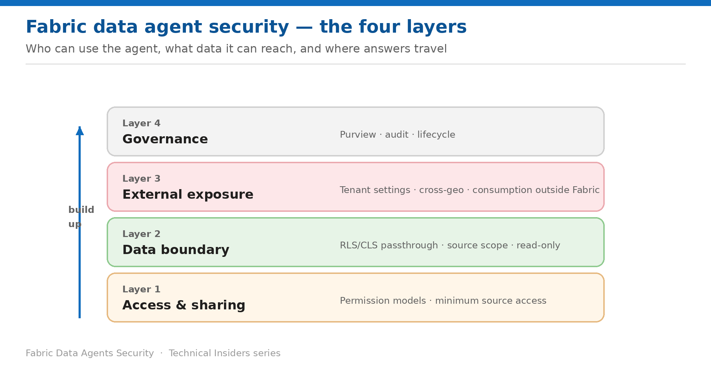

# Security for Fabric Data Agents — Series Overview

> A prescriptive, 7-part how-to series for sharing, source permissions, data boundary, and external consumption.

*Fabric Technical Insiders · 7-part how-to series · Level 300 · Start here*

A data agent is a natural-language front door to your governed data. It does not carry its own data permissions — it **uses the requesting user's credentials** and inherits whatever the underlying sources enforce. That makes it simultaneously the safest and the most misunderstood way to expose data in Fabric.

This series covers the agent layer in **7 prescriptive entries** across four layers: who can use the agent, what data it can reach, where its answers travel, and how the whole thing is governed. Every entry is a self-contained runbook — **prerequisites → numbered steps → validation → limitations → rollback** — with its own architecture diagram.

This overview is the entry point. Use it to find the layer you need, then work through that layer's entries in order.

*Figure — The four security layers of the series.*

## How to use this series

- **Secure the sources first.** An agent is only as constrained as the lakehouse, warehouse, model or KQL database behind it.
- **Each entry stands alone.** Land on any single entry and act on it without reading the others.
- **Every step is grounded in Microsoft Learn** and scoped to data agents rather than Copilot generally.
- **Validate as you go.** Each entry ends with a validation step and a rollback.

## Layer 1 — Access & sharing

- **01 · Share a Data Agent with the Right Permission Model** — three models, and how publishing changes all of them.
- **02 · Grant the Minimum Source Permissions** — the per-source table, and why Read is enough for semantic models.

## Layer 2 — Data boundary

- **03 · Prove RLS and CLS Reach the Agent** — the validation most teams skip.
- **04 · Scope What a Data Agent Can Reach** — five sources, selected tables, and a precedence model you can't instruct around.

## Layer 3 — External exposure

- **05 · Configure the Tenant Settings and Cross-Geo Boundary** — where the compliance boundary is decided.
- **06 · Control Consumption Outside Fabric** — Foundry, Copilot Studio, M365 Copilot and MCP.

## Layer 4 — Governance

- **07 · Govern Data Agents with Purview and Lifecycle Controls** — posture capstone.

## Where to start

If you are about to share an agent and have read only one entry, make it **entry 02**. Sharing a data agent does not share its data — recipients need their own minimum permission on every connected source, and below that threshold queries fail or return empty results with no explanation.

- **Publishing your first agent?** Entries 01 and 02.
- **Security review asking about the data boundary?** Entry 03, then 04.
- **Compliance asking where the data goes?** Entries 05 and 06.
- **Rolling out at scale?** Entry 07.

> **A note on currency** — Fabric ships quickly, and several capabilities in this series are recent or in preview. Every step reflects the product and documentation as of publication — verify current behaviour in your own tenant before standardizing on it.
