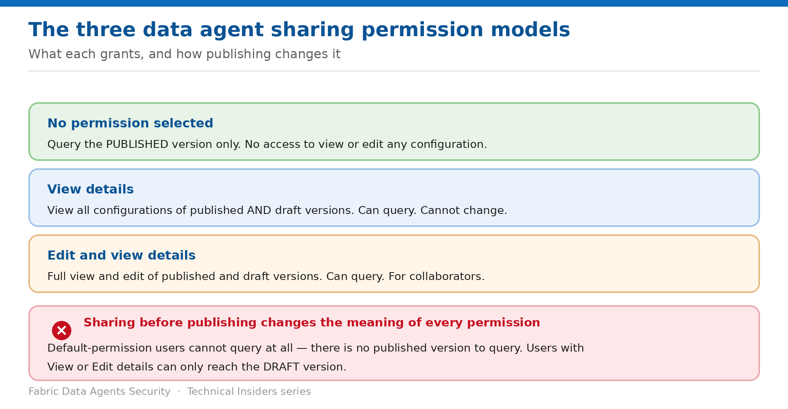

# Share a Data Agent with the Right Permission Model

> Three models — and publishing state changes what every one of them means.

*Series: Access & sharing · Layer 1 (1 of 2) · Audience: Agent authors · Level 300*

Data agent sharing offers three permission models with materially different reach. This entry covers what each grants, how the published-versus-draft distinction changes their behaviour, and the sequence that avoids the most common support ticket.

## How to read this series

This is the first of seven entries on securing Fabric data agents — access and sharing first, then the data boundary, then external exposure, then governance. Every entry is written as a **prescriptive, step-by-step runbook**, not a conceptual overview: exact prerequisites, the portal actions, a validation step to prove the control works, the current limitations, and a rollback.

The *why* behind each control is kept deliberately short so the steps stay front and centre. For deeper technical rationale, use the **Microsoft Fabric security white paper** as the companion reference; each entry also links the specific product documentation in its **References** section.

- [Microsoft Fabric security white paper — Microsoft Learn](https://learn.microsoft.com/en-us/fabric/security/white-paper-landing-page)

## Scenario — when to use this

You build an agent, share it with the finance team, and they report that it does nothing. Nobody made a mistake — the agent was shared before it was published, and the default permission only grants access to a published version that doesn't exist yet.

Reach for this entry before your first share, and whenever a recipient reports that an agent they were given access to won't answer.

For more detail on how this option works, see:

- [Microsoft Fabric security white paper — Microsoft Learn](https://learn.microsoft.com/en-us/fabric/security/white-paper-landing-page)
- [Fabric data agent sharing and permission management — Microsoft Learn](https://learn.microsoft.com/en-us/fabric/data-science/data-agent-sharing)

## What you'll set up

- The narrowest permission model that meets the need.
- The agent published before it is shared.
- An accurate answer to "what can this recipient do with it?"

*Figure 1 — What each permission grants, and the publish trap.*

## Prerequisites

- A paid **F2 or higher** Fabric capacity, or a **Power BI Premium P1 or higher** capacity with Fabric enabled.
- At least one connected data source with data — a warehouse, lakehouse, Power BI semantic model, KQL database, mirrored database, or ontology.
- **Read access to the data source** yourself.
- The tenant settings from entry 05 already enabled.

## Step 1 — Publish before you share

1. Refine the agent: select the relevant tables, define the instructions, and add example queries per data source.
2. Ask the agent to describe what it does, then refine that answer into a description.
3. Publish the agent with that description — a **read-only version** is generated, and that is what you share.
4. Continue refining the draft afterwards; changes stay isolated from the published version.

> **The description is not cosmetic** — The description is available to consumers so they understand the agent's purpose, and **other automated systems and orchestrators use it to invoke the agent outside Fabric**. Treat it as an interface contract, not a label.

## Step 2 — Choose the permission model

| Permission | What the recipient can do |
| --- | --- |
| No permission selected | Query the published version only. No access to edit — or even view — any configuration or detail. Preserves the integrity of your setup. |
| View details | View the details and configurations of both published and draft versions, without making changes. Can still query and build insights. |
| Edit and view details | Full access to view and edit all details and configurations of both published and draft versions. Can also query. Intended for collaborative work. |

Pick the narrowest that works. **No permission selected** is the correct default for consumers; **Edit and view details** should be reserved for co-authors.

## Step 3 — Understand the unpublished-agent behaviour

> **Sharing before publishing inverts the models** — If you share an agent **before** you publish it, users with default permissions **can't query it at all** — the default permission allows querying only the published version. Users with **View details** or **Edit and view details** can only access the **draft** version.

- This is the single most common cause of "the agent doesn't work for my colleague."
- The fix is always to publish first, then share.
- Switch between published and draft versions to test the same queries on both and compare behaviour.
- To change only the description, go to **Settings → Publishing** and update it there.

## Validate

- A consumer with no additional permission can query the agent but sees no configuration.
- A **View details** holder can inspect the configuration but cannot change it.
- An **Edit and view details** holder can modify instructions — confirm this is intended.
- After a draft change, a consumer still sees the **published** behaviour, not the draft.

## Limitations & gotchas

- **Sharing before publishing** breaks default-permission consumers entirely.
- **Sharing the agent is not sharing the data** — see entry 02.
- Draft and published versions can drift; consumers only ever see published.
- Trial capacities and capacities below F2 are not supported.
- The published version is read-only by design — republish to promote changes.

## Rollback

1. Remove the recipient from the agent's sharing list.
2. Reduce an over-granted permission from **Edit and view details** back to the default.
3. Note that removing agent access does not remove the underlying source permissions — revoke those separately.

## References

- [Fabric data agent sharing and permission management — Microsoft Learn](https://learn.microsoft.com/en-us/fabric/data-science/data-agent-sharing)
- [Fabric data agent concepts — Microsoft Learn](https://learn.microsoft.com/en-us/fabric/data-science/concept-data-agent)
