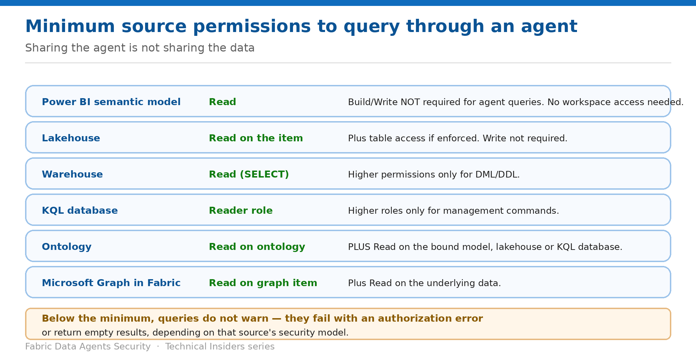

# Grant the Minimum Source Permissions

> Sharing the agent is not sharing the data — and Read is enough for semantic models.

*Series: Access & sharing · Layer 1 (2 of 2) · Audience: Agent authors & data owners · Level 300*

When you share a data agent, you **must also share access to the underlying data it uses**. This entry gives the exact minimum permission per source type, the failure mode below that threshold, and the least-privilege pattern that avoids over-granting.

## Scenario — when to use this

Half your users get answers and half get empty results from the same agent, asking the same question. Nobody is being blocked by the agent — they're being blocked by a source they don't have access to, and the agent has no way to tell them that.

Reach for this entry whenever agent behaviour differs between users, and as the checklist before granting anyone access to a new agent.

For more detail on how this option works, see:

- [Microsoft Fabric security white paper — Microsoft Learn](https://learn.microsoft.com/en-us/fabric/security/white-paper-landing-page)
- [Fabric data agent sharing and permission management — Microsoft Learn](https://learn.microsoft.com/en-us/fabric/data-science/data-agent-sharing)

## What you'll set up

- Every consumer holding the minimum permission on every connected source.
- No over-granting of Build or workspace roles.
- A diagnostic for empty or failing agent answers.

*Figure 2 — Minimum effective permission per source type.*

## Prerequisites

- A list of every data source connected to the agent.
- The ability to grant permissions on each of those sources, or a data owner who can.
- The agent already published and shared (entry 01).

## Step 1 — Apply the minimum per source

For a user to successfully query through a data agent, they need the following **minimum effective permission** for each connected source type:

| Data source type | Minimum permission | Notes |
| --- | --- | --- |
| Power BI semantic model | Read | Read is sufficient to query via an agent. Build/Write only to modify the model or use Prep for AI. Workspace access isn't required. |
| Lakehouse | Read on the lakehouse item | Plus table access if enforced. Write not required unless modifying data. |
| Warehouse | Read (SELECT on relevant tables) | Higher permissions only for DML/DDL operations. |
| KQL database | Reader role on the database | Higher roles only for management commands. |
| Ontology | Read on the ontology item | Plus Read on the underlying semantic model, lakehouse or KQL database bound to it. |
| Microsoft Graph in Fabric | Read on the graph item | Plus Read on the underlying data. |
| Other supported sources | Query/read-level access | Must allow metadata and data retrieval. |

> **The semantic model rule is newer than most people's mental model** — Microsoft's guidance is explicit: **Read permission on the semantic model is sufficient for queries initiated via a Fabric data agent. Build or workspace roles aren't required for these agent interactions.** This applies *only* to agent interactions — Analyze in Excel and direct report authorship may still require Build.

## Step 2 — Follow least privilege deliberately

1. For each source, grant only the permission listed above — nothing higher.
2. For semantic models, grant **Read** when users only need to query through an agent.
3. Grant **Build** or broader workspace roles only when users must modify the model or use features such as **Prep for AI**.
4. Document which grant belongs to which agent so the permission can be revoked when the agent is retired.

## Step 3 — Diagnose an under-permissioned user

If a user can open the agent but lacks the minimum on one or more sources, the query behaviour depends on that source's security model:

- The query **fails with an authorization error**, or
- The query **returns empty results**.

> **Empty is not the same as none** — An empty result looks identical to "there is no matching data." A user can spend an afternoon concluding the business has no orders in a region when they simply lack access to that source. Check permissions before you debug the data.

## Validate

- A consumer with Read on the semantic model — and no Build, no workspace role — gets an answer.
- A consumer missing access to one of several sources gets answers for the others and a failure or empty result for that one.
- Removing Read from a source stops that source answering, while the agent itself still opens.
- No consumer holds Build purely to use the agent.

## Limitations & gotchas

- **Sharing the agent does not share the data** — the two are entirely separate grants.
- The Read-is-sufficient rule applies **only to data agent interactions**, not other entry points.
- Ontology sources need **two** grants — the ontology item and the source bound to it.
- An agent **can't execute queries when the source's workspace capacity is in a different region** than the agent's workspace capacity.
- The failure mode is silent by design; nothing tells the user which source blocked them.

## Rollback

1. Remove the source-level grant from the user or group.
2. Confirm the agent still opens for them but no longer returns that source's data.
3. Remove agent access separately if they should lose the agent entirely.

## References

- [Fabric data agent sharing and permission management — Microsoft Learn](https://learn.microsoft.com/en-us/fabric/data-science/data-agent-sharing)
- [Fabric data agent concepts — Microsoft Learn](https://learn.microsoft.com/en-us/fabric/data-science/concept-data-agent)
