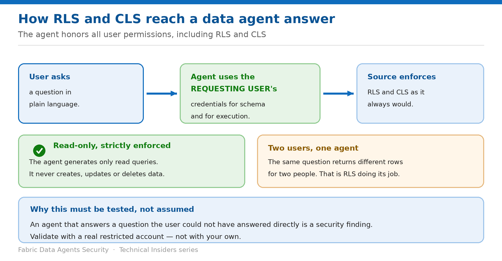

# Prove RLS and CLS Reach the Agent

> The agent honors every user permission — validate it with a real restricted account, not your own.

*Series: Data boundary · Layer 2 (1 of 2) · Audience: Data owners & security reviewers · Level 300*

A data agent **honors all user permissions to the data, including Row-Level Security (RLS) and Column-Level Security (CLS)**. This entry covers how that enforcement works end to end, and how to prove it in your own tenant before a security review asks.

## Scenario — when to use this

Your security reviewer asks a fair question: does the natural-language interface bypass row-level security? The honest answer is no — but "the docs say so" is not evidence, and you need a test you can show.

Reach for this entry before any security review of an agent, and immediately after connecting a source that carries RLS or CLS.

For more detail on how this option works, see:

- [Microsoft Fabric security white paper — Microsoft Learn](https://learn.microsoft.com/en-us/fabric/security/white-paper-landing-page)
- [Fabric data agent concepts — Microsoft Learn](https://learn.microsoft.com/en-us/fabric/data-science/concept-data-agent)
- [Fabric data agent sharing and permission management — Microsoft Learn](https://learn.microsoft.com/en-us/fabric/data-science/data-agent-sharing)

## What you'll set up

- Demonstrable proof that RLS and CLS apply through the agent.
- A repeatable test with a real restricted account.
- Confidence that the agent cannot write.

*Figure 3 — The requesting user's credentials drive every step.*

## Prerequisites

- RLS or CLS already configured on at least one connected source.
- A **real test account** subject to those rules — not your own identity.
- The test account holding the minimum source permissions from entry 02.
- An agent published and shared with that account.

## Step 1 — Understand where enforcement happens

- **Question parsing and validation** — the agent ensures the question complies with security protocols, responsible AI policies, and **user permissions**.
- **Enforcement** — it uses the **requesting user's credentials and permissions** to enforce least-privilege access, so each interaction only reaches data the user is authorized to view.
- **Data source identification** — the agent uses the user's credentials to access the **schema**, so it only sees structure the user may view.
- **Guardrails constrain tool invocation and outputs to scoped data sources**, preventing queries from reaching resources outside the configured scope.
- **Read-only** — the agent strictly enforces read-only access and maintains read-only connections to all sources.

> **The security property that matters** — Because the user's own credentials drive both schema retrieval and execution, the agent cannot surface data the user could not have queried directly. Your job is to prove that, not to assume it.

## Step 2 — Run the test

1. Sign in as the restricted test account.
2. Ask a question whose correct answer differs between the restricted user and an unrestricted one — a regional total, or a count of rows in a filtered table.
3. Record the answer.
4. Sign in as an unrestricted user and ask the identical question.
5. Confirm the two answers differ in exactly the way RLS predicts.
6. Repeat for a CLS-protected column: ask for that column by name and confirm the restricted user cannot retrieve it.

## Step 3 — Confirm the read-only boundary

1. Ask the agent to update, insert or delete a row in plain language.
2. Confirm it refuses — the agent **only generates SQL, DAX and KQL read queries**.
3. For Eventhouse sources, confirm the agent does not trigger anomaly detection jobs, notebooks, or other write or action workflows.
4. Record both results as evidence for your review.

## Validate

- Two users, one agent, one question, two correct-but-different answers.
- A CLS-protected column is unavailable to the restricted user.
- No phrasing of a write request produces a write.
- An answer the restricted user should not be able to reach is treated as a **security finding**, not a modelling quirk.

## Limitations & gotchas

- **Testing with your own account proves nothing** — you almost certainly hold broader access.
- Purview **DLP** and **access restriction policies** can also prevent queries running or data being surfaced; a blocked answer may be policy rather than RLS.
- Responses are capped at **25 rows and 25 columns**, so a truncated answer is not evidence of a security filter.
- **Previous chat history can influence subsequent responses** — start a fresh conversation for each test.
- Conversation history may be reset by backend changes, so don't rely on it as an audit record.

## Rollback

1. If the test surfaces data it should not, remove the source from the agent immediately.
2. Fix the rule at the source — RLS and CLS live in the source, not the agent.
3. Re-run the full test before reconnecting the source.

## References

- [Fabric data agent concepts — Microsoft Learn](https://learn.microsoft.com/en-us/fabric/data-science/concept-data-agent)
- [Fabric data agent sharing and permission management — Microsoft Learn](https://learn.microsoft.com/en-us/fabric/data-science/data-agent-sharing)
