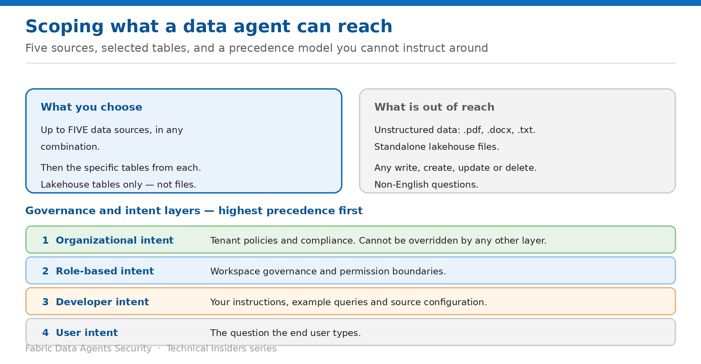

# Scope What a Data Agent Can Reach

> Five sources, chosen tables, and a precedence model that instructions cannot override.

*Series: Data boundary · Layer 2 (2 of 2) · Audience: Agent authors · Level 300*

Permissions decide what a user *may* reach. Scoping decides what the agent *will* reach. This entry covers source and table selection, the instruction layer, and the governance precedence model that keeps a cleverly-worded prompt from widening the surface.

## Scenario — when to use this

Someone asks the agent to ignore its instructions and query a source it wasn't given. Or an author writes an instruction that quietly broadens what the agent will answer. Both need to fail predictably.

Reach for this entry when configuring a new agent, and when reviewing an agent someone else built.

For more detail on how this option works, see:

- [Microsoft Fabric security white paper — Microsoft Learn](https://learn.microsoft.com/en-us/fabric/security/white-paper-landing-page)
- [Fabric data agent concepts — Microsoft Learn](https://learn.microsoft.com/en-us/fabric/data-science/concept-data-agent)

## What you'll set up

- The smallest source and table surface that answers the real questions.
- Instructions that route rather than widen.
- A documented understanding of what overrides what.

*Figure 4 — The four intent layers, highest precedence first.*

## Prerequisites

- A defined set of questions the agent is meant to answer.
- Read access to each candidate source.
- Knowledge of which tables actually carry the answers.

## Step 1 — Select sources and tables narrowly

1. Choose the data sources — an agent supports **up to five**, in any combination of lakehouses, warehouses, KQL databases, semantic models, ontologies and Microsoft Graph.
2. Add them one at a time, and define the specific **tables** from each source the agent uses.
3. For lakehouses, select **lakehouse tables — not individual files**. Data that starts as CSV or JSON must be ingested into tables or exposed through tables.
4. For Eventhouse-backed KQL databases, select only the tables most relevant to typical questions.
5. Resist the temptation to add sources speculatively — every added source is added surface.

## Step 2 — Use instructions to route, not to widen

- Add **data agent instructions** to guide which source answers which type of question — financial metrics to the semantic model, raw exploration to the lakehouse, log analysis to the KQL database.
- Add **example queries** as question/query pairs, up to **100 per data source**.
- Note that adding sample query/question pairs **isn't currently supported for Power BI semantic model sources**.

> **Instructions are not a security control** — Microsoft is explicit that developer-provided instructions and example queries **must operate within organizational and role-based constraints**. If instructions or prompts conflict with policy — attempts to bypass read-only behaviour or reach out-of-scope sources — the agent refuses or redirects.

## Step 3 — Know the precedence model

| Layer | What it is |
| --- | --- |
| 1 · Organizational intent | Tenant-wide policies and compliance requirements set by administrators. Highest precedence — can't be overridden by any other layer. |
| 2 · Role-based intent | Workspace governance settings and permission boundaries applying to specific roles or groups. |
| 3 · Developer intent | Your custom instructions, example queries and data source configuration. |
| 4 · User intent | The questions and prompts end users submit during conversations. |

When layers conflict, higher precedence wins. Organizational policies and workspace governance settings **always override developer instructions and user prompts** — which is what makes prompt-level attempts to widen scope fail by design rather than by luck.

## Validate

- A question about a topic outside the configured sources returns no data rather than reaching for one.
- A prompt asking the agent to ignore its instructions does not change which sources it queries.
- A prompt asking for a write is refused.
- Routing instructions send the right question to the right source — check with one question per source.

## Limitations & gotchas

- **Five data sources maximum** per agent.
- **Unstructured data is unsupported** — .pdf, .docx and .txt files can't be reached at all.
- **Standalone lakehouse files aren't read** unless ingested or exposed as tables.
- **Non-English languages aren't currently supported** — provide questions, instructions and examples in English.
- **You can't change the LLM** the agent uses.
- Responses are capped at **25 rows and 25 columns** — agents are for conversational insight, not dataset extraction.

## Rollback

1. Remove a source from the agent configuration and republish.
2. Narrow the table selection rather than removing the source entirely where that is enough.
3. Revert an instruction change by editing the draft and republishing.

## References

- [Fabric data agent concepts — Microsoft Learn](https://learn.microsoft.com/en-us/fabric/data-science/concept-data-agent)
- [Fabric data agent sharing and permission management — Microsoft Learn](https://learn.microsoft.com/en-us/fabric/data-science/data-agent-sharing)
