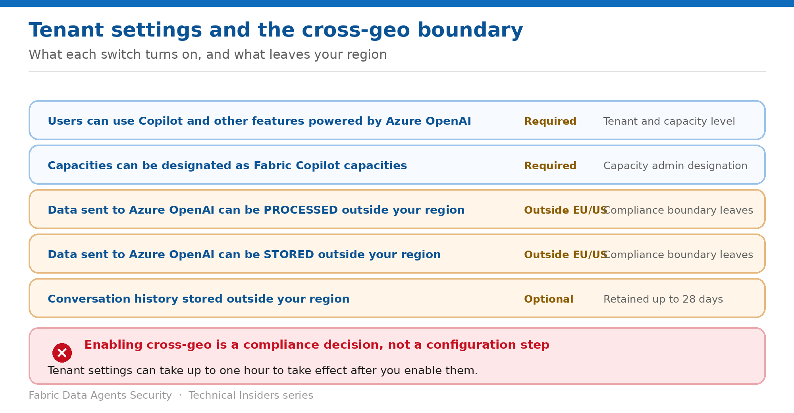

# Configure the Tenant Settings and Cross-Geo Boundary

> Five switches — two of which move data outside your compliance boundary.

*Series: External exposure · Layer 3 (1 of 2) · Audience: Fabric administrators · Level 300*

Data agents don't run until several tenant settings are enabled, and two of them are **compliance decisions rather than configuration steps**. This entry covers each switch, what it opens, and the retention window most teams don't know about.

## Scenario — when to use this

A team asks why their agent won't respond. The answer is a tenant switch. Then compliance asks what enabling it means, and nobody has written it down.

Reach for this entry before enabling data agents tenant-wide, and when compliance asks where agent data is processed and stored.

For more detail on how this option works, see:

- [Microsoft Fabric security white paper — Microsoft Learn](https://learn.microsoft.com/en-us/fabric/security/white-paper-landing-page)
- [Configure Fabric data agent tenant settings — Microsoft Learn](https://learn.microsoft.com/en-us/fabric/data-science/data-agent-tenant-settings)

## What you'll set up

- Every required setting enabled deliberately.
- A documented position on cross-geo processing and storage.
- An accurate answer on conversation-history retention.

*Figure 5 — What each switch turns on, and what leaves your region.*

## Prerequisites

- **Administrative privileges** to access the Fabric admin portal.
- Knowledge of your capacity's geographic region relative to the **EU data boundary** and the **US**.
- A compliance position on data leaving that boundary.

## Step 1 — Open tenant settings

1. Sign in to Microsoft Fabric with an admin account.
2. Select the **gear icon** in the top-right corner, then **Admin Portal**.
3. Select **Tenant settings** from the left navigation pane.
4. Locate the Copilot and Azure OpenAI settings.

## Step 2 — Enable the required settings

| Setting | Why it's needed |
| --- | --- |
| Users can use Copilot and other features powered by Azure OpenAI | Allows access to Copilot-powered features including data agents. Manageable at tenant and capacity level. |
| Capacities can be designated as Fabric Copilot capacities | Allows capacity administrators to designate capacities as Fabric Copilot capacities for Copilot usage, including data agents. |

> **Allow an hour** — Tenant settings **might take up to one hour to take effect** after you enable them. An agent that doesn't work immediately after a settings change may simply need time.

## Step 3 — Decide the cross-geo position

Three settings govern where data goes. Each is **required for customers whose capacity's geographic region is outside the EU data boundary and the US**:

- **Data sent to Azure OpenAI can be processed outside your capacity's geographic region, compliance boundary, or national cloud instance.**
- **Data sent to Azure OpenAI can be stored outside your capacity's geographic region, compliance boundary, or national cloud instance.**
- **Conversation history stored outside your capacity's geographic region, compliance boundary, or national cloud instance** — needed for fully conversational agentic experiences, because the agent stores conversation history across user sessions to retain context.

> **The retention window** — **Conversation history is stored for as long as the user allows, up to 28 days if not manually removed.** Users can delete their history at any time by clearing the chat. Include this in your data-retention documentation.

## Step 4 — Document the decision

1. Record which cross-geo settings you enabled and the business justification.
2. Record the 28-day conversation-history window against your retention policy.
3. Record that consumption from non-Fabric services carries its own boundary implications (entry 06).
4. Share the record with your compliance team before the first production agent ships.

## Validate

- An agent responds successfully after the settings propagate.
- A capacity designated as a Fabric Copilot capacity is visible to capacity admins.
- Clearing a chat removes the conversation history.
- Your compliance record matches the settings actually enabled.

## Limitations & gotchas

- **Up to one hour** for settings to take effect.
- Cross-geo settings are **required**, not optional, outside the EU boundary and the US — the choice is whether to run data agents at all.
- Conversation history **might not always persist** — backend changes, service updates or model upgrades can reset it.
- Capacity-level Copilot settings interact with the tenant setting; check both.
- An agent **can't query a source whose workspace capacity is in a different region** than the agent's.

## Rollback

1. Disable the tenant setting — existing agents stop functioning.
2. Allow up to an hour for the change to take effect.
3. Note that disabling cross-geo settings may make data agents unusable entirely in some regions.

## References

- [Configure Fabric data agent tenant settings — Microsoft Learn](https://learn.microsoft.com/en-us/fabric/data-science/data-agent-tenant-settings)
- [Fabric data agent concepts — Microsoft Learn](https://learn.microsoft.com/en-us/fabric/data-science/concept-data-agent)
