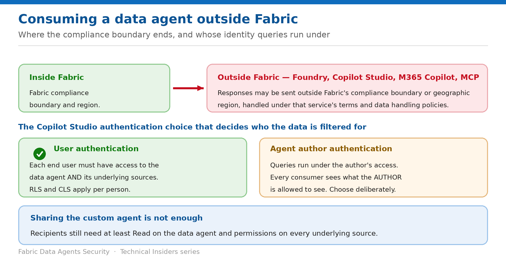

# Control Consumption Outside Fabric

> Foundry, Copilot Studio, M365 Copilot and MCP — and the authentication choice that decides whose data everyone sees.

*Series: External exposure · Layer 3 (2 of 2) · Audience: Fabric admins & agent authors · Level 300*

A data agent's value multiplies when it's consumed from Copilot Studio, Azure AI Foundry, Microsoft 365 Copilot or as an MCP server. So does its exposure. This entry covers what leaves Fabric, and the single configuration choice that determines whether per-user security still applies.

## Scenario — when to use this

You connect your agent to a Copilot Studio bot and everyone in the department can now ask it questions. Under one authentication setting they each see their own data. Under the other they all see yours.

Reach for this entry before any external consumption goes live, and when compliance asks whether agent answers stay inside your boundary.

For more detail on how this option works, see:

- [Microsoft Fabric security white paper — Microsoft Learn](https://learn.microsoft.com/en-us/fabric/security/white-paper-landing-page)
- [Consume a Fabric data agent in Microsoft Copilot Studio — Microsoft Learn](https://learn.microsoft.com/en-us/fabric/data-science/data-agent-microsoft-copilot-studio)
- [Configure Fabric data agent tenant settings — Microsoft Learn](https://learn.microsoft.com/en-us/fabric/data-science/data-agent-tenant-settings)

## What you'll set up

- A deliberate decision on which external surfaces are permitted.
- The correct authentication mode for each connected agent.
- A documented compliance-boundary position.

*Figure 6 — Where the compliance boundary ends, and whose identity queries run under.*

## Prerequisites

- A **published** data agent with a rich, detailed description.
- The agent and the consuming service on the **same tenant**.
- Signed in to both Fabric and the consuming service with the **same account** that has access to the agent.
- A **Microsoft 365 Copilot license** and a user license for each individual who builds and manages custom agents, for Copilot Studio.
- At least **Read access to the data agent**, permission to create and modify agents in the consuming service, and **access to the underlying data sources**.

## Step 1 — Understand what leaves Fabric

> **The compliance-boundary statement** — Microsoft states it directly: when users connect to non-Fabric services — Microsoft Foundry, Copilot Studio, M365 Copilot, or as an MCP server — **responses returned by Fabric data agents may be sent outside of Fabric's compliance boundary or geographic region, and processed and/or stored according to the non-Fabric service's applicable terms and data handling policies.**

- This is a different boundary from the cross-geo tenant settings in entry 05 — those govern Azure OpenAI processing; this governs the consuming service.
- Purview governance policies **continue to apply to the underlying data sources** when agents are surfaced through Microsoft 365 Copilot.
- Users can only access data their credentials and Purview policies allow, **regardless of the entry point**.

## Step 2 — Connect the agent deliberately

1. Publish the agent in Fabric and confirm it responds to queries as expected.
2. In Copilot Studio, open your environment and select or create the custom agent.
3. Select **Agents → + Add**, choose **Microsoft Fabric**, and create the connection if one doesn't exist.
4. Select the data agent from the list of those you have access to, adjust its description, and **Add agent**.
5. Enable **generative AI orchestration** under Settings → Orchestration.

## Step 3 — Choose the authentication mode

On the connected agent, under additional details, you choose between two modes. This is the most consequential security decision in the entry:

| Mode | What it means |
| --- | --- |
| User authentication | Each end user's own access applies. You must ensure users have access to the data agent and its underlying data sources. RLS and CLS filter per person. |
| Agent author authentication | Queries run under the author's access. Every consumer effectively sees what the author is permitted to see. |

> **Default to user authentication** — Agent author authentication is legitimate for genuinely shared, non-sensitive content. For anything carrying RLS, CLS or per-user scoping, it silently collapses your entire data-boundary design into one identity.

## Step 4 — Set expectations for sharing

- **If you share your custom agent with others, they must have at least Read access to the Fabric data agent and the necessary permissions for all underlying data sources.**
- Using a custom agent with a connected data agent **isn't currently supported in Microsoft 365 Copilot**.
- A Copilot Studio agent with a connected data agent is **only validated for Microsoft Teams**; other channels may work but haven't been formally tested.
- Data agents remain **read-only** regardless of the orchestrator invoking them.

## Validate

- Under **user authentication**, two consumers with different source access get different answers.
- A consumer without Read on the data agent cannot use the connected agent at all.
- The agent appears in the connected-agents list only when published and on the same tenant.
- Your compliance record names each external surface in use.

## Limitations & gotchas

- **Agent author authentication bypasses per-user data scoping** — the biggest gotcha in this entry.
- Copilot Studio connection is in **preview**.
- **Custom agents with connected data agents aren't supported in Microsoft 365 Copilot** currently.
- Only **Microsoft Teams** is a validated channel.
- The agent must be **published** — a draft never appears in the list.
- Both sides must be on the **same tenant**, signed in with the **same account**.

## Rollback

1. Remove the connected agent from the custom agent in the consuming service.
2. Switch authentication from author to user mode if that was the issue — then re-test.
3. Unpublish the Fabric data agent to remove it from every external surface at once.

## References

- [Consume a Fabric data agent in Microsoft Copilot Studio — Microsoft Learn](https://learn.microsoft.com/en-us/fabric/data-science/data-agent-microsoft-copilot-studio)
- [Consume a Fabric data agent in Azure AI Foundry — Microsoft Learn](https://learn.microsoft.com/en-us/fabric/data-science/data-agent-foundry)
- [Configure Fabric data agent tenant settings — Microsoft Learn](https://learn.microsoft.com/en-us/fabric/data-science/data-agent-tenant-settings)
