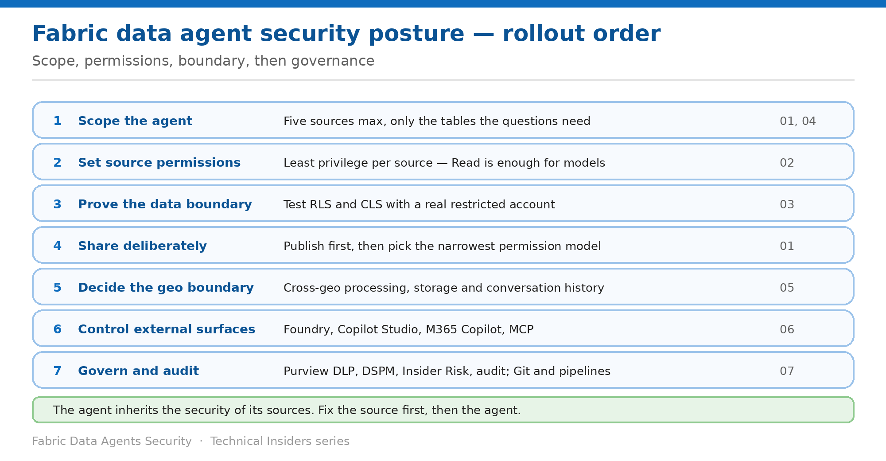

# Govern Data Agents with Purview and Lifecycle Controls

> The order to apply these controls in — starting one layer below the agent.

*Series: Governance · Layer 4 (1 of 1) · Audience: Fabric admins & architects · Level 300*

The preceding six entries each solve one problem. This capstone puts them in order, adds the Purview controls that apply across all of them, and gives the lifecycle mechanics for running agents at scale.

Data agents have one sequencing rule above all others: **the agent inherits the security of its sources**. Fix the source first, then the agent.

## Scenario — when to use this

You're rolling out agents across an organisation, or auditing agents someone else built. Starting with the agent's sharing settings feels natural and leaves the actual data boundary untouched.

Reach for this entry when planning a rollout, onboarding a new agent, or reviewing an existing estate against a target posture.

For more detail on how this option works, see:

- [Microsoft Fabric security white paper — Microsoft Learn](https://learn.microsoft.com/en-us/fabric/security/white-paper-landing-page)
- [Fabric data agent concepts — Microsoft Learn](https://learn.microsoft.com/en-us/fabric/data-science/concept-data-agent)
- [Use Microsoft Purview to govern Microsoft Fabric — Microsoft Learn](https://learn.microsoft.com/en-us/fabric/governance/microsoft-purview-fabric)

## What you'll set up

- A sequenced rollout plan across all four layers.
- Purview controls applied where they help.
- A lifecycle that promotes agents safely between environments.

*Figure 7 — Scope, permissions, boundary, then governance.*

## The rollout order

| # | Step | What you do | Entries |
| --- | --- | --- | --- |
| 1 | Scope the agent | Five sources max, only the tables the questions need | 04 |
| 2 | Set source permissions | Least privilege per source — Read is enough for models | 02 |
| 3 | Prove the data boundary | Test RLS and CLS with a real restricted account | 03 |
| 4 | Share deliberately | Publish first, then pick the narrowest permission model | 01 |
| 5 | Decide the geo boundary | Cross-geo processing, storage, conversation history | 05 |
| 6 | Control external surfaces | Foundry, Copilot Studio, M365 Copilot, MCP | 06 |
| 7 | Govern and audit | Purview policies, audit, and the agent lifecycle | 07 |

> **Step 1 is not optional** — An agent connected to a source with no RLS gives every consumer everything in that source, no matter how carefully you configure the agent itself.

## Step 1 — Apply the Purview controls

If your tenant or workspace is governed by Microsoft Purview policies, agents **must operate within those policies**:

- **Purview DLP policies in Fabric Data Warehouse** (generally available) — detect and restrict access to sensitive data in warehouse assets the agent queries.
- **Access restriction policies (preview)** for Fabric KQL Database, Fabric SQL Database and Fabric Data Warehouse — can prevent the agent accessing or returning results from assets classified as sensitive.
- **Risk discovery and auditing** (preview) — prompts and responses can be subject to Purview risk discovery and auditing.
- **DSPM Data Risk Assessments** — surface sensitive data risks in the sources agents use.
- **Insider Risk Management** — detect risky AI usage patterns such as unusual query volumes or access to sensitive data.
- **Audit, eDiscovery and retention** policies apply to agent interactions and outputs in supported workloads.

> **Policy enforcement is visible to users** — Policy enforcement **might prevent certain queries from running or specific data from being surfaced in responses**. Tell your users that, so a policy block isn't diagnosed as a broken agent.

## Step 2 — Put a lifecycle around the agent

1. Use **Git integration** to version-control agent configurations — instructions, example queries and source selections.
2. Use **deployment pipelines** to promote agents from development to production, testing changes in staging first.
3. Use built-in **diagnostics** to monitor behaviour, identify query-generation issues and troubleshoot response quality.
4. Manage **workspace outbound access protection** boundaries — workspace admins control which external endpoints the agent can reach.
5. Optionally integrate **Azure AI Content Safety** to apply content risk controls.

## Step 3 — Establish operational oversight

- **Logging and audit** — review query patterns and response quality to identify unexpected behaviour early.
- **Human-in-the-loop escalation** — define paths that route sensitive or high-impact requests to qualified reviewers.
- **Periodic review** — regularly review instructions and example queries against current policies and data structures.
- Update the agent configuration as sources or business requirements change.

## End-to-end validation

- **Scope:** every connected source is one the agent genuinely needs.
- **Permissions:** no consumer holds more than the minimum on any source.
- **Boundary:** a restricted test account gets correctly filtered answers.
- **Sharing:** the agent is published, and permission models match intent.
- **Geo:** cross-geo settings and the 28-day history window are documented.
- **External:** each external surface is approved and uses user authentication.
- **Governance:** Purview policies are in place and the agent is under source control.

## Limitations & gotchas

- **The agent inherits the security of its sources** — the whole series rests on this.
- **Sharing the agent is not sharing the data**, and the reverse is also true.
- **Sharing before publishing** breaks default-permission consumers.
- **Agent author authentication** in external orchestrators collapses per-user scoping.
- **Read is sufficient for semantic models** via agents — don't grant Build reflexively.
- Several capabilities here are in **preview**; re-verify before each publication cycle.

## Review cadence

1. Re-run the RLS/CLS validation whenever a source is added or its rules change.
2. Review source permissions quarterly, and whenever an agent is retired.
3. Re-check external surfaces whenever a consuming service is added.
4. Re-verify tenant settings after each Fabric release that touches Copilot or AI.
5. Review instructions and example queries against current policy on a fixed cycle.

## References

- [Fabric data agent concepts — Microsoft Learn](https://learn.microsoft.com/en-us/fabric/data-science/concept-data-agent)
- [Fabric data agent sharing and permission management — Microsoft Learn](https://learn.microsoft.com/en-us/fabric/data-science/data-agent-sharing)
- [Configure Fabric data agent tenant settings — Microsoft Learn](https://learn.microsoft.com/en-us/fabric/data-science/data-agent-tenant-settings)
- [Use Microsoft Purview to govern Microsoft Fabric — Microsoft Learn](https://learn.microsoft.com/en-us/fabric/governance/microsoft-purview-fabric)
- [Track user activities in Microsoft Fabric — Microsoft Learn](https://learn.microsoft.com/en-us/fabric/admin/track-user-activities)
- [Microsoft Fabric security white paper — Microsoft Learn](https://learn.microsoft.com/en-us/fabric/security/white-paper-landing-page)
