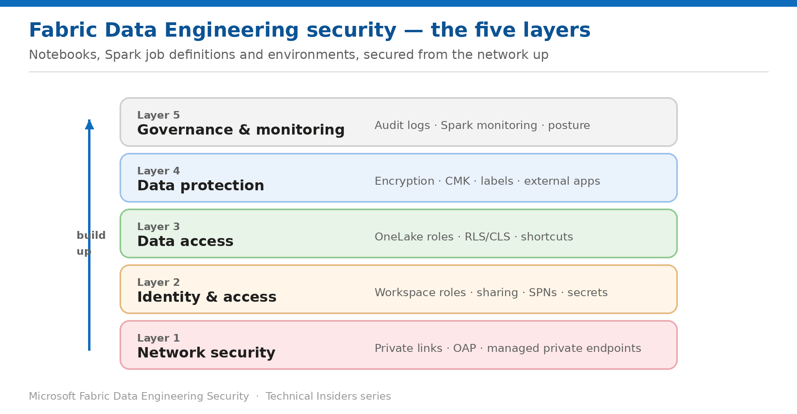

# Security for Fabric Data Engineering — Series Overview

> A prescriptive, 16-part how-to series for notebooks, Spark job definitions, and environments.

*Fabric Data Engineering Technical Insiders · 16-part how-to series · Level 300 · Start here*

Securing Fabric Data Engineering means making decisions at five different layers — and the guidance for each one lives in a different place. This series pulls all of it into one prescriptive set: **16 how-to entries**, organized into five layers, built from the network up.

Every entry is a self-contained runbook — **prerequisites → numbered steps → validation → limitations → rollback** — with its own architecture diagram, scoped specifically to **notebooks**, **Spark job definitions**, and **environments**. No conceptual detours: just the steps, in the order you perform them.

This overview is the entry point. Use it to find the layer you need, then work through that layer's entries in order.

*Figure — The five security layers of the series, built from the network up.*

## How to use this series

- **Work from the bottom up.** The layers build on one another — network access first, then identity, then what data is visible, then how the data itself is protected, then how you govern and watch it.
- **Each entry stands alone.** Land on any single entry and act on it without reading the others.
- **Every step is grounded in Microsoft Learn** and scoped to Data Engineering items rather than Fabric in general.
- **Validate as you go.** Each entry ends with a validation step and a rollback.

## Layer 1 — Network security

- **01 · Reach Data Engineering Workspaces Only Over Private Links** — inbound private links, managed VNet Spark, starter pool impact.
- **02 · Block Outbound Access from Notebooks and Spark Jobs** — enable OAP and understand exactly what stops working.
- **03 · Open Approved Destinations with Managed Private Endpoints** — cross-workspace and external sources.
- **04 · Install Python Libraries in a Protected Workspace** — wheel files and a private PyPI mirror.

## Layer 2 — Identity & access

- **05 · Control Data Engineering Access with Workspace Roles** — the Admin/Member/Contributor/Viewer capability matrix.
- **06 · Share Notebooks and Spark Job Definitions with Least Privilege** — item access versus data access.
- **07 · Run Automated Spark Jobs Under a Service Principal** — SPN setup and token scope limits.
- **08 · Keep Secrets Out of Notebook Code with Key Vault** — getSecret, getToken, and redaction.

## Layer 3 — Data access

- **09 · Grant Granular Data Access with OneLake Security Roles** — the data-plane model every engine enforces.
- **10 · Filter Rows and Hide Columns in OneLake** — RLS and CLS constraints for Spark.
- **11 · Read Data Across Workspaces from a Notebook** — path form and network path.
- **12 · Audit Shortcut Security Before You Expose Data** — permissions resolve at the target.

## Layer 4 — Data protection

- **13 · Encrypt Data Engineering Data with Customer-Managed Keys** — envelope encryption and revocation.
- **14 · Restrict OneLake Access from Applications Outside Fabric** — one tenant switch, large blast radius.

## Layer 5 — Governance & monitoring

- **15 · Audit Data Engineering and OneLake Activity** — what is captured, and the read-request gap.
- **16 · Assemble a Data Engineering Security Posture** — rollout order and control map (capstone).

## Where to start

If you're securing a Data Engineering workspace from scratch, start at **Layer 1** and work up — the network boundary is the control that makes every layer above it meaningful.

- **Regulated data or a compliance mandate?** Layer 1 (network isolation) and Layer 5 (audit).
- **Onboarding a team of data engineers?** Layer 2 (roles and sharing) and Layer 3 (what they can read).
- **Secrets scattered through notebooks?** Entry 08 is the one to read first.
- **Already locked down and hitting failures?** Entries 03, 04 and 11 cover the errors OAP produces.

> **A note on currency** — Fabric ships quickly. Every step here reflects the product and documentation as of publication — verify current behaviour in your own tenant before standardizing on it, particularly for capabilities that recently reached GA.
