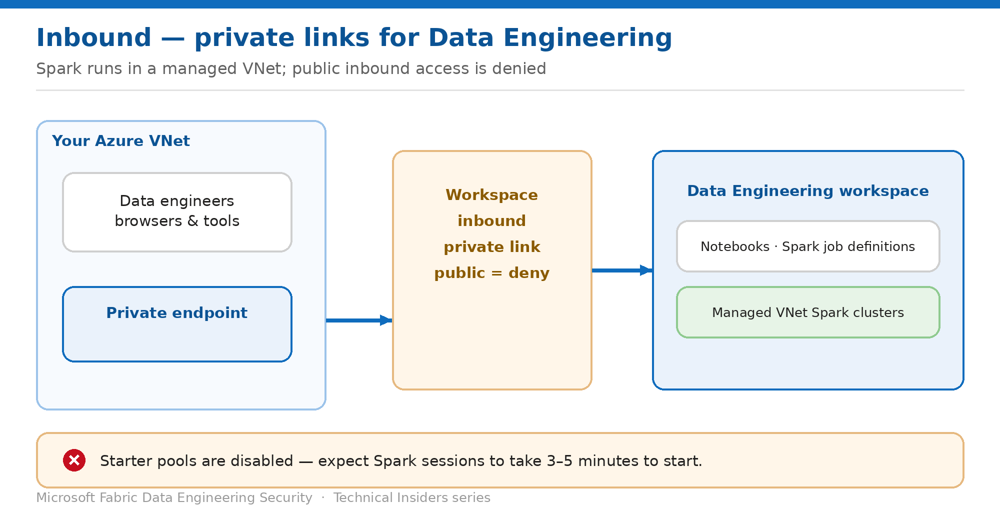

# Reach Data Engineering Workspaces Only Over Private Links

> Route inbound access to notebooks and Spark job definitions through Azure Private Link.

*Series: Network security · Layer 1 (1 of 4) · Audience: Fabric admins & data engineers · Level 300*

This entry walks you through putting a Fabric workspace that hosts **notebooks**, **Spark job definitions** and **environments** behind **Azure Private Link**, then denying public internet access. After this, data engineers reach the workspace only from inside your virtual network.

## How to read this series

This is the first of sixteen entries on securing Fabric Data Engineering — network first, then identity, data access, protection, and governance. Every entry is written as a **prescriptive, step-by-step runbook**, not a conceptual overview: exact prerequisites, the portal actions, the code where it applies, a validation step to prove the control works, the current limitations, and a rollback.

The *why* behind each control is kept deliberately short so the steps stay front and centre. For deeper technical rationale, use the **Microsoft Fabric security white paper** as the companion reference; each entry also links the specific product documentation in its **References** section.

- [Microsoft Fabric security white paper — Microsoft Learn](https://learn.microsoft.com/en-us/fabric/security/white-paper-landing-page)

## Scenario — when to use this

Your data engineering team works with regulated data, and your security team has mandated that no Fabric surface may be reachable from the public internet. Engineers already connect from a corporate network peered to Azure through VNet, ExpressRoute, or VPN.

Reach for this pattern when *"no public endpoints"* is a hard requirement. Be aware it changes how Spark behaves: workspaces using private networking run Spark in a **managed virtual network**, which disables starter pools and lengthens session start time.

For more detail on how this option works, see:

- [Microsoft Fabric security white paper — Microsoft Learn](https://learn.microsoft.com/en-us/fabric/security/white-paper-landing-page)
- [Set up and use workspace-level private links — Microsoft Learn](https://learn.microsoft.com/en-us/fabric/security/security-workspace-level-private-links-set-up)

## What you'll set up

- A **workspace-level private link** terminating in your Azure VNet.
- Public internet access to the workspace set to **deny**.
- A clear understanding of the **managed VNet** side effects on Spark sessions.

*Figure 1 — Inbound access arrives over a private endpoint; Spark itself runs in a managed VNet.*

## Prerequisites

- The workspace is on a **Fabric capacity (F SKU)**. Trial and P SKU capacities aren't supported for workspace-level private links.
- A Fabric administrator has enabled the tenant setting **Configure workspace-level inbound network rules**.
- You are a **workspace admin** and hold Azure rights to create a private link service, virtual network, and private endpoint.
- You have the **workspace ID** (the GUID after `/groups/` in the workspace URL) and the **tenant ID**.
- First time in the tenant: re-register the **Microsoft.Fabric** resource provider in the Azure portal.

## Step 1 — Create the private link and endpoint

1. Confirm the workspace runs on an F SKU under **Workspace settings → License info**.
2. In the Azure portal, deploy a Fabric private link service resource for the workspace, supplying your tenant ID and workspace ID.
3. Create (or reuse) a virtual network and subnet in the same region as your capacity.
4. Create a **private endpoint** targeting the Fabric private link service, selecting the workspace sub-resource.
5. Integrate it with the **privatelink.fabric.microsoft.com** private DNS zone so name resolution returns the private address.

> **DNS is where this usually fails** — If the private DNS zone isn't linked to the VNet performing the lookup, clients silently fall back to the public name and the connection fails in a way that looks like a firewall problem. Verify resolution before you blame the endpoint.

## Step 2 — Deny public access

1. Open **Workspace settings → Network security**.
2. Set inbound public internet access to **Deny**.
3. Allow time for propagation before testing — this is not instant.

## Step 3 — Plan for the Spark side effects

Private networking moves Spark into a **managed virtual network**. Two consequences land immediately on your engineers:

- **Starter pools are disabled.** Sessions no longer start from a warm pool.
- **Spark sessions take 3 to 5 minutes to start.** This is expected behaviour, not a fault — tell your team before they raise tickets.

> **Set expectations first** — The single most common support complaint after enabling private networking is slow session start. Communicating the 3–5 minute figure in advance turns an incident into a known characteristic.

## Validate

- From a VM inside the VNet, run `nslookup` against the workspace endpoint — it resolves to a **private IP** in your subnet range.
- Open the workspace and run a notebook from inside the VNet — it succeeds.
- Attempt the same from a public network — access is refused.
- Time a cold Spark session start and confirm it lands in the expected 3–5 minute window.

## Limitations & gotchas

- **F SKU only** — trial capacities can't use workspace-level private links.
- **Starter pools are disabled** in workspaces using managed VNets.
- If you also plan to enable outbound access protection (entry 02), note that private links change how some settings are configured — plan both together rather than sequentially.
- Propagation is not immediate; test after it settles.

## Rollback

1. Set inbound public access back to **Allow** under **Workspace settings → Network security**.
2. Remove the private endpoint and private link service resource if no longer needed.
3. Starter pool availability returns once the workspace no longer requires a managed VNet.

## References

- [Set up and use workspace-level private links — Microsoft Learn](https://learn.microsoft.com/en-us/fabric/security/security-workspace-level-private-links-set-up)
- [Workspace outbound access protection for data engineering — Microsoft Learn](https://learn.microsoft.com/en-us/fabric/security/workspace-outbound-access-protection-data-engineering)
- [Data security overview (OneLake) — Microsoft Learn](https://learn.microsoft.com/en-us/fabric/onelake/security/get-started-security)
