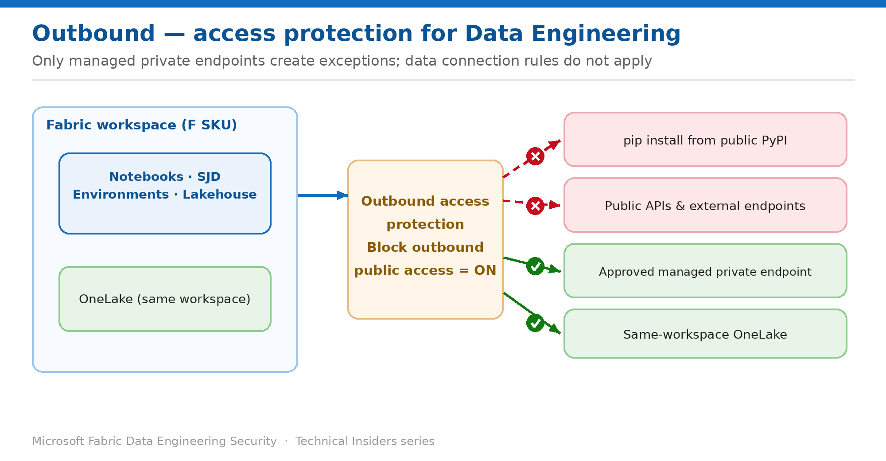

# Block Outbound Access from Notebooks and Spark Jobs

> Stop Spark clusters reaching the public internet, and know exactly what breaks.

*Series: Network security · Layer 1 (2 of 4) · Audience: Fabric admins & data engineers · Level 300*

This entry shows you how to enable **workspace outbound access protection (OAP)** on a workspace hosting Data Engineering items, so notebooks and Spark job definitions can no longer reach arbitrary external endpoints.

It also sets out — precisely — what stops working the moment you turn it on, because that list is longer than most teams expect.

## Scenario — when to use this

A notebook is a general-purpose code execution environment. Anyone who can run one inside your workspace can, by default, open a connection to any endpoint on the internet and write data to it. That is a data-exfiltration path with a friendly UI on top.

Reach for this pattern when you need a guarantee that Spark compute cannot talk to unapproved destinations, and you're prepared to manage an explicit allow-list of the destinations your jobs legitimately need.

For more detail on how this option works, see:

- [Microsoft Fabric security white paper — Microsoft Learn](https://learn.microsoft.com/en-us/fabric/security/white-paper-landing-page)
- [Workspace outbound access protection for data engineering — Microsoft Learn](https://learn.microsoft.com/en-us/fabric/security/workspace-outbound-access-protection-data-engineering)

## What you'll set up

- OAP enabled on the workspace so **all** outbound public access from Spark is blocked by default.
- A documented list of what your existing notebooks will lose.
- A plan for the exceptions you actually need (entries 03 and 04).

*Figure 2 — With OAP on, public destinations are blocked; only managed private endpoints create exceptions.*

## Prerequisites

- You hold the **Admin** role on the workspace.
- The workspace is on a **Fabric capacity (F SKU)** — other capacity types and F SKU trials aren't supported.
- A Fabric tenant administrator has enabled the tenant setting **Configure workspace-level outbound network rules**.
- Re-register the **Microsoft.Network** resource provider in the Azure portal.
- The workspace contains no unsupported artifacts — OAP can't be enabled until those are removed.

## Step 1 — Enable outbound access protection

1. Open the workspace → **Workspace settings → Network security**.
2. Switch **Block outbound public access** to **On**.
3. If you rely on source control, switch **Allow Git integration** to **On** — Git sync is blocked by default under OAP.
4. Wait for the setting to apply before testing.

> **Allow up to 15 minutes** — The block-outbound setting can take up to 15 minutes to take effect. Testing immediately produces confusing, inconsistent results.

## Step 2 — Know exactly what stops working

Fabric enforces this through **Managed Virtual Networks**, which isolate Spark clusters from external networks. Specifically, the following all fail once OAP is on:

- **`pip install` from public PyPI** — package installation from public feeds is blocked outright (see entry 04 for the supported alternatives).
- **Public domains** such as `https://login.microsoftonline.com`.
- **Any external API or website** called from notebook code.
- **Cross-workspace access** to a lakehouse in another workspace, unless a managed private endpoint exists from this workspace to that one.
- **Git integration**, unless you explicitly allow it.

What continues to work without any exception configured:

- Reading and writing **OneLake data inside the same workspace**.
- Lakehouse schema operations via **Spark DataFrame APIs** within the workspace.

> **Starter pools go away here too** — OAP puts Spark into a managed VNet. As with private links, starter pools are disabled and sessions take 3–5 minutes to start.

## Step 3 — Inventory before you enforce

Turning OAP on without an inventory turns every scheduled job into a potential outage. Before enabling it in production:

1. Search your notebooks for `pip install`, `%pip`, and `requests` / `urllib` calls to catalogue external dependencies.
2. List every lakehouse referenced by a fully qualified path pointing at another workspace.
3. List external data sources (ADLS Gen2, Azure SQL, Blob Storage) read directly from Spark.
4. Map each item to a planned exception — a managed private endpoint (entry 03) or a library strategy (entry 04).
5. Enable OAP in a non-production workspace first and run the full job schedule against it.

## Validate

- Run `%pip install` for a package not in the runtime — it **fails**, confirming public egress is blocked.
- Read a table from a lakehouse in the **same** workspace — it **succeeds**.
- Read from a lakehouse in a **different** workspace with no managed private endpoint — it **fails**.
- Confirm the toggle state under **Workspace settings → Network security**.

## Limitations & gotchas

- **Data connection rules aren't supported for Data Engineering** — managed private endpoints are the only exception mechanism (this differs from Data Factory and Warehouse).
- **Cross-tenant allow lists aren't supported.**
- Starter pools are disabled; expect 3–5 minute session starts.
- In workspaces with OAP enabled, querying warehouse file paths from notebooks using the `dbo` schema isn't supported — use the T-SQL option instead.
- OAP isn't currently compatible with **OneLake Diagnostics** or **Fabric external data sharing**.

## Rollback

1. Open **Workspace settings → Network security**.
2. Switch **Block outbound public access** to **Off**.
3. Prefer narrowing over disabling — add a managed private endpoint for the specific destination instead (entry 03).

## References

- [Workspace outbound access protection for data engineering — Microsoft Learn](https://learn.microsoft.com/en-us/fabric/security/workspace-outbound-access-protection-data-engineering)
- [Enable workspace outbound access protection — Microsoft Learn](https://learn.microsoft.com/en-us/fabric/security/workspace-outbound-access-protection-set-up)
- [Workspace outbound access protection overview — Microsoft Learn](https://learn.microsoft.com/en-us/fabric/security/workspace-outbound-access-protection-overview)
