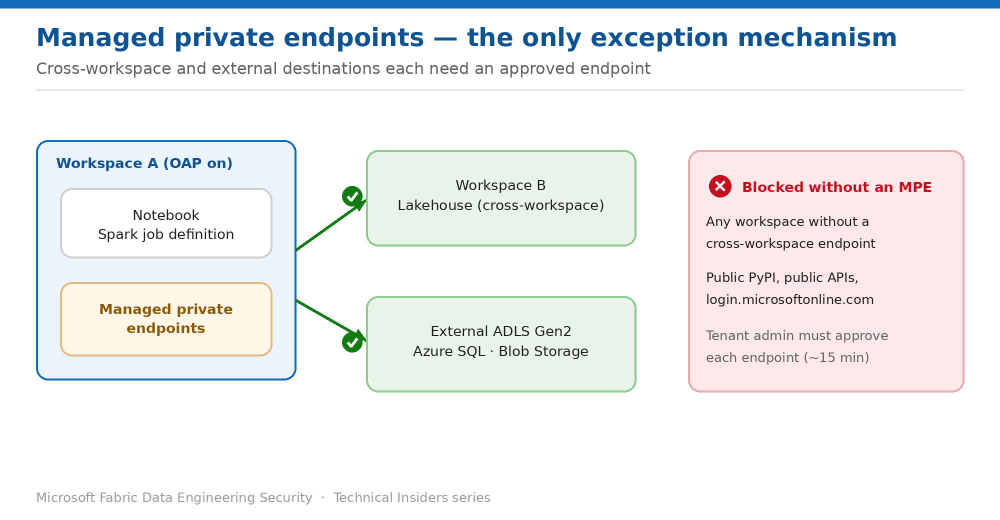

# Open Approved Destinations with Managed Private Endpoints

> The only way to create outbound exceptions for notebooks and Spark job definitions.

*Series: Network security · Layer 1 (3 of 4) · Audience: Fabric admins · Level 300*

With outbound access protection enabled, Spark reaches nothing outside its own workspace. This entry shows you how to open the specific destinations your jobs legitimately need using **managed private endpoints** — the only exception mechanism Data Engineering supports.

## Scenario — when to use this

Your notebooks need to read a lakehouse that lives in a different workspace, or land data in an external ADLS Gen2 account. Under OAP both fail, and no amount of permission-granting fixes it — the failure is at the network layer, not the authorization layer.

Reach for this pattern whenever a Data Engineering item must reach outside its own workspace. Note the important difference from other workloads: **data connection rules do not apply to Data Engineering**, so managed private endpoints are your only option.

For more detail on how this option works, see:

- [Microsoft Fabric security white paper — Microsoft Learn](https://learn.microsoft.com/en-us/fabric/security/white-paper-landing-page)
- [Workspace outbound access protection for data engineering — Microsoft Learn](https://learn.microsoft.com/en-us/fabric/security/workspace-outbound-access-protection-data-engineering)

## What you'll set up

- A **cross-workspace** managed private endpoint so notebooks can read a lakehouse in another workspace.
- An **external** managed private endpoint to an approved data source.
- A repeatable approval workflow with your tenant administrator.



*Figure 3 — Cross-workspace and external destinations each require an approved managed private endpoint.*

## Prerequisites

- **Outbound access protection is already enabled** on the source workspace (entry 02).
- You are a **workspace admin** on the source workspace.
- A **tenant administrator** is available to approve pending private endpoint connections in the Azure portal.
- For cross-workspace access, the **target workspace** must have the Private Link service enabled.

## Step 1 — Create the managed private endpoint

1. In the source workspace, open **Workspace settings → Network security → Managed private endpoints**.
2. Select **Create**, and give the endpoint a descriptive name that identifies the destination.
3. Choose the resource type — another **Fabric workspace** for cross-workspace access, or the Azure resource type for an external source.
4. Supply the target resource identifier and submit.
5. The endpoint enters a **pending** state until it is approved.

## Step 2 — Approve the connection

1. Have a tenant administrator open the Azure portal → **Private Link Services → Pending connections**.
2. Locate the request raised by the Fabric workspace and select **Approve**.
3. Allow roughly **15 minutes** for the approval to propagate.
4. Confirm the endpoint shows as approved in **Workspace settings → Network security**.

> **This is a two-team operation** — The workspace admin creates the request; a tenant admin approves it in Azure. Build that handoff into your process, or endpoints sit pending and engineers assume the feature is broken.

## Step 3 — Reference the destination correctly

A working endpoint is necessary but not sufficient — the path in your code must also be resolvable. For cross-workspace lakehouse access, use IDs rather than display names:

```python
df = spark.read.format("csv").option("header", "true").load(
    "abfss://<workspace_id>@onelake.dfs.fabric.microsoft.com/"
    "<lakehouse_id>/Files/sales/people.csv"
)
```

- **Workspace ID** — the GUID after `/groups/` in the workspace URL.
- **Lakehouse ID** — the GUID after `/lakehouses/` in the URL.

> **Display names cause socket timeouts** — A fully qualified path built from workspace and lakehouse *names* fails with a socket timeout, because the Spark session can't resolve them. This error looks like a network fault and sends people hunting the wrong problem.

## Validate

- A notebook in workspace A reads a lakehouse in workspace B — **succeeds** once the endpoint is approved.
- The same read against a workspace with **no** endpoint — still **blocked**.
- A read against the approved external data source — **succeeds**.
- The endpoint appears as **approved**, not pending, in workspace settings.

## Limitations & gotchas

- **Data connection rules aren't supported** for Data Engineering workloads — don't look for them in the portal.
- **Cross-tenant allow lists aren't supported.**
- Approval takes roughly 15 minutes and needs a tenant administrator.
- For **schema-enabled lakehouses** accessed cross-workspace under OAP: Spark DataFrame APIs (for example `spark.read.table()`) continue to work, but Spark SQL statements such as `SELECT * FROM table` may fail.
- Each destination needs its own endpoint — there is no wildcard.

## Rollback

1. Delete the managed private endpoint from **Workspace settings → Network security**.
2. Outbound access to that destination returns to blocked immediately.
3. Remove the corresponding private endpoint resource in Azure if it is no longer used.

## References

- [Workspace outbound access protection for data engineering — Microsoft Learn](https://learn.microsoft.com/en-us/fabric/security/workspace-outbound-access-protection-data-engineering)
- [Workspace outbound access protection overview — Microsoft Learn](https://learn.microsoft.com/en-us/fabric/security/workspace-outbound-access-protection-overview)
- [Enable workspace outbound access protection — Microsoft Learn](https://learn.microsoft.com/en-us/fabric/security/workspace-outbound-access-protection-set-up)
