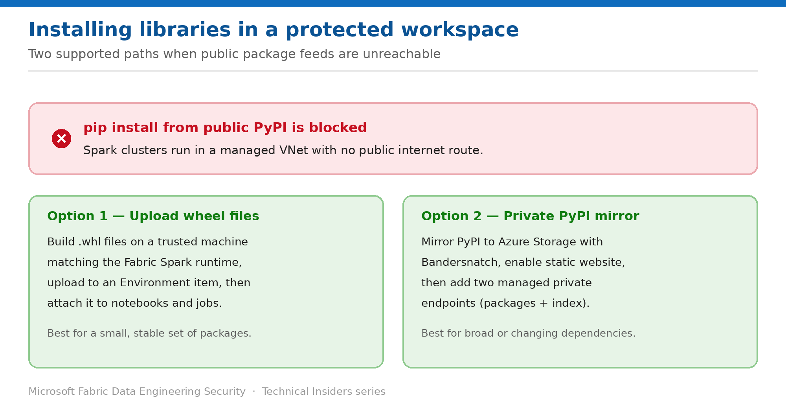

# Install Python Libraries in a Protected Workspace

> Two supported paths when pip can no longer reach public PyPI.

*Series: Network security · Layer 1 (4 of 4) · Audience: Data engineers & platform teams · Level 300*

Enabling outbound access protection blocks `pip install` from public PyPI. This entry shows the two supported ways to get libraries into a protected workspace: **uploading wheel files**, and **hosting a private PyPI mirror** reached through managed private endpoints.

## Scenario — when to use this

OAP is on, and the first thing your data scientists hit is a failed `%pip install`. Every notebook that depends on a package outside the Fabric Spark runtime is now broken, and "turn the security control off" is not an acceptable answer.

Reach for **wheel files** when you need a small, stable set of packages. Reach for a **private PyPI mirror** when dependencies are broad or change often and you don't want to repackage by hand each time.

For more detail on how this option works, see:

- [Microsoft Fabric security white paper — Microsoft Learn](https://learn.microsoft.com/en-us/fabric/security/white-paper-landing-page)
- [Workspace outbound access protection for data engineering — Microsoft Learn](https://learn.microsoft.com/en-us/fabric/security/workspace-outbound-access-protection-data-engineering)

## What you'll set up

- A working library installation path that doesn't require public internet access.
- An **Environment** item that notebooks and Spark job definitions attach to.
- If needed, a private PyPI mirror on Azure Storage reached through managed private endpoints.



*Figure 4 — Wheel files for a stable dependency set; a private PyPI mirror for broader needs.*

## Prerequisites

- **Outbound access protection is enabled** on the workspace (entry 02).
- You can create and edit **Environment** items in the workspace.
- For the mirror option: an **Azure Storage account**, a Linux VM or WSL machine, and rights to create **managed private endpoints**.
- Know your Fabric **Spark runtime version** — wheels must match it.

## Option 1 — Upload wheel files

Best when you need a handful of packages that rarely change.

1. Identify which packages your notebooks need that aren't already in the Fabric Spark runtime.
2. On a trusted build machine, create a Python environment matching the Fabric Spark runtime version.
3. Resolve your requirements and collect the resulting wheel files and their dependencies.
4. Download the `.whl` files.
5. Upload them to an **Environment** item in Fabric.
6. Attach the Environment to your notebooks and Spark job definitions.

```python
# On the build machine — resolve and list the wheels you need
pip install -r input-user-req.txt > pip_output.txt
cat pip_output.txt | grep "Using cached *"
```

> **Match the runtime** — Wheels built against a different Python or Spark runtime version will install but fail at import time. Build against the same runtime your workspace uses.

## Option 2 — Host a private PyPI mirror

Best when dependencies are broad or change frequently. You mirror PyPI into Azure Storage and point Fabric at it through private endpoints.

1. Provision a Linux VM (or WSL) and an Azure Storage account.
2. Install **Bandersnatch**, the PyPI mirroring tool, on the build machine.
3. Configure Bandersnatch and run an initial mirror. Expect the first sync to take **8 to 48 hours** depending on hardware and network.
4. Use Bandersnatch's allow-list and block-list plugins to mirror only what you need — this materially reduces size, cost and maintenance.
5. Enable **Static website** on the storage account, which creates a `$web` container.
6. Upload the `packages` folder to a container, and the `simple`, `pypi`, `local-stats` and `json` folders to `$web`.
7. Create **two managed private endpoints** in Fabric — one for the blob container (packages) and one for the static website (index).
8. Point your Environment or notebook at the mirror index URL.

```python
# In an Environment YAML
dependencies:
  - pip
  - pip:
    - pytest==8.2.2
    - --index-url https://<storage-account>.z5.web.core.windows.net/simple
```

```python
# Or inline in a notebook
%pip install pytest --index-url https://<storage-account>.z5.web.core.windows.net/simple
```

> **Budget for maintenance** — A mirror needs periodic re-syncs to stay current. Selective mirroring (for example excluding Windows binaries when only Fabric consumes the mirror) keeps that cost manageable.

## Validate

- `%pip install` from **public PyPI** still fails — confirming OAP is intact.
- Installing a package from your **uploaded wheels** or **private mirror** succeeds.
- The package imports correctly in a fresh Spark session.
- A scheduled Spark job definition using the same Environment completes.

## Limitations & gotchas

- The initial PyPI mirror sync can take **8–48 hours** — plan the rollout around it.
- Wheels must match the Fabric Spark runtime; mismatches fail at import, not install.
- Both managed private endpoints (packages **and** index) are required for the mirror — one alone produces confusing partial failures.
- Microsoft-hosted private libraries should be removed from the runtime YAML when replicating the environment locally.

## Rollback

1. Detach the Environment from notebooks to revert to the default runtime.
2. Remove the mirror's managed private endpoints if you abandon that approach.
3. Disabling OAP restores public `pip install` — at the cost of the protection it provides.

## References

- [Workspace outbound access protection for data engineering — Microsoft Learn](https://learn.microsoft.com/en-us/fabric/security/workspace-outbound-access-protection-data-engineering)
- [Workspace outbound access protection overview — Microsoft Learn](https://learn.microsoft.com/en-us/fabric/security/workspace-outbound-access-protection-overview)
