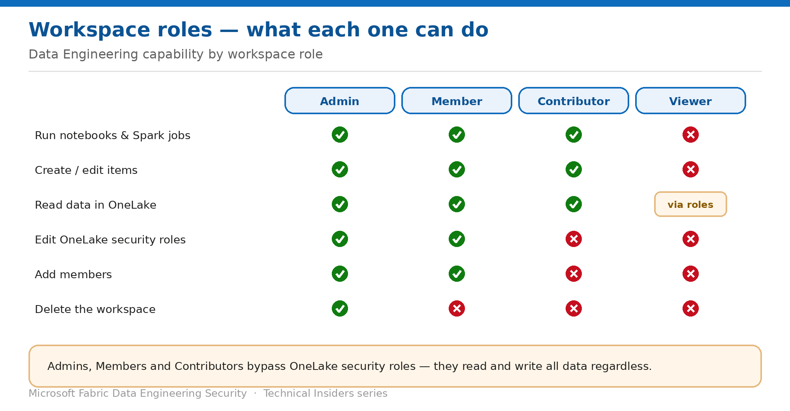

# Control Data Engineering Access with Workspace Roles

> What Admin, Member, Contributor and Viewer actually grant over notebooks and Spark jobs.

*Series: Identity & access · Layer 2 (1 of 4) · Audience: Fabric admins · Level 300*

Workspace roles are the broadest access control in Fabric, and the one most often granted carelessly. This entry sets out exactly what each role can do with **notebooks**, **Spark job definitions** and the data they touch — and the one behaviour that surprises nearly everyone.

## Scenario — when to use this

Someone asks for access to run a notebook. The quickest answer is to add them to the workspace as a Contributor — and in doing so you have just granted read and write access to every byte of data in every item in that workspace, bypassing any granular data roles you configured.

Reach for this entry before you grant workspace roles at scale, and whenever you're deciding between a workspace role and item-level sharing (entry 06).

For more detail on how this option works, see:

- [Microsoft Fabric security white paper — Microsoft Learn](https://learn.microsoft.com/en-us/fabric/security/white-paper-landing-page)
- [Roles in workspaces in Microsoft Fabric — Microsoft Learn](https://learn.microsoft.com/en-us/fabric/fundamentals/roles-workspaces)
- [Data security overview (OneLake) — Microsoft Learn](https://learn.microsoft.com/en-us/fabric/onelake/security/get-started-security)

## What you'll set up

- A clear mapping of role to capability for Data Engineering items.
- Role assignment through **security groups** rather than individuals.
- An understanding of which roles bypass OneLake security.

*Figure 5 — Data Engineering capability by workspace role.*

## Prerequisites

- You are a workspace **Admin**, or a Member with rights to add members.
- Microsoft Entra **security groups** exist (or you can request them) for the teams you're granting access to.

## Step 1 — Understand what each role grants

| Capability | Admin | Member | Contributor | Viewer |
| --- | --- | --- | --- | --- |
| Add admins | Yes | No | No | No |
| Add members | Yes | Yes | No | No |
| Edit OneLake security roles | Yes | Yes | No | No |
| Write data and create items | Yes | Yes | Yes | No |
| Read data in OneLake | Yes | Yes | Yes | Only via OneLake roles |
| Update and delete the workspace | Yes | No | No | No |

> **The behaviour that surprises people** — **Admins, Members and Contributors are not affected by OneLake security roles.** They can read and write all data in an item regardless of role membership. Granular data restrictions only bite for Viewers and users holding item-level Read.

## Step 2 — Assign roles to groups, not people

1. Create or identify an Entra **security group** per team and access level.
2. Open **Workspace → Manage access**.
3. Add the **group** and assign the role.
4. Manage ongoing access by changing group membership rather than the workspace ACL.

> **Why this matters for audit** — Reviewing who had access six months ago is straightforward with group membership history, and near-impossible with individually assigned roles that have since been edited.

## Step 3 — Choose the lowest role that works

- **Viewer** for consumers who only read data — combine with OneLake security roles (entry 09) to grant precise access.
- **Contributor** for engineers who build and run notebooks and jobs — but understand this grants full data read/write in the workspace.
- **Member** only where the person must manage access for others.
- **Admin** sparingly, and never as the default for a team.
- If someone needs to run **one** notebook, don't grant a workspace role at all — share the item instead (entry 06).

## Validate

- A Viewer with no OneLake role opens a notebook — they cannot read lakehouse data.
- A Viewer added to a OneLake security role can read exactly the tables in that role.
- A Contributor reads a table excluded by a OneLake role — access still succeeds, confirming the bypass behaviour.
- **Manage access** lists groups rather than long lists of individuals.

## Limitations & gotchas

- Contributor is a **high** privilege in data terms, despite sounding modest.
- Workspace roles are workspace-wide — you can't scope them to a subset of items.
- Removing someone from a group takes effect on their next token refresh, not instantly.
- Viewers see no data by default; if they report an empty lakehouse, they're missing a OneLake role, not broken.

## Rollback

1. Open **Workspace → Manage access** and remove or downgrade the assignment.
2. For group-based access, remove the user from the security group instead.

## References

- [Roles in workspaces in Microsoft Fabric — Microsoft Learn](https://learn.microsoft.com/en-us/fabric/fundamentals/roles-workspaces)
- [Data security overview (OneLake) — Microsoft Learn](https://learn.microsoft.com/en-us/fabric/onelake/security/get-started-security)
