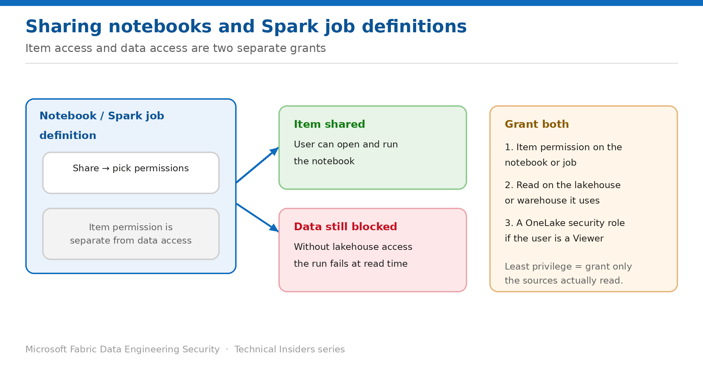

# Share Notebooks and Spark Job Definitions with Least Privilege

> Item access and data access are two separate grants — give both, deliberately.

*Series: Identity & access · Layer 2 (2 of 4) · Audience: Data engineers · Level 300*

This entry shows you how to give someone access to a specific **notebook** or **Spark job definition** without adding them to the workspace — and why that share alone usually isn't enough for the item to actually run.

## Scenario — when to use this

A colleague needs to run one notebook. Adding them to the workspace would hand them read and write access to everything in it. Sharing the single item is the least-privilege answer — but they run it and it fails at the first data read, because item access and data access are different things.

Reach for this pattern for any access request narrower than "work in this workspace": ad-hoc collaboration, handovers, or letting an analyst trigger a job they don't own.

For more detail on how this option works, see:

- [Microsoft Fabric security white paper — Microsoft Learn](https://learn.microsoft.com/en-us/fabric/security/white-paper-landing-page)
- [Data security overview (OneLake) — Microsoft Learn](https://learn.microsoft.com/en-us/fabric/onelake/security/get-started-security)

## What you'll set up

- A notebook or Spark job definition shared with a named user or group.
- The matching **data** permissions on the sources it reads.
- No unnecessary workspace role granted.

*Figure 6 — Sharing the item lets someone open it; reading data needs a second grant.*

## Prerequisites

- You can share the item — typically workspace Admin, Member, or the item owner.
- You know which lakehouses, warehouses or shortcuts the item reads.
- The recipient exists in your Entra tenant.

## Step 1 — Share the item

1. In the workspace list, select **⋯** on the notebook or Spark job definition, then **Share**.
2. Enter the user or security group.
3. Choose the permissions to grant alongside the default read access.
4. Send the share.

## Step 2 — Grant the data access it needs

Sharing the item conveys the right to open and run it. It conveys nothing about the data the code touches. Grant the second half explicitly:

1. Identify every data item the notebook reads or writes.
2. Grant **Read** on each lakehouse or warehouse involved.
3. If the recipient is a workspace **Viewer** or holds only item Read, add them to the appropriate **OneLake security role** (entry 09) so they can see the underlying tables or folders.
4. Re-run the notebook as the recipient, or ask them to, and confirm it completes.

> **Understand the item permission model** — Item permissions differ in what they expose: **Write** shows metadata, SQL data and OneLake data; **Read** shows metadata only; **ReadData** exposes SQL data in delegated mode; **ReadAll** exposes OneLake data through the DefaultReader role.

## Step 3 — Keep the grant minimal

- Share to **groups** rather than individuals wherever the access is ongoing.
- Grant read on **only** the sources the item actually uses — not the whole workspace.
- Prefer sharing over a workspace role whenever the need is a single item.
- Review shares periodically; item shares are easy to create and easy to forget.

## Validate

- The recipient sees **only** the shared item, not the rest of the workspace.
- They can open and run the notebook.
- The run reads data successfully — proving the second grant landed.
- A source you deliberately did **not** grant remains inaccessible to them.

## Limitations & gotchas

- The most common failure is a share with no matching data permission — the notebook opens, then fails mid-run.
- Shared users aren't workspace members, so they won't appear in workspace access reviews — track shares separately.
- A Spark job definition triggered on a schedule runs under its configured identity, not the recipient's — see entry 07.
- Item sharing doesn't override OneLake security constraints.

## Rollback

1. Open the item's **Manage permissions** page and remove the user or group.
2. Remove any OneLake security role membership granted for the share.

## References

- [Data security overview (OneLake) — Microsoft Learn](https://learn.microsoft.com/en-us/fabric/onelake/security/get-started-security)
- [Roles in workspaces in Microsoft Fabric — Microsoft Learn](https://learn.microsoft.com/en-us/fabric/fundamentals/roles-workspaces)
