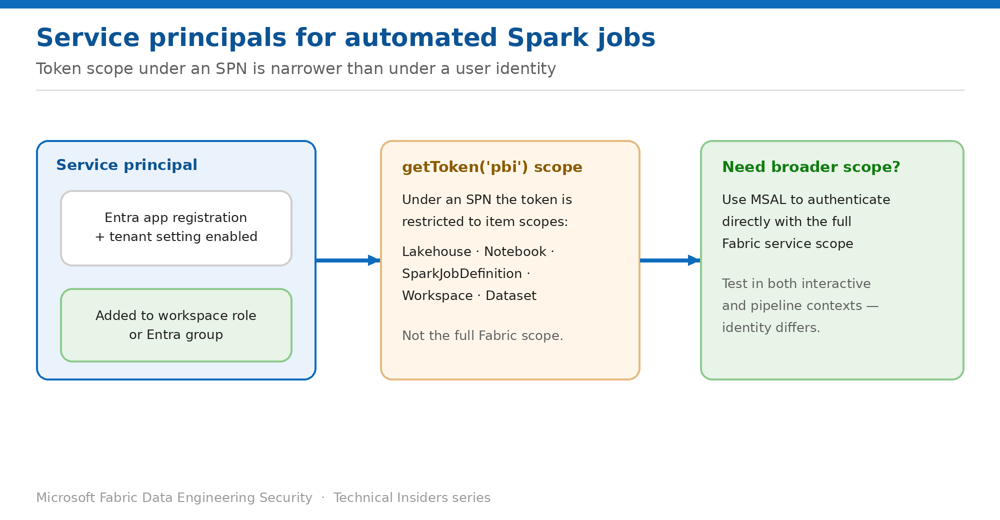

# Run Automated Spark Jobs Under a Service Principal

> Take personal identities out of scheduled pipelines — and understand the token scope limits.

*Series: Identity & access · Layer 2 (3 of 4) · Audience: Platform teams · Level 300*

This entry shows you how to run notebooks and Spark job definitions under a **service principal** rather than a person, and sets out the token scope differences that catch teams out when they make the switch.

## Scenario — when to use this

Your production Spark jobs run under whichever engineer happened to build them. When that person changes role or leaves, the pipeline breaks — and until then, every job runs with a human's full permissions.

Reach for this pattern for anything scheduled or automated. A service principal gives the job its own identity, its own least-privilege grants, and a lifecycle that doesn't depend on staffing.

For more detail on how this option works, see:

- [Microsoft Fabric security white paper — Microsoft Learn](https://learn.microsoft.com/en-us/fabric/security/white-paper-landing-page)
- [NotebookUtils credentials utilities for Fabric — Microsoft Learn](https://learn.microsoft.com/en-us/fabric/data-engineering/notebookutils/notebookutils-credentials)
- [Data security overview (OneLake) — Microsoft Learn](https://learn.microsoft.com/en-us/fabric/onelake/security/get-started-security)

## What you'll set up

- A service principal that can run Data Engineering items.
- Least-privilege workspace and data access for that identity.
- A working authentication approach that accounts for restricted token scopes.

*Figure 7 — Token scope under a service principal is narrower than under a user identity.*

## Prerequisites

- A **Microsoft Entra app registration** with a client secret or certificate.
- A tenant administrator has enabled service principal access in **Admin portal → Developer settings** — for the whole tenant or a specific security group.
- You can assign workspace roles or item permissions.

## Step 1 — Enable and grant the service principal

1. Confirm the tenant setting allowing service principals is enabled, and that your app is in the permitted security group if the setting is scoped.
2. Add the service principal — ideally via an Entra **security group** — to the workspace with the lowest role that works.
3. Grant it **Read** on the specific lakehouses or warehouses the job uses.
4. If it needs restricted data, add it to the relevant **OneLake security role**.

> **Prefer a group** — Adding service principals to a security group and granting the group access makes rotation and inventory far easier than per-principal assignments.

## Step 2 — Understand the token scope limitation

This is the part that surprises teams. When a notebook runs under a service principal, `notebookutils.credentials.getToken("pbi")` returns a token with **restricted scopes** compared with a user identity. The scopes available under a service principal are:

- `Lakehouse.ReadWrite.All`
- `Notebook.ReadWrite.All`
- `SparkJobDefinition.ReadWrite.All`
- `MLExperiment.ReadWrite.All` and `MLModel.ReadWrite.All`
- `Workspace.ReadWrite.All`
- `Dataset.ReadWrite.All`

Under a **user** identity the same call still returns the full Fabric service scope — which is exactly why a notebook that works interactively can fail when scheduled.

> **When you need broader scope** — If the job needs Fabric services beyond that list, use **MSAL** to authenticate directly with the full Fabric service scope instead of relying on `getToken("pbi")`.

## Step 3 — Test in both contexts

1. Run the notebook interactively under your own identity and confirm it succeeds.
2. Run it under the service principal — scheduled, or via the pipeline that will own it in production.
3. Compare the results. A difference almost always points at token scope or a missing data grant.
4. Where scope is the issue, switch that call to MSAL authentication.

## Validate

- The scheduled job completes under the service principal with no user credentials involved.
- The service principal can read exactly the sources you granted, and nothing else.
- Removing the principal from the workspace causes the job to fail — confirming it is genuinely the running identity.
- Audit entries attribute the run to the service principal.

## Limitations & gotchas

- **Token scopes differ between user and service principal identities** — the single biggest cause of "works interactively, fails on schedule".
- Service principal access must be enabled at tenant level first; without it, nothing works and the error is unhelpful.
- Tokens expire — implement refresh logic for long-running jobs.
- Service principals are **not** subject to interactive MFA; govern them with Conditional Access for workload identities instead.
- Fabric notebooks don't support `DefaultAzureCredential` directly; use a custom credential class wrapping NotebookUtils tokens for Azure SDK clients.

## Rollback

1. Remove the service principal from the workspace or security group.
2. Revert the job to a user identity only as a temporary measure.
3. Rotate the app's client secret if the principal is being decommissioned.

## References

- [NotebookUtils credentials utilities for Fabric — Microsoft Learn](https://learn.microsoft.com/en-us/fabric/data-engineering/notebookutils/notebookutils-credentials)
- [Data security overview (OneLake) — Microsoft Learn](https://learn.microsoft.com/en-us/fabric/onelake/security/get-started-security)
- [NotebookUtils for Fabric — Microsoft Learn](https://learn.microsoft.com/en-us/fabric/data-engineering/notebook-utilities)
