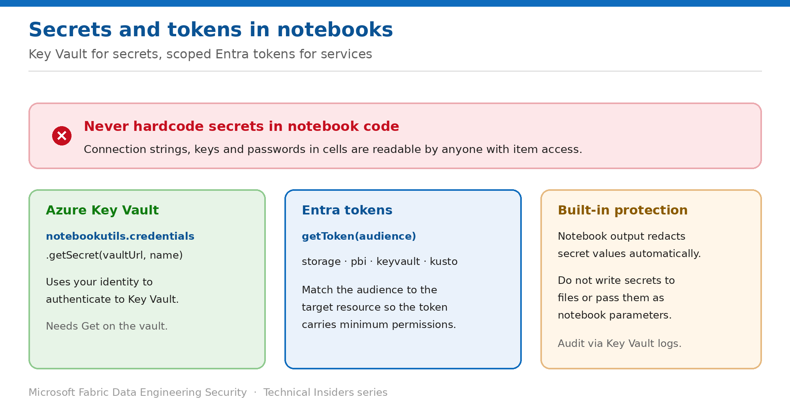

# Keep Secrets Out of Notebook Code with Azure Key Vault

> Retrieve credentials at runtime with notebookutils.credentials instead of hardcoding them.

*Series: Identity & access · Layer 2 (4 of 4) · Audience: Data engineers · Level 300*

A hardcoded connection string in a notebook is readable by everyone who can open that notebook, survives in version history, and travels with every export. This entry shows you how to retrieve secrets and tokens at runtime instead, using the built-in **notebookutils.credentials** module.

## Scenario — when to use this

You inherit a workspace and find storage account keys, database passwords and API tokens pasted directly into notebook cells. Every one of them is exposed to anyone with item access, and rotating any of them means editing code.

Reach for this pattern immediately for any notebook touching an external system. It is the lowest-effort, highest-value security change available in Data Engineering.

For more detail on how this option works, see:

- [Microsoft Fabric security white paper — Microsoft Learn](https://learn.microsoft.com/en-us/fabric/security/white-paper-landing-page)
- [NotebookUtils credentials utilities for Fabric — Microsoft Learn](https://learn.microsoft.com/en-us/fabric/data-engineering/notebookutils/notebookutils-credentials)

## What you'll set up

- Secrets stored in **Azure Key Vault** and retrieved at runtime.
- Scoped **Entra tokens** for Azure services instead of stored credentials.
- A notebook codebase with no embedded secrets.



*Figure 8 — Key Vault for secrets, scoped Entra tokens for services, redaction as a backstop.*

## Prerequisites

- An **Azure Key Vault** containing your secrets.
- **Get** permission on the vault for the identity running the notebook (and **Set** if you intend to write secrets).
- Fabric Spark **Runtime v1.2 (Spark 3.4)** or above — `notebookutils` requires it.
- The identity context is understood: interactive runs use your identity, scheduled runs use the job's identity (entry 07).

## Step 1 — Retrieve a secret instead of hardcoding it

Replace embedded credentials with a Key Vault lookup. The call authenticates using the current identity:

```python
vault_url = "https://myvault.vault.azure.net/"

db_host     = notebookutils.credentials.getSecret(vault_url, "db-host")
db_user     = notebookutils.credentials.getSecret(vault_url, "db-user")
db_password = notebookutils.credentials.getSecret(vault_url, "db-password")

connection_string = f"Server={db_host};User={db_user};Password={db_password}"
```

- Use the **fully qualified vault URL** in the form `https://<vault-name>.vault.azure.net/`.
- `putSecret` writes a secret back (Python, PySpark and R only — not the public Scala API).
- `isValidToken` checks a token before you spend an API call on it.

## Step 2 — Use scoped tokens for Azure services

For Azure services, request a token scoped to the specific resource rather than storing a credential at all:

```python
storage_token  = notebookutils.credentials.getToken('storage')   # ADLS Gen2, Blob
pbi_token      = notebookutils.credentials.getToken('pbi')       # Power BI / Fabric REST
keyvault_token = notebookutils.credentials.getToken('keyvault')  # Key Vault
kusto_token    = notebookutils.credentials.getToken('kusto')     # KQL databases
```

> **Match the audience to the target** — Requesting the narrowest audience that works means the token carries only the permissions it needs. A storage token can't be replayed against Power BI.

## Step 3 — Adopt the supporting practices

- **Never** log secret values — rely on redaction as a backstop, not a control.
- Don't write secrets to files, and don't pass them as **notebook parameters**.
- Grant the **minimum** Key Vault permissions required.
- Audit secret access through **Azure Key Vault diagnostic logs**.
- Use **managed identities** where available rather than managing credentials by hand.
- Implement **refresh logic** for long-running operations, since tokens expire.

## Validate

- A search across notebooks for password, key and connection-string patterns returns nothing.
- Printing a retrieved secret shows a **redacted placeholder**, not the value.
- Rotating the secret in Key Vault changes behaviour with **no code edit**.
- The notebook works both interactively and on schedule (or the difference is explained by entry 07).
- Key Vault diagnostic logs show the retrieval.

## Limitations & gotchas

- **Secret redaction is a safety net, not a control** — it prevents accidental display, not deliberate exfiltration by someone who can run code.
- Under a **service principal**, `getToken('pbi')` returns restricted scopes (entry 07); use MSAL where full scope is required.
- `putSecret` and `isValidToken` aren't available in the public Scala API.
- Fabric notebooks don't support `DefaultAzureCredential` directly — wrap NotebookUtils tokens in a custom credential class for Azure SDK clients.
- Token audience scopes may evolve; re-verify against current documentation periodically.

## Rollback

1. There is no meaningful rollback — reverting to hardcoded secrets reintroduces the exposure.
2. If a vault lookup fails, fix the Key Vault permission rather than inlining the value.
3. If a secret was previously committed in notebook history, **rotate it** — removing the code doesn't undo the exposure.

## References

- [NotebookUtils credentials utilities for Fabric — Microsoft Learn](https://learn.microsoft.com/en-us/fabric/data-engineering/notebookutils/notebookutils-credentials)
- [NotebookUtils for Fabric — Microsoft Learn](https://learn.microsoft.com/en-us/fabric/data-engineering/notebook-utilities)
