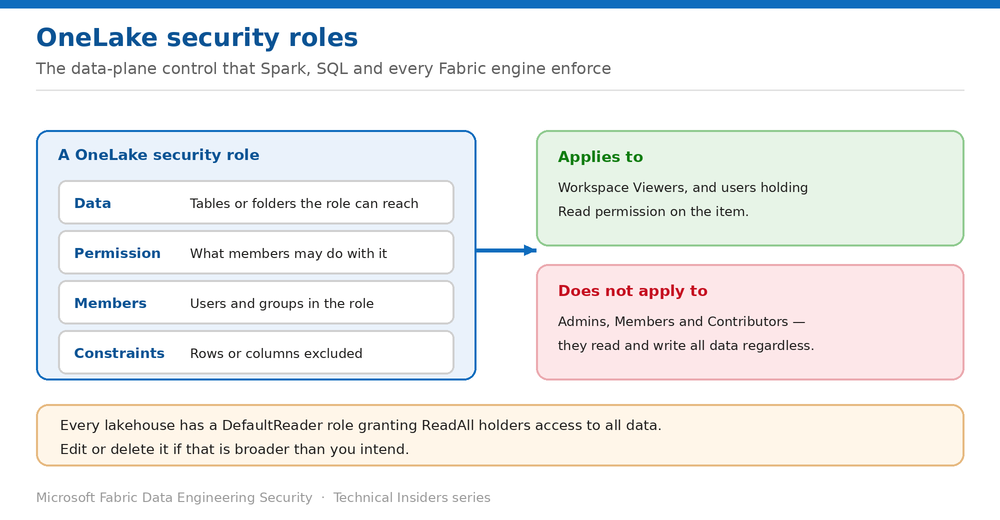

# Grant Granular Data Access with OneLake Security Roles

> The data-plane control that Spark, SQL and every Fabric engine enforce consistently.

*Series: Data access · Layer 3 (1 of 4) · Audience: Fabric admins & data engineers · Level 300*

Workspace roles are all-or-nothing. This entry shows you how to grant access to **specific tables and folders** using **OneLake security roles** — the data-plane model enforced consistently across Spark, the SQL analytics endpoint, Power BI, and authorized external engines.

## Scenario — when to use this

An analytics team needs read access to three tables in a lakehouse that contains thirty. Adding them as Contributors would expose all thirty and let them write. Adding them as Viewers exposes nothing at all.

Reach for this pattern whenever access needs to be narrower than an entire item. It is the mechanism that makes the Viewer role useful.

For more detail on how this option works, see:

- [Microsoft Fabric security white paper — Microsoft Learn](https://learn.microsoft.com/en-us/fabric/security/white-paper-landing-page)
- [Data security overview (OneLake) — Microsoft Learn](https://learn.microsoft.com/en-us/fabric/onelake/security/get-started-security)

## What you'll set up

- A OneLake security role scoped to specific tables or folders.
- Members granted read access to exactly that data and nothing more.
- A reviewed **DefaultReader** role.

*Figure 9 — A OneLake security role, and exactly who it applies to.*

## Prerequisites

- You are in the workspace **Admin** or **Member** role — only these can create OneLake security roles.
- The consumers are workspace **Viewers**, or hold **Read** permission on the item.
- You know which tables or folders the audience legitimately needs.

## Step 1 — Create the role

A OneLake security role has four components. Define each deliberately:

1. Open the lakehouse → **Manage OneLake security** (or the equivalent data access entry point for the item).
2. Create a role and name it for the audience, not the data — for example `Finance-Readers`.
3. **Data** — select the tables or folders the role can reach.
4. **Permission** — set what members may do with that data.
5. **Members** — add the users or, preferably, security groups.
6. **Constraints** — exclude specific rows or columns if needed (entry 10).

## Step 2 — Know who the role actually affects

- **Applies to:** users in the workspace **Viewer** role, and users with **Read** permission on the item.
- **Does not apply to:** workspace **Admins**, **Members** and **Contributors** — they read and write all data in the item regardless of role membership.

> **Design around the bypass** — If your granular model must hold for everyone, the audience cannot hold Contributor or above. Grant Viewer plus a OneLake role instead — this is the single most important design decision in the layer.

## Step 3 — Review the DefaultReader role

Every lakehouse ships with a **DefaultReader** role that grants any user holding the **ReadAll** permission access to data in the lakehouse. That may be broader than you intend.

1. Open the lakehouse's OneLake security roles and locate **DefaultReader**.
2. Review who holds **ReadAll** on the item.
3. Edit the role to narrow its scope, or delete it, if the default grant is wider than your policy allows.
4. Re-test consumer access afterwards — deleting it will revoke access some users currently rely on.

## Validate

- A Viewer in the role reads **only** the tables the role covers, from a Spark notebook.
- The same user reading an excluded table receives an authorization failure.
- The same restriction holds through the **SQL analytics endpoint** and Power BI — proving cross-engine enforcement.
- A Contributor reads an excluded table successfully, confirming the documented bypass.

## Limitations & gotchas

- **Admins, Members and Contributors bypass these roles entirely** — this is by design and cannot be overridden.
- Only Admins and Members can create or edit the roles.
- The **DefaultReader** role exists by default and is easy to overlook in a security review.
- Shortcuts resolve permissions at the **target** location, not where the shortcut appears (entry 12).
- Role changes may take a short time to propagate to running sessions.

## Rollback

1. Remove members from the role, or delete the role entirely.
2. Restore **DefaultReader** if you deleted it and consumers depended on it.
3. Verify no downstream reports or jobs relied on the access you removed.

## References

- [Data security overview (OneLake) — Microsoft Learn](https://learn.microsoft.com/en-us/fabric/onelake/security/get-started-security)
- [Roles in workspaces in Microsoft Fabric — Microsoft Learn](https://learn.microsoft.com/en-us/fabric/fundamentals/roles-workspaces)
