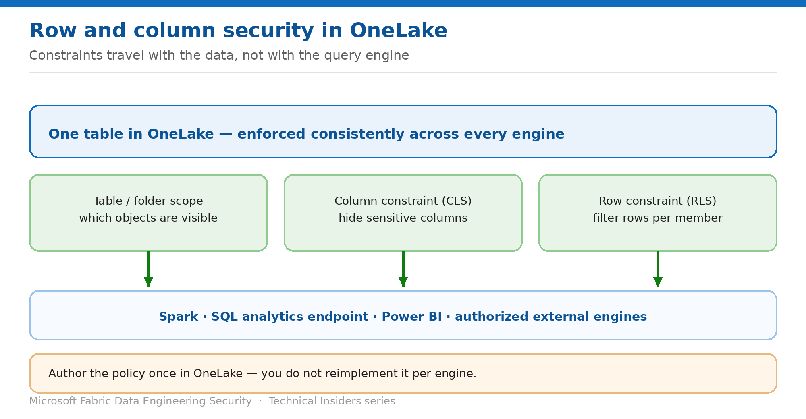

# Filter Rows and Hide Columns in OneLake

> Author row and column constraints once, enforced across every engine that reads the data.

*Series: Data access · Layer 3 (2 of 4) · Audience: Fabric admins & data engineers · Level 300*

This entry shows you how to add **row** and **column** constraints to a OneLake security role, so a Spark notebook, the SQL analytics endpoint and Power BI all see the same restricted view of a table without you implementing the rule three times.

## Scenario — when to use this

One sales table serves the whole company, but each region should see only its own rows, and nobody outside HR should see the commission column. Maintaining filtered copies per audience is a data-duplication and drift problem waiting to happen.

Reach for this pattern when the restriction is about *which rows* or *which columns* rather than which tables — and especially when the same data is read by several different engines.

For more detail on how this option works, see:

- [Microsoft Fabric security white paper — Microsoft Learn](https://learn.microsoft.com/en-us/fabric/security/white-paper-landing-page)
- [Data security overview (OneLake) — Microsoft Learn](https://learn.microsoft.com/en-us/fabric/onelake/security/get-started-security)

## What you'll set up

- **Column constraints** hiding sensitive columns from a role.
- **Row constraints** filtering rows per role membership.
- Consistent enforcement verified across Spark and SQL.

*Figure 10 — Constraints travel with the data, not with the query engine.*

## Prerequisites

- A **OneLake security role** already exists (entry 09).
- You are a workspace **Admin** or **Member**.
- The audience holds **Viewer** or item **Read** — constraints don't apply to Contributor and above.
- You know which column identifies the row owner or region for row filtering.

## Step 1 — Add a column constraint

1. Open the OneLake security role covering the table.
2. Add a **column** constraint and select the columns to exclude from the role.
3. Save, then re-test as a member of the role.

## Step 2 — Add a row constraint

1. In the same role, add a **row** constraint on the target table.
2. Define the predicate that determines which rows members may see — typically matching a column against the requesting identity or a fixed value for that role.
3. Save and re-test.
4. Repeat per audience, creating one role per distinct row scope.

## Step 3 — Verify cross-engine consistency

The value of OneLake-level constraints is that you author them once. Prove that:

1. Read the table from a **Spark notebook** as a role member — confirm rows and columns are restricted.
2. Query the same table through the **SQL analytics endpoint** — confirm identical results.
3. Open a **Power BI** report over the same table — confirm the same restriction.

> **Authorized external engines too** — OneLake supports enforcement by authorized third-party engines, which retrieve policy definitions and effective access through OneLake APIs. OneLake remains the single source of truth — the policy is authored once and enforced consistently.

## Validate

- A role member sees only their permitted rows in Spark.
- Excluded columns are absent, not blank.
- The same restrictions hold via SQL and Power BI.
- A user in a different role sees a different, correct row set.
- A Contributor sees everything — the expected bypass.

## Limitations & gotchas

- Constraints don't apply to workspace **Admins, Members or Contributors**.
- A `SELECT *` style read against a table with hidden columns behaves differently by engine — test the engines your consumers actually use.
- Each distinct row scope typically needs its own role, which can multiply quickly — plan the naming.
- Changes may take a short time to reach running Spark sessions; restart the session when testing.

## Rollback

1. Remove the constraint from the role to restore full row and column visibility.
2. Delete the role entirely to remove access altogether.
3. Re-test consumers afterwards — reports built against a filtered view may behave differently.

## References

- [Data security overview (OneLake) — Microsoft Learn](https://learn.microsoft.com/en-us/fabric/onelake/security/get-started-security)
