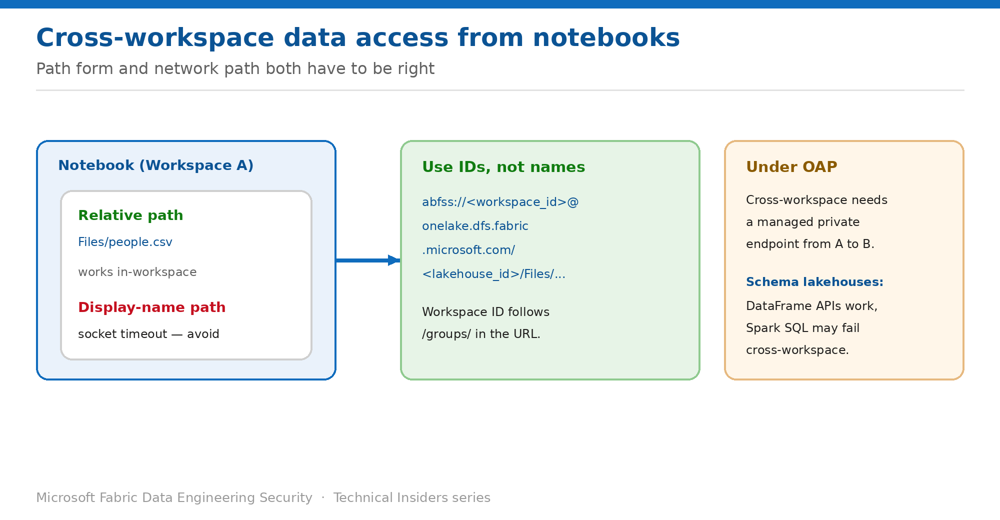

# Read Data Across Workspaces from a Notebook

> Get the path form and the network path right — both fail in ways that look like the other.

*Series: Data access · Layer 3 (3 of 4) · Audience: Data engineers · Level 300*

Cross-workspace reads fail for two entirely different reasons that produce similar-looking errors: the **path form** is wrong, or the **network path** is blocked. This entry shows you how to get both right.

## Scenario — when to use this

A notebook in one workspace needs to read a lakehouse in another — a shared curated zone, or a hand-off between teams. It works in development and fails in the locked-down environment, or it fails with a socket timeout that looks like a firewall issue but isn't.

Reach for this entry whenever a notebook references data outside its own workspace, and especially when diagnosing a read that worked before OAP was enabled.

For more detail on how this option works, see:

- [Microsoft Fabric security white paper — Microsoft Learn](https://learn.microsoft.com/en-us/fabric/security/white-paper-landing-page)
- [Workspace outbound access protection for data engineering — Microsoft Learn](https://learn.microsoft.com/en-us/fabric/security/workspace-outbound-access-protection-data-engineering)

## What you'll set up

- A working cross-workspace read using the correct URI form.
- The managed private endpoint required when OAP is enabled.
- An understanding of the schema-lakehouse limitation.



*Figure 11 — Use workspace and lakehouse IDs, and an endpoint when OAP is on.*

## Prerequisites

- You have **Read** access to the target lakehouse and its data.
- You can obtain the **workspace ID** and **lakehouse ID** of the target.
- If the consuming workspace has **OAP enabled**, you can create managed private endpoints (entry 03).

## Step 1 — Use the correct path form

Within the current lakehouse, relative paths are simplest and always work:

```python
df = spark.read.format("csv").option("header", "true").load("Files/people.csv")
```

Across workspaces you must use a fully qualified path built from **IDs**, not display names:

```python
df = spark.read.format("csv").option("header", "true").load(
    "abfss://4c8efb42-7d2a-4a87-b1b1-e7e98bea053d@onelake.dfs.fabric.microsoft.com/"
    "5a0ffa3d-80b9-49ce-acd2-2c9302cce6b8/Files/people.csv"
)
```

- **Workspace ID** — the GUID after `/groups/` in the workspace URL.
- **Lakehouse ID** — the GUID after `/lakehouses/` in the URL.

> **Why display names fail** — A path built from workspace and lakehouse names causes errors such as socket timeouts, because the Spark session can't resolve them by default. The error resembles a network fault and routinely sends teams debugging the wrong layer.

## Step 2 — Open the network path if OAP is enabled

1. Confirm whether the consuming workspace has **Block outbound public access** enabled.
2. If it does, create a **cross-workspace managed private endpoint** from the consuming workspace to the target workspace.
3. Have a tenant administrator approve it (~15 minutes).
4. Re-run the read.

## Step 3 — Account for schema-enabled lakehouses

When the target lakehouse uses **schemas** and the consuming workspace has OAP enabled, behaviour differs by API:

- **Spark DataFrame APIs work** — for example `spark.read.table()` succeeds.
- **Spark SQL statements may fail** — for example `SELECT * FROM table` in a cross-workspace scenario.

> **Prefer DataFrame APIs for cross-workspace** — Where you control the code, standardising on DataFrame reads for cross-workspace access avoids this class of failure entirely.

## Validate

- The ID-based path reads successfully from the notebook.
- The equivalent display-name path fails — confirming you're using the right form for the right reason.
- With OAP on and no endpoint, the read is blocked; with the endpoint approved, it succeeds.
- For schema lakehouses, a DataFrame read succeeds where the Spark SQL equivalent may not.

## Limitations & gotchas

- Display-name paths produce **socket timeouts**, not clear authorization errors.
- Cross-workspace access under OAP always needs an endpoint — permissions alone are not enough.
- **Spark SQL against schema-enabled lakehouses may fail** cross-workspace under OAP.
- Same-workspace access with schemas is fully supported and unaffected.
- Hardcoded GUIDs make notebooks environment-specific — parameterise them for promotion across dev, test and production.

## Rollback

1. Move the data into the consuming workspace if cross-workspace access proves fragile.
2. Or remove the managed private endpoint to close the path.
3. Revert to same-workspace reads, which need no network exception.

## References

- [Workspace outbound access protection for data engineering — Microsoft Learn](https://learn.microsoft.com/en-us/fabric/security/workspace-outbound-access-protection-data-engineering)
- [Data security overview (OneLake) — Microsoft Learn](https://learn.microsoft.com/en-us/fabric/onelake/security/get-started-security)
