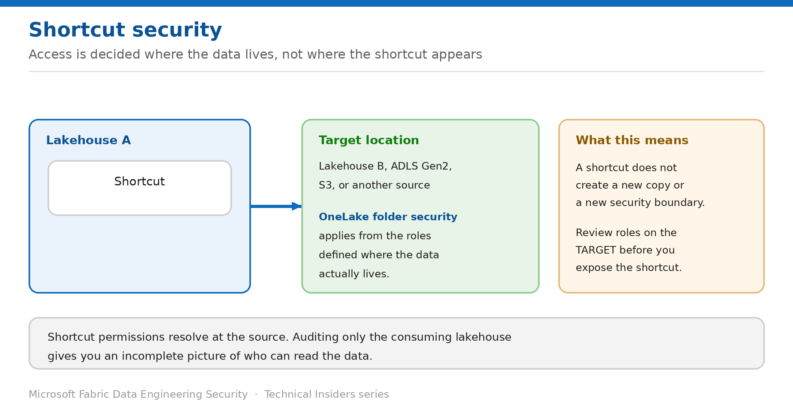

# Audit Shortcut Security Before You Expose Data

> Shortcut permissions resolve at the target — not where the shortcut appears.

*Series: Data access · Layer 3 (4 of 4) · Audience: Fabric admins & data engineers · Level 300*

Shortcuts make data appear in a lakehouse without copying it. That convenience has a security consequence teams routinely miss: **the permissions that matter are the ones defined where the data actually lives**. This entry shows you how to audit that properly.

## Scenario — when to use this

Your lakehouse shows a folder of data that looks local. It's a shortcut to another lakehouse, an ADLS Gen2 account, or an S3 bucket. You review permissions on the lakehouse in front of you, conclude access is appropriately restricted, and are wrong — because the effective permissions live somewhere else.

Reach for this entry before exposing any lakehouse containing shortcuts to a wider audience, and as part of any access review.

For more detail on how this option works, see:

- [Microsoft Fabric security white paper — Microsoft Learn](https://learn.microsoft.com/en-us/fabric/security/white-paper-landing-page)
- [Data security overview (OneLake) — Microsoft Learn](https://learn.microsoft.com/en-us/fabric/onelake/security/get-started-security)

## What you'll set up

- A complete inventory of shortcuts in the lakehouses you're responsible for.
- Verified permissions at each shortcut **target**.
- An access review process that follows shortcuts rather than stopping at them.

*Figure 12 — Access is decided where the data lives, not where the shortcut sits.*

## Prerequisites

- Access to the lakehouses you're reviewing.
- The ability to inspect OneLake security roles at the **target** locations.
- For external targets, visibility of the source system's access model.

## Step 1 — Inventory the shortcuts

1. Open each lakehouse and expand **Tables** and **Files** in the explorer.
2. Identify every item marked as a shortcut.
3. Record the **target** of each — internal lakehouse, ADLS Gen2, S3, or other source.
4. Note which are internal to Fabric and which point outside it.

## Step 2 — Review permissions at the target

OneLake folder security applies to shortcuts based on the roles defined **in the lakehouse where the data is stored**. Review accordingly:

1. For each internal target, open that lakehouse and review its OneLake security roles.
2. Confirm the audience of the consuming lakehouse is appropriate for the target's restrictions.
3. For external targets, review the source system's access configuration and the credentials the shortcut uses.
4. Document the effective access — who can read this data through this shortcut.

> **A shortcut is not a security boundary** — It creates no copy and no new boundary. If the target grants broad access, the shortcut surfaces that breadth in a new place — often to an audience the target's owner never considered.

## Step 3 — Build shortcuts into access reviews

- Treat "does this lakehouse contain shortcuts?" as a standard access-review question.
- Record the target owner alongside each shortcut so reviews can be routed correctly.
- Re-check after any change to target permissions — the consuming lakehouse gives no signal that something changed.
- Be deliberate about shortcuts that cross team or domain boundaries.

## Validate

- A user restricted at the **target** cannot read the data through the **shortcut**.
- A user permitted at the target can read it through the shortcut.
- Your shortcut inventory matches what the lakehouse explorer shows.
- Each shortcut has a documented target owner.

## Limitations & gotchas

- Auditing only the consuming lakehouse gives an **incomplete** picture of who can read the data.
- External shortcut targets follow the source system's model, not OneLake's — two different review processes.
- Permission changes at the target take effect through the shortcut with no notification to the consuming workspace.
- Shortcuts can chain; follow them to the actual storage location.

## Rollback

1. Delete the shortcut from the consuming lakehouse — this removes the surfaced access without touching the source data.
2. Or tighten the OneLake security roles at the target, which affects every consumer of that data.

## References

- [Data security overview (OneLake) — Microsoft Learn](https://learn.microsoft.com/en-us/fabric/onelake/security/get-started-security)
