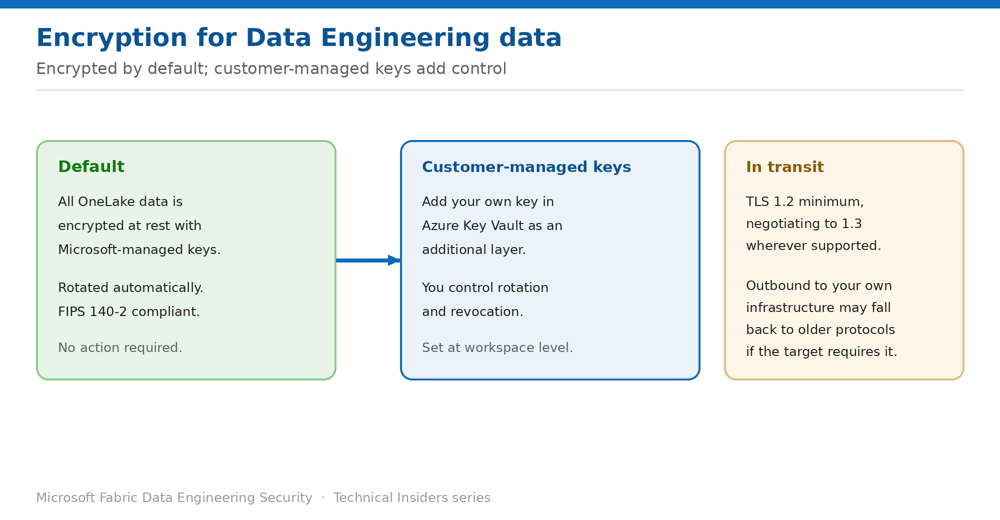

# Encrypt Data Engineering Data with Customer-Managed Keys

> Add a key you own and control on top of default encryption at rest.

*Series: Data protection · Layer 4 (1 of 2) · Audience: Fabric admins · Level 300*

All OneLake data is already encrypted at rest with Microsoft-managed keys. This entry covers when and how to add **customer-managed keys (CMK)** — and what that actually buys you.

## Scenario — when to use this

Your compliance team accepts that data is encrypted, but asks a different question: who holds the key, and can you revoke it? Default encryption answers the first question with "Microsoft" and the second with "no".

Reach for CMK when a regulator or internal policy requires customer-held key material, key rotation on your schedule, or the ability to revoke access to data cryptographically.

For more detail on how this option works, see:

- [Microsoft Fabric security white paper — Microsoft Learn](https://learn.microsoft.com/en-us/fabric/security/white-paper-landing-page)
- [Customer-managed keys for Fabric workspaces — Microsoft Learn](https://learn.microsoft.com/en-us/fabric/security/workspace-customer-managed-keys)

## What you'll set up

- A clear picture of what default encryption already provides.
- Customer-managed keys configured where policy requires them.
- A documented rotation and revocation procedure.

*Figure 13 — Encrypted by default; customer-managed keys add control over rotation and revocation.*

## Prerequisites

- An **Azure Key Vault** with purge protection and soft delete enabled.
- A **versionless key** in that vault.
- Rights to configure workspace settings and to grant the Fabric platform access to the key.
- An understanding that CMK is configured at the **workspace** level.

## Step 1 — Confirm what you already have

- Data stored in OneLake is **encrypted at rest by default** using Microsoft-managed keys, which are rotated appropriately.
- OneLake encrypts and decrypts transparently and is **FIPS 140-2 compliant**.
- Data in transit between Microsoft services uses **TLS 1.2 minimum**, negotiating to **TLS 1.3** where possible, over the Microsoft global network.

> **Decide whether you need CMK at all** — If the requirement is simply "data must be encrypted at rest", that is already satisfied. CMK answers a narrower question about key custody and revocation — adopt it for that reason, not by default.

## Step 2 — Configure customer-managed keys

1. Create or identify the Azure Key Vault holding your key, with soft delete and purge protection enabled.
2. Create a **versionless key** — versioned keys aren't suitable because rotation would break access.
3. Grant the Fabric platform identity the required permissions on the key.
4. Apply the key to the workspace in its encryption settings.
5. Confirm the workspace reports the key as active.

## Step 3 — Document rotation and revocation

1. Rotate the key in Key Vault on your policy's schedule; the versionless reference means Fabric picks up the new version.
2. To revoke, remove the Fabric platform's access to the key — plan and rehearse this, because it renders data inaccessible.
3. Record who can perform each operation and under what approval.
4. Test rotation in a non-production workspace before applying to production.

## Validate

- The workspace reports the customer-managed key as applied.
- Notebooks and Spark jobs continue to read and write data normally.
- A key rotation completes with no interruption to running workloads.
- A rehearsed revocation in a test workspace produces the expected loss of access.

## Limitations & gotchas

- The key must be **versionless** — a versioned key breaks on rotation.
- **Soft delete and purge protection** are required on the vault; without them the configuration fails or leaves you unable to recover.
- Revoking the key makes data inaccessible — this is the point, but it is not reversible by support.
- CMK is a workspace-level setting; plan which workspaces genuinely require it.
- Losing the key means losing the data. Treat key custody with the same rigour as backup.

## Rollback

1. Revert the workspace to Microsoft-managed keys in the encryption settings if policy allows.
2. Retain the customer key until you have confirmed all data is accessible under the new configuration.

## References

- [Customer-managed keys for Fabric workspaces — Microsoft Learn](https://learn.microsoft.com/en-us/fabric/security/workspace-customer-managed-keys)
- [Data security overview (OneLake) — Microsoft Learn](https://learn.microsoft.com/en-us/fabric/onelake/security/get-started-security)
