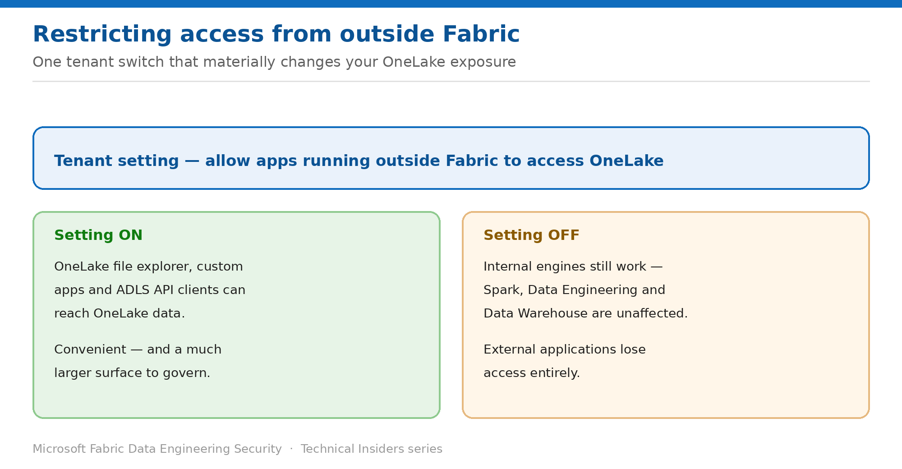

# Restrict OneLake Access from Applications Outside Fabric

> One tenant setting that materially changes how exposed your lake is.

*Series: Data protection · Layer 4 (2 of 2) · Audience: Fabric administrators · Level 300*

OneLake speaks the ADLS Gen2 API, which means tools outside Fabric can read it directly. This entry covers the tenant setting that governs that, and how to decide which way to set it.

## Scenario — when to use this

Your data is well governed inside Fabric — roles, constraints, audit. Then someone points OneLake file explorer or a custom ADLS client at the same data from a laptop, and your carefully designed in-product controls are no longer the only path in.

Reach for this entry when you need to bound how OneLake data can be reached, particularly in regulated environments where the approved access paths are enumerated.

For more detail on how this option works, see:

- [Microsoft Fabric security white paper — Microsoft Learn](https://learn.microsoft.com/en-us/fabric/security/white-paper-landing-page)
- [Data security overview (OneLake) — Microsoft Learn](https://learn.microsoft.com/en-us/fabric/onelake/security/get-started-security)

## What you'll set up

- A deliberate decision on external application access, rather than an inherited default.
- An inventory of anything that depends on it before you change it.
- The setting applied and verified.

*Figure 14 — Internal engines are unaffected; external applications lose access entirely.*

## Prerequisites

- You are a **Fabric tenant administrator**.
- You have surveyed teams for dependencies on OneLake file explorer or custom ADLS-API applications.
- You have a communication plan — this change is visible to users immediately.

## Step 1 — Inventory what depends on external access

1. Ask teams whether they use **OneLake file explorer** for day-to-day work.
2. Identify custom applications using **ADLS Gen2 APIs** against OneLake.
3. Check third-party tools configured to read OneLake directly.
4. Record each, with an owner and a migration path to an in-Fabric equivalent.

## Step 2 — Set the tenant setting

1. Open the **Admin portal → Tenant settings**, and find the **OneLake** section.
2. Locate the setting governing whether apps running outside Fabric can access OneLake data.
3. Set it according to your decision, and scope it to security groups if partial access is appropriate.
4. Communicate the change before it takes effect.

- **Turned on** — users can access data from all sources, including custom applications using ADLS Gen2 APIs and OneLake file explorer.
- **Turned off** — users can still access data from internal engines such as **Spark, Data Engineering and Data Warehouse**, but not from applications running outside Fabric.

> **Internal work is unaffected** — Turning this off does not disrupt notebooks, Spark jobs, or warehouse queries. It removes a parallel access path, not the primary one — which is what makes it a comparatively low-disruption control.

## Validate

- A Spark notebook reads and writes OneLake data normally.
- A SQL analytics endpoint query succeeds.
- With the setting off, **OneLake file explorer** can no longer reach the data.
- A custom ADLS-API client is refused.

## Limitations & gotchas

- This is a **tenant-level** setting — it affects every workspace, so scope by security group where you need nuance.
- Turning it off breaks external tooling immediately; the inventory step is not optional.
- It governs the access path, not the permissions — a user who shouldn't see data still shouldn't see it inside Fabric either.
- Users may perceive this as a regression unless the reasoning is communicated.

## Rollback

1. Re-enable the setting in the Admin portal.
2. Access from external applications resumes.
3. If only one team needs it, scope the setting to that security group rather than re-enabling tenant-wide.

## References

- [Data security overview (OneLake) — Microsoft Learn](https://learn.microsoft.com/en-us/fabric/onelake/security/get-started-security)
