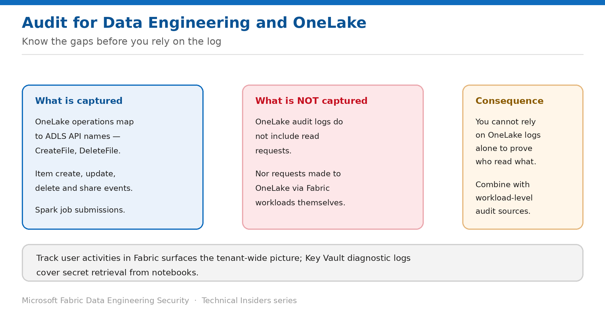

# Audit Data Engineering and OneLake Activity

> Know what the log captures — and the significant gap it leaves.

*Series: Governance & monitoring · Layer 5 (1 of 2) · Audience: Fabric admins & security teams · Level 300*

This entry covers auditing activity across Data Engineering items and OneLake — how to retrieve it, what it contains, and the one gap you must design around before promising anyone a complete access trail.

## Scenario — when to use this

Someone asks who accessed a dataset last quarter. You reach for the audit log confident the answer is there, and discover the specific event you need was never captured.

Reach for this entry before you commit to an audit capability, so the gap is a known design constraint rather than a discovery made during an investigation.

For more detail on how this option works, see:

- [Microsoft Fabric security white paper — Microsoft Learn](https://learn.microsoft.com/en-us/fabric/security/white-paper-landing-page)
- [Track user activities in Microsoft Fabric — Microsoft Learn](https://learn.microsoft.com/en-us/fabric/admin/track-user-activities)
- [Data security overview (OneLake) — Microsoft Learn](https://learn.microsoft.com/en-us/fabric/onelake/security/get-started-security)

## What you'll set up

- Access to Fabric audit activity for Data Engineering items.
- A clear statement of what is and isn't captured.
- Complementary sources covering the gaps.

*Figure 15 — OneLake audit logs exclude read requests; plan around that.*

## Prerequisites

- Permissions to view the Fabric or Microsoft 365 audit log — typically a tenant administrator or a compliance role.
- Access to Azure Key Vault diagnostic logs if you need secret-retrieval events.
- A defined retention requirement to check the available window against.

## Step 1 — Retrieve the activity

1. Follow **Track user activities in Fabric** to reach the tenant audit data.
2. Filter to the workspaces hosting your Data Engineering items.
3. Filter to the time window and identities of interest.
4. Export the result set before the retention window moves if it relates to an investigation.

## Step 2 — Understand what is captured

OneLake operation names correspond to **ADLS APIs** — for example `CreateFile` or `DeleteFile`. Alongside those you get Fabric item events such as create, update, delete and share.

- **Captured:** file and folder write operations, item lifecycle events, sharing and permission changes.
- **Not captured:** OneLake audit logs **don't include read requests**.
- **Not captured:** requests made to OneLake **via Fabric workloads** themselves.

> **This is the gap that matters** — You cannot answer "who read this table" from OneLake audit logs alone. If read-tracking is a requirement, it must come from workload-level sources — the warehouse's own SQL audit logs, or Power BI activity — not from OneLake.

## Step 3 — Fill the gaps with complementary sources

- **Azure Key Vault diagnostic logs** for secret retrieval from notebooks (entry 08).
- **Warehouse SQL audit logs** where data is also reachable through a SQL endpoint.
- **Spark application monitoring** for job-level execution history (entry 16).
- **Entra sign-in logs** to tie activity back to a device and Conditional Access outcome.
- The **tenant admin API for workspace network policies** to evidence which workspaces have inbound or outbound protection enabled.

## Validate

- Perform a write operation in a lakehouse and confirm it appears in the audit data.
- Perform a **read** and confirm it does **not** — verifying the documented gap in your own tenant.
- A permission change appears with the acting identity.
- Retrieval of a secret appears in Key Vault diagnostics.

## Limitations & gotchas

- **Read requests are not in OneLake audit logs** — the single most important limitation here.
- Requests made through Fabric workloads are also excluded from OneLake logs.
- Audit availability depends on tenant configuration and retention settings.
- Correlating across sources requires consistent time handling — record the timezone basis you used.

## Rollback

1. Auditing is a read activity; there is nothing to roll back.
2. If you enabled additional diagnostic settings for the investigation, review whether to keep them given their volume and cost.

## References

- [Track user activities in Microsoft Fabric — Microsoft Learn](https://learn.microsoft.com/en-us/fabric/admin/track-user-activities)
- [Data security overview (OneLake) — Microsoft Learn](https://learn.microsoft.com/en-us/fabric/onelake/security/get-started-security)
