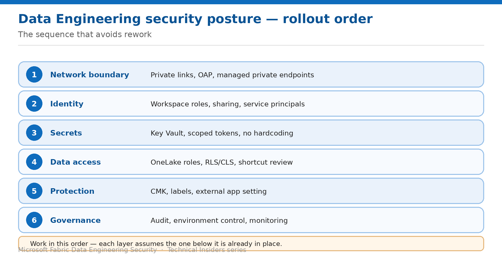

# Assemble a Data Engineering Security Posture

> The order to apply these controls in, and how to verify the whole stack.

*Series: Governance & monitoring · Layer 5 (2 of 2) · Audience: Fabric admins & architects · Level 300*

The preceding fifteen entries each solve one problem. This capstone puts them in order, so you can take a workspace from default to defensible without rework — and verify the result end to end.

## Scenario — when to use this

You have read the series, or inherited a workspace, and need a plan rather than a list. Applying these controls in the wrong order means re-doing work: enabling OAP before you have inventoried dependencies breaks jobs, and granting workspace roles before you understand the OneLake bypass undermines your granular model from day one.

Reach for this entry when planning a rollout, onboarding a new workspace, or reviewing an existing one against a target posture.

For more detail on how this option works, see:

- [Microsoft Fabric security white paper — Microsoft Learn](https://learn.microsoft.com/en-us/fabric/security/white-paper-landing-page)
- [Workspace outbound access protection for data engineering — Microsoft Learn](https://learn.microsoft.com/en-us/fabric/security/workspace-outbound-access-protection-data-engineering)
- [Data security overview (OneLake) — Microsoft Learn](https://learn.microsoft.com/en-us/fabric/onelake/security/get-started-security)

## What you'll set up

- A sequenced rollout plan across all five layers.
- A control map you can review a workspace against.
- An end-to-end validation covering every layer.

*Figure 16 — Rollout order: each layer assumes the one below it is already in place.*

## The rollout order

Work bottom-up. Each step assumes the previous one is done.

| # | Layer | What you apply | Entries |
| --- | --- | --- | --- |
| 1 | Network boundary | Private links, then OAP, then endpoints and libraries | 01–04 |
| 2 | Identity | Workspace roles, item sharing, service principals | 05–07 |
| 3 | Secrets | Key Vault, scoped tokens, no hardcoded credentials | 08 |
| 4 | Data access | OneLake roles, row/column constraints, shortcut review | 09–12 |
| 5 | Protection | Customer-managed keys, external app access | 13–14 |
| 6 | Governance | Audit, monitoring, periodic review | 15–16 |

> **Why order matters** — Inventory before enforcement (entry 02) is the step teams skip and regret. Enabling OAP without knowing which jobs reach outside the workspace converts a security improvement into an outage.

## Step 1 — Baseline the workspace

1. Record the capacity type — F SKU or not, since several controls require it.
2. List every notebook, Spark job definition and environment.
3. List external dependencies: packages, APIs, cross-workspace reads, external storage.
4. List current workspace role assignments and item shares.
5. Note whether any lakehouse contains shortcuts, and to where.

## Step 2 — Apply the layers in order

1. **Network:** private links if required (01), then OAP (02), then endpoints (03) and a library strategy (04).
2. **Identity:** right-size workspace roles (05), replace broad roles with item sharing where appropriate (06), move automation to service principals (07).
3. **Secrets:** move every credential to Key Vault (08).
4. **Data access:** define OneLake roles (09), add row and column constraints (10), fix cross-workspace paths (11), audit shortcuts (12).
5. **Protection:** apply CMK where policy requires (13); decide the external app setting (14).
6. **Governance:** confirm audit coverage and its gaps (15), then schedule review.

## Step 3 — Monitor Spark activity

Security posture includes knowing what is running. Use the built-in monitoring surfaces to keep an operational view alongside the audit trail:

- Review Spark **application runs** for jobs that fail repeatedly after a control change — this is usually the first signal that an exception is missing.
- Watch for jobs whose runtime changes sharply after enabling managed VNets, given starter pools are disabled.
- Track which **Environments** are in use, and retire ones nobody attaches.
- Correlate failures with the audit trail from entry 15 when investigating.

## End-to-end validation

- **Network:** public access to the workspace is refused; `pip install` from public PyPI fails; an approved endpoint works.
- **Identity:** a Viewer sees no data without a OneLake role; a shared item opens for its recipient; the scheduled job runs as a service principal.
- **Secrets:** no credentials appear in notebook code; a rotated secret takes effect without a code change.
- **Data access:** row and column constraints hold in Spark and SQL; shortcut targets have been reviewed.
- **Protection:** encryption configuration matches policy; the external app setting is deliberate.
- **Governance:** a write appears in the audit log, a read does not, and your team knows why.

## Limitations & gotchas

- **Contributor and above bypass OneLake security** — a granular data model is only as strong as your role assignments.
- **Read requests aren't audited in OneLake** — don't promise a complete access trail from that source.
- **Managed VNets disable starter pools** — factor 3–5 minute session starts into expectations.
- **Data connection rules don't apply to Data Engineering** — managed private endpoints are the only exception mechanism.
- Preview and recently-GA capabilities change; re-verify before each publication or audit cycle.

## Review cadence

1. Re-run the baseline inventory quarterly, or after any significant platform change.
2. Review workspace roles and item shares on the same cycle.
3. Re-check shortcut targets whenever the source team changes their access model.
4. Re-validate the network controls after any Fabric release that touches networking.

## References

- [Workspace outbound access protection for data engineering — Microsoft Learn](https://learn.microsoft.com/en-us/fabric/security/workspace-outbound-access-protection-data-engineering)
- [Data security overview (OneLake) — Microsoft Learn](https://learn.microsoft.com/en-us/fabric/onelake/security/get-started-security)
- [Track user activities in Microsoft Fabric — Microsoft Learn](https://learn.microsoft.com/en-us/fabric/admin/track-user-activities)
- [Microsoft Fabric security white paper — Microsoft Learn](https://learn.microsoft.com/en-us/fabric/security/white-paper-landing-page)
