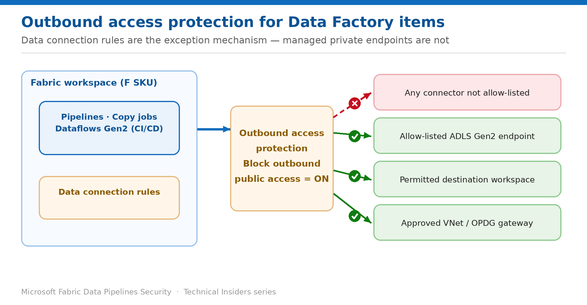

# Block Outbound Connections from Pipelines

> Enable outbound access protection for Data Factory items — and know exactly what stops working.

*Series: Network security · Layer 1 (1 of 4) · Audience: Fabric admins & data engineers · Level 300*

This entry shows you how to enable **workspace outbound access protection (OAP)** on a workspace hosting pipelines, Copy jobs, and Dataflows Gen2 — so those items can no longer connect to arbitrary external destinations.

It also sets out the specific limitations that bite Data Factory workloads, several of which have no workaround other than designing around them.

## How to read this series

This is the first of ten entries on securing Fabric Data Pipelines — network boundary first, then credentials, then access control, then governance. Every entry is written as a **prescriptive, step-by-step runbook**, not a conceptual overview: exact prerequisites, the portal actions, the code where it applies, a validation step to prove the control works, the current limitations, and a rollback.

The *why* behind each control is kept deliberately short so the steps stay front and centre. For deeper technical rationale, use the **Microsoft Fabric security white paper** as the companion reference; each entry also links the specific product documentation in its **References** section.

- [Microsoft Fabric security white paper — Microsoft Learn](https://learn.microsoft.com/en-us/fabric/security/white-paper-landing-page)

## Scenario — when to use this

A pipeline is a scheduled process holding stored credentials that can read from and write to systems across your estate. Left unrestricted, any workspace author can point one at an external endpoint and move data out of your tenant on a timer.

Reach for this pattern when you need a guarantee that Data Factory items can only reach approved destinations, and you're ready to maintain an explicit allow-list of the connectors and endpoints your jobs legitimately use.

For more detail on how this option works, see:

- [Microsoft Fabric security white paper — Microsoft Learn](https://learn.microsoft.com/en-us/fabric/security/white-paper-landing-page)
- [Workspace outbound access protection for Data Factory — Microsoft Learn](https://learn.microsoft.com/en-us/fabric/security/workspace-outbound-access-protection-data-factory)

## What you'll set up

- OAP enabled on the workspace so **all** outbound connections from Data Factory items are blocked by default.
- A documented list of what your existing pipelines will lose.
- A plan for the data connection rules you actually need (entry 02).

*Figure 1 — With OAP on, only destinations named in data connection rules are reachable.*

## Prerequisites

- You hold the **Admin** role on the workspace.
- The workspace is on a **Fabric capacity (F SKU)** — other capacity types and F SKU trials aren't supported.
- A Fabric tenant administrator has enabled the tenant setting **Configure workspace-level outbound network rules**.
- Re-register the **Microsoft.Network** resource provider in the Azure portal.
- The workspace contains no unsupported artifacts — OAP can't be enabled until those are removed.

## Step 1 — Inventory your connections first

This step is not optional for pipelines. Enabling OAP before you know what your pipelines connect to converts a security improvement into an outage across every scheduled job.

1. Open **Settings → Manage connections and gateways** and list every connection used by items in the workspace.
2. For each pipeline, record the source and destination connectors it uses.
3. Note any activity that reaches a **different workspace** — those need workspace-level rules.
4. Note any **gateway** connections, on-premises or VNet.
5. Flag pipelines using **workspace staging** in copy settings — see the limitations below.

> **Use connection recency** — Connection metadata exposes **Last linked to items** and **Last credentials used**. The second one tells you which connections are genuinely in use at runtime versus merely configured — invaluable for deciding what actually needs an allow-list rule.

## Step 2 — Enable outbound access protection

1. Open the workspace → **Workspace settings → Network security**.
2. Switch **Block outbound public access** to **On**.
3. If you rely on source control, switch **Allow Git integration** to **On** — Git sync is blocked by default under OAP.
4. Wait for the setting to apply before testing.

> **Allow up to 15 minutes** — The block-outbound setting can take up to 15 minutes to take effect. Testing immediately produces confusing, inconsistent results.

## Step 3 — Know the Data Factory limitations

Several constraints are specific to Data Factory items and have no configuration workaround. Design around them rather than discovering them in production:

- **Pipelines support a limited connector set** under OAP: FabricDataPipeline, CopyJob, UserDataFunction, PowerBIDataset, Notebook, and Spark Job Definition.
- **The Teams activity and Office 365 Outlook activity don't support OAP** at all — pipelines relying on them for notifications will need rework.
- **Workspace staging in pipelines doesn't work.** Internal staging scenarios fail; use **external staging**, configurable in the pipeline copy settings.
- **Dataflows can't use cross-workspace Data Warehouse destinations.**
- **Lakehouses with default semantic models aren't supported.** Enabling OAP on a workspace that already contains a lakehouse and its associated semantic model isn't supported.

> **Sequence matters for lakehouses** — Microsoft's guidance is to enable outbound access protection on the workspace **before** creating a lakehouse. Retrofitting OAP onto a workspace that already has one is not a supported path.

## Validate

- A pipeline copying from an external endpoint with no rule configured **fails**.
- A pipeline copying between items in the **same workspace** still succeeds.
- Git sync behaves according to the **Allow Git integration** setting you chose.
- Confirm the toggle state under **Workspace settings → Network security**.

## Limitations & gotchas

- **Managed private endpoints aren't supported for Data Factory** — data connection rules are the only exception mechanism (the opposite of Data Engineering).
- **Cross-tenant allow lists aren't supported.**
- Teams and Outlook activities are incompatible with OAP.
- Workspace staging fails; switch to external staging.
- Allow up to 15 minutes for the setting to apply.

## Rollback

1. Open **Workspace settings → Network security**.
2. Switch **Block outbound public access** to **Off**.
3. Prefer narrowing over disabling — add a data connection rule for the specific destination instead (entry 02).

## References

- [Workspace outbound access protection for Data Factory — Microsoft Learn](https://learn.microsoft.com/en-us/fabric/security/workspace-outbound-access-protection-data-factory)
- [Enable workspace outbound access protection — Microsoft Learn](https://learn.microsoft.com/en-us/fabric/security/workspace-outbound-access-protection-set-up)
- [Workspace outbound access protection overview — Microsoft Learn](https://learn.microsoft.com/en-us/fabric/security/workspace-outbound-access-protection-overview)
